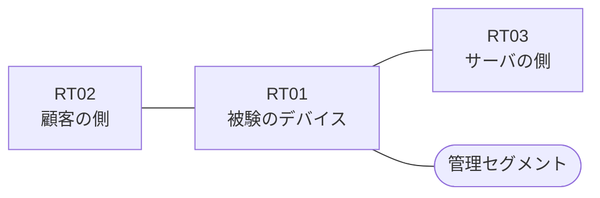

# 問題 20260828-003

> **本問は機器に接続せずに解答すること。追加の show 実行は認めない。**

## トポロジ

あなたの組織は、下記に示されているところのネットワークを運用しています。ある企業のネットワークにおいて、RT01 は、顧客の側のネットワークと、サーバの側のネットワークとの間に、配置されています。



| 区間 | 被験デバイス側のインターフェイス | ネットワーク |
|------|----------------------------------|--------------|
| RT02（顧客の側） ⇔ RT01 | `Ethernet0/0` | 10.159.253.0/24 |
| RT01 ⇔ RT03（サーバの側） | `Ethernet0/1` | 10.159.254.0/24 |
| RT01 ⇔ 管理セグメント | `Ethernet0/2` | 10.159.255.0/24 |

## 要件

1. `10.159.29.0/24` からの通信は、許可されてはなりません。
2. 当該のサーバの他のポートへの通信、および当該のサーバ以外の宛先への通信は、許可されることはできません。
3. アクセス リストは、顧客の側のインターフェイスである `Ethernet0/0` において、着信の方向に適用されなければなりません。
4. 本作業は、日中の時間帯において実施されるという理由により、対象外であるところのデバイスに対する構成の変更は、許可されていません。
5. RT01 において、`10.159.24.0/24`、`10.159.25.0/24`、`10.159.26.0/24` のネットワークからの通信が、サーバである `172.17.91.58` の TCP ポート 443 に到達できなければなりません。
6. アクセス リストのエントリは、1行で構成されなければなりません。

## 現在の状態

```
RT01# show logging | include SEC-6
%SEC-6-IPACCESSLOGP: list CUST-IN denied tcp 10.159.29.7(19343) -> 172.17.91.58(443), 1 packet
```

## 設定抜粋

```
RT01# show ip access-lists CUST-IN
Extended IP access list CUST-IN
    10 deny   tcp 10.159.29.0 0.0.0.255 host 172.17.91.58 eq 443 log
    20 deny   tcp 10.159.27.0 0.0.0.255 host 172.17.91.58 eq 443
    30 permit ip any any
```

## 設問

示されているところの記録および構成から読み取ることができるものは、どれですか。(2つを選択してください)

## 選択肢
A. `10.159.29.7` からの通信は、アクセス・リストによって拒否された。

B. `10.159.27.7` からの通信は、記録には現れていないが、アクセス・リストによって拒否された。

C. 記録に現れていない通信は、いずれも許可されたものである。

D. `10.159.24.7` からの通信は、拒否された。

E. `10.159.27.7` からの通信は、許可された。
