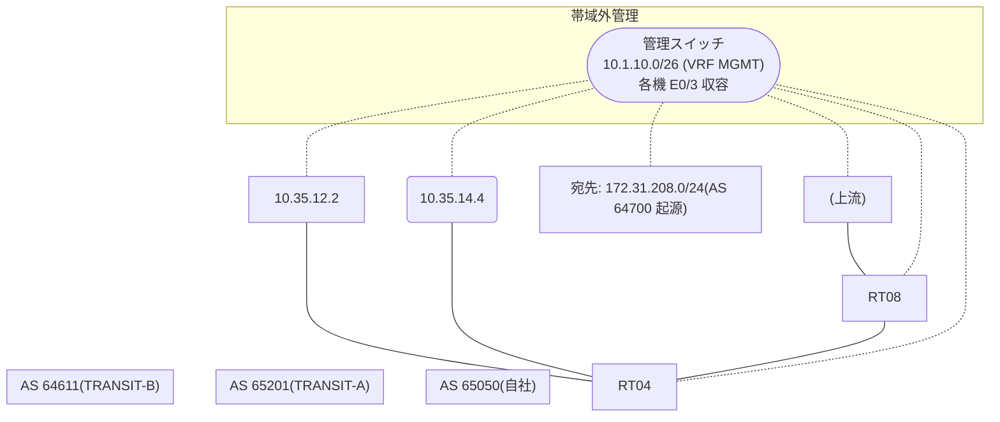

# 問題 20260828-004

> **本問は機器に接続せずに解答すること。追加の show 実行は認めない。**

## シナリオ

あなたは、下記のネットワークの保守を担当する技術者です。自社のルーター RT04 は、外部のネットワーク 172.31.208.0/24 への到達性を、複数の経路を通じて、確立しています。 TRANSIT-A とは、接続されています。 TRANSIT-B とも、接続されています。 一部の経路は、自 AS 内の境界ルータから、iBGP で、学習されています。現在、172.31.208.0/24 への転送は、要件に適合しないところの経路を、使用しています。AS 65050 内の、すべてのルータにおいて、172.31.208.0/24 への転送が、next hop 10.35.14.4 の経路を、使用すること。個々のルータに対する、個別の設定の繰り返しは、行わないこと。なお、設定の投入後、変更は、適切に、反映されているものとする。



## 出力

```
RT04# show ip bgp
BGP table version is 22, local router ID is 31.31.31.31
Status codes: s suppressed, d damped, h history, * valid, > best, i - internal, 
              r RIB-failure, S Stale, m multipath, b backup-path, f RT-Filter, 
              x best-external, a additional-path, c RIB-compressed, 
              t secondary path, L long-lived-stale,
Origin codes: i - IGP, e - EGP, ? - incomplete
RPKI validation codes: V valid, I invalid, N Not found

     Network          Next Hop            Metric LocPrf Weight Path
 *>   172.31.208.0/24  10.35.12.2             200             0 65201 64700 i
 * i                   5.6.6.6                       100      0 65201 65201 64700 64700 i
 *                     10.35.14.4              80             0 64611 64700 ?
```
```
RT04# show running-config | section router bgp
router bgp 65050
 bgp router-id 31.31.31.31
 bgp log-neighbor-changes
 neighbor 5.6.6.6 remote-as 65050
 neighbor 5.6.6.6 update-source Loopback0
 neighbor 10.35.12.2 remote-as 65201
 neighbor 10.35.14.4 remote-as 64611
 !
 address-family ipv4
  neighbor 5.6.6.6 activate
  neighbor 10.35.12.2 activate
  neighbor 10.35.14.4 activate
 exit-address-family
```

## 設問

示されているところのすべての要件が満たされることを確実にするために、適用されなければならない構成は、どれですか。(1つを選択してください)

## 選択肢
**A.**
```
clear ip bgp * soft
```

**B.**
```
router bgp 65050
 address-family ipv4
  neighbor 10.35.14.4 weight 30000
```

**C.**
```
route-map RM-BACKUP-OUT permit 10
 set as-path prepend 65050 65050
router bgp 65050
 address-family ipv4
  neighbor 10.35.12.2 route-map RM-BACKUP-OUT out
```

**D.**
```
route-map RM-PRIMARY-IN permit 10
 set local-preference 200
router bgp 65050
 address-family ipv4
  neighbor 10.35.14.4 route-map RM-PRIMARY-IN in
```

**E.**
```
router bgp 65050
 bgp always-compare-med
```

**F.**
```
route-map RM-MED-A permit 10
 set metric 200
route-map RM-MED-B permit 10
 set metric 10
router bgp 65050
 address-family ipv4
  neighbor 10.35.12.2 route-map RM-MED-A out
  neighbor 10.35.13.3 route-map RM-MED-B out
```
