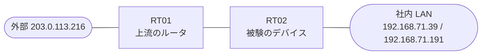

# 問題 20260828-005

> **本問は機器に接続せずに解答すること。追加の show 実行は認めない。**

## トポロジ

あなたの組織は、下記に示されているところのネットワークを運用しています。あなたの会社の拠点のルータ RT02 は、上流のルーター RT01 を経由して、外部のネットワークへ接続されています。社内の LAN には、管理のステーション 192.168.71.39 およびサーバ 192.168.71.191 が存在し、そして、RT02 と RT01 の間では、ルーティング プロトコルの隣接関係が確立されています。RT02 には、コントロール プレーンを保護するためのサービス ポリシーが、構成されています。



| 対象 | 内容 |
|------|------|
| RT02 ⇔ RT01（外部側） | Ethernet0/0・10.188.204.0/30（RT02=10.188.204.1 / RT01=10.188.204.2） |
| RT02 ⇔ 社内 LAN | Ethernet0/1・192.168.71.0/24（RT02=192.168.71.1） |
| 管理のステーション（NMS） | 192.168.71.39（SSH / ping の発信元） |
| サーバ | 192.168.71.191 |
| 外部の発信元 | 203.0.113.216 |

## 要件

1. 上記以外の、ルータ自身に宛てられたトラフィックは、class-default において帯域が制限され、超過は破棄される必要があります。
2. SSH およびルーティング・プロトコルのトラフィックは、明示の class によって分類され、いかなる制限も受けてはなりません。
3. 特定の用途または発信元ごとの class の追加は、認められていません。
4. ルータを通過するところのトラフィックの転送に、影響が与えられてはなりません。
5. ルータ自身に宛てられたトラフィックの保護は、control-plane の input のサービス ポリシーによって、実装されなければなりません。
6. スタティック ルートおよび既定のルートによる迂回は、実施されることはできません。
7. 管理のステーション 192.168.71.39 からの SSH によるアクセス、および、ルーティング プロトコルの隣接関係は、影響を受けてはなりません。

## 現在の状態

一部の通信が、意図されているとおりに動作していない、という報告があります。あなたは、提示されているところの情報のみを使用して、要求されている状態が満たされていない理由を、特定しなければなりません。

```
RT02# show policy-map control-plane
Control Plane 

  Service-policy input: PM-CPP

    Class-map: CM-SSH (match-all)  
      Match: access-group 130
      police:
          cir 8000 bps, bc 1500 bytes
        conformed 22 packets, 2024 bytes; actions:
          drop 
        exceeded 0 packets, 0 bytes; actions:
          transmit 
        conformed 0000 bps, exceeded 0000 bps

    Class-map: CM-ICMP-LIMIT (match-all)  
      Match: access-group 110
      police:
          cir 8000 bps, bc 1500 bytes
        conformed 220 packets, 25080 bytes; actions:
          transmit 
        exceeded 19 packets, 2166 bytes; actions:
          drop 
        conformed 2000 bps, exceeded 0000 bps

    Class-map: class-default (match-any)  
      Match: any
```

## 設定抜粋

```
RT02# show running-config | section control-plane
control-plane
 service-policy input PM-CPP
```
```
RT02# show access-lists
Extended IP access list 110
    10 permit icmp any any
Extended IP access list 130
    10 permit tcp host 192.168.71.39 any eq 22
```
```
RT02# show running-config | section interface
interface Ethernet0/0
 description === to RT01 ===
 ip address 10.188.204.1 255.255.255.252
interface Ethernet0/1
 ip address 192.168.71.1 255.255.255.0
```
```
RT02# show running-config | section line
line con 0
 logging synchronous
line vty 0 4
 login local
 transport input ssh
```

## 設問

次のうち、正しいものは、どれですか。

## 選択肢
A. RT02 において、ICMP の class が参照するところのアクセス・リストの先頭に、`deny icmp host 203.0.113.216 any` のエントリを追加する

B. RT02 において、発信元 203.0.113.216 からの ICMP を permit によって一致させるところの class を、ポリシーの先頭に定義し、その police のアクションを、conform-action drop および exceed-action drop に構成する。続く class において、その他の ICMP の帯域を8000 bps に制限し、そして、192.168.71.39 からの SSH を一致させるclass を、police なしで定義する

C. RT02 の外部のインターフェイスの in 方向に、`deny icmp any any` および `permit ip any any` からなるところのアクセス・グループを適用する(コントロール・プレーンのポリシーは、ICMP の帯域の制限の形を維持する)

D. RT02 において、192.168.71.39 からの SSH、および、ルーティング・プロトコルのトラフィックを一致させるところの class を、police なしで定義する。そして、class-default に対して、帯域の制限(8000 bps)を、超過 drop のアクションで構成する

E. RT02 において、ルータに宛てられた ICMP を一致させるところの class に、police を conform-action transmit および exceed-action transmit のアクションで構成する
