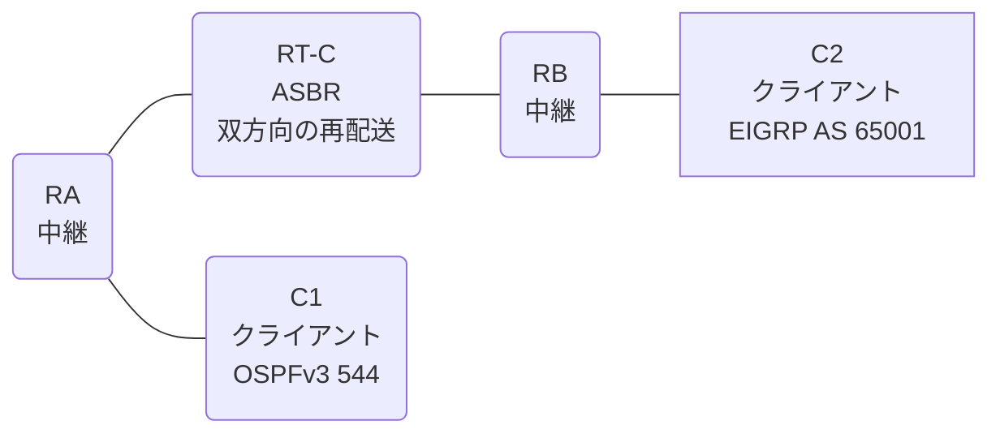

# 問題 20260828-006

> **本問は機器に接続せずに解答すること。追加の show 実行は認めない。**

## トポロジ

あなたは、ネットワークの運用を担当しています。クライアントである C1 は OSPFv3 の ドメイン に、そして、C2 は EIGRP の ドメイン に、それぞれ収容されています。RT-C は、2 つの ドメイン の境界に位置しており、双方向の 再配送 が構成されています。



| ルータ | 位置づけ | 参加プロトコル |
|--------|----------|----------------|
| C1 | クライアント | OSPFv3 544 area 0 |
| RA | 中継 | OSPFv3 544 area 0 |
| RT-C | **ASBR(2 つの ドメイン の 境界)** | 双方向の 再配送 |
| RB | 中継 | EIGRP LAB AS 65001 |
| C2 | クライアント | EIGRP LAB AS 65001 |

リンク一覧:
```
  (a) C1:Et0/0                ── RA:Et0/1           2001:DB8:1A:1:1::/64   C1 = 2001:DB8:1A:1:1::2
  (b) RA:Et0/0                ── RT-C:Ethernet0/0   2001:DB8:10:2::/64
  (c) RT-C:GigabitEthernet0/1 ── RB:Et0/0           2001:DB8:1:1C::/64
  (d) RB:Et0/1                ── C2:Et0/0           2001:DB8:1:1:1C::/64   C2 = 2001:DB8:1:1:1C::2
```

OSPFv3 の ドメイン には、RA によって注入されたところの 外部の ルート `2001:DB8:2A:B::/64` が存在する。

## 要件

1. C1 と C2 は、相互に 通信 できなければなりません。
2. ルーティング プロトコルの種別およびプロセスの配置は、変更されてはなりません。
3. C1 において、2001:DB8:1:1:1C::/64 は、タイプ 1 の 外部の ルート として受信される必要があります。

## 現在の状態

通信の一部において、想定されていない挙動が、観測されています。あなたは、提示されているところの情報のみを使用して、要求されている状態が満たされていない理由を、特定しなければなりません。

```
C1# show ipv6 route ospf | include ^O|via
OE2 2001:DB8:1:1:1C::/64 [110/20]
     via FE80::A8BB:CCFF:FE01:6700, Ethernet0/0
OE2 2001:DB8:1:1C::/64 [110/20]
     via FE80::A8BB:CCFF:FE01:6700, Ethernet0/0
OE2 2001:DB8:2A:B::/64 [110/20]
     via FE80::A8BB:CCFF:FE01:6700, Ethernet0/0
```
```
RB# show ipv6 route eigrp | include ^D|^EX|via
(no entries)
```

## 設定抜粋

```
RT-C# show running-config
Building configuration...
!
interface Ethernet0/0
 description === to RA ===
 no ip address
 ipv6 address 2001:DB8:10:2::1/64
 ipv6 enable
 ipv6 ospf 544 area 0
!
interface GigabitEthernet0/1
 description === to RB ===
 no ip address
 ipv6 address 2001:DB8:1:1C::1/64
 ipv6 enable
!
router eigrp LAB
 !
 address-family ipv6 unicast autonomous-system 65001
  !
  af-interface Ethernet0/0
   shutdown
  exit-af-interface
  !
  topology base
   redistribute ospf 544 match internal route-map REDIST-MAP include-connected
  exit-af-topology
  eigrp router-id 2.5.5.4
 exit-address-family
!
router ospfv3 544
 router-id 9.4.3.6
 !
 address-family ipv6 unicast
  redistribute eigrp 65001 route-map RM-EIGRP include-connected
 exit-address-family
!
ipv6 prefix-list E5400 seq 5 permit 2001:DB8:10:2::/64
ipv6 prefix-list O544 seq 5 permit 2001:DB8:1A:1:1::/64
ipv6 prefix-list O544 seq 10 permit 2001:DB8:1:1:1C::/64
ipv6 prefix-list PL-CORE seq 5 permit 2001:DB8:10:2::/64
ipv6 prefix-list PL-CORE seq 10 permit 2001:DB8:1A:1:1::/64
ipv6 prefix-list PL-EIGRP seq 5 permit 2001:DB8:1:1C::/64
ipv6 prefix-list PL-EIGRP seq 10 permit 2001:DB8:1:1:1C::/64
ipv6 prefix-list PL-REDIST seq 5 permit ::/0 le 64
!
route-map REDIST-MAP permit 10
 match ipv6 address prefix-list PL-CORE
route-map RM-EIGRP permit 10
 match ipv6 address prefix-list PL-EIGRP
route-map RM-OSPF permit 10
 match ipv6 address prefix-list PL-REDIST
!
```

## 設問

次のうち、正しいものは、どれですか。

## 選択肢
**A.**
```
C1# ping 2001:DB8:1:1:1C::2
Type escape sequence to abort.
Sending 5, 100-byte ICMP Echos to 2001:DB8:1:1:1C::2, timeout is 2 seconds:

% No valid route for destination
Success rate is 0 percent (0/1)

C2# ping 2001:DB8:1A:1:1::2
Type escape sequence to abort.
Sending 5, 100-byte ICMP Echos to 2001:DB8:1A:1:1::2, timeout is 2 seconds:
.....
Success rate is 0 percent (0/5)
```
**B.**
```
C1# ping 2001:DB8:1:1:1C::2
Type escape sequence to abort.
Sending 5, 100-byte ICMP Echos to 2001:DB8:1:1:1C::2, timeout is 2 seconds:
.....
Success rate is 0 percent (0/5)

C2# ping 2001:DB8:1A:1:1::2
Type escape sequence to abort.
Sending 5, 100-byte ICMP Echos to 2001:DB8:1A:1:1::2, timeout is 2 seconds:
.....
Success rate is 0 percent (0/5)
```
**C.**
```
C1# ping 2001:DB8:1:1:1C::2
Type escape sequence to abort.
Sending 5, 100-byte ICMP Echos to 2001:DB8:1:1:1C::2, timeout is 2 seconds:
!!!!!
Success rate is 100 percent (5/5), round-trip min/avg/max = 1/1/2 ms

C2# ping 2001:DB8:1A:1:1::2
Type escape sequence to abort.
Sending 5, 100-byte ICMP Echos to 2001:DB8:1A:1:1::2, timeout is 2 seconds:
!!!!!
Success rate is 100 percent (5/5), round-trip min/avg/max = 1/1/2 ms
```
**D.**
```
C1# ping 2001:DB8:1:1:1C::2
Type escape sequence to abort.
Sending 5, 100-byte ICMP Echos to 2001:DB8:1:1:1C::2, timeout is 2 seconds:
.....
Success rate is 0 percent (0/5)

C2# ping 2001:DB8:1A:1:1::2
Type escape sequence to abort.
Sending 5, 100-byte ICMP Echos to 2001:DB8:1A:1:1::2, timeout is 2 seconds:

% No valid route for destination
Success rate is 0 percent (0/1)
```
