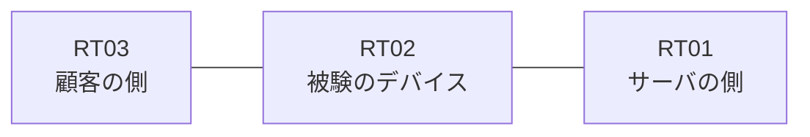

# 問題 20260828-008

> **本問は機器に接続せずに解答すること。追加の show 実行は認めない。**

## トポロジ

あなたの組織は、下記に示されているところのネットワークを運用しています。ある企業のネットワークにおいて、RT02 は、顧客の側のネットワークと、サーバの側のネットワークとの間に配置されており、IPv6 によって運用されています。



## 要件

1. 拒否のエントリを使用してはなりません。
2. `2001:DB8:12:D::/64` からの通信は、許可されることはできません。
3. RT02 において、`2001:DB8:12:8::/64`、`2001:DB8:12:9::/64`、`2001:DB8:12:A::/64` のネットワークからの通信のみが、`2001:DB8:12:FF::10` の TCP ポート 22 に到達できなければなりません。
4. 管理のための構成に対して、変更が加えられてはなりません。

## 現在の状態

ユーザーから、通信に関する事象が、報告されています。あなたは、示されているところの出力および構成に基づいて、その構成が、下記において記述されているとおりに動作していない理由を、判断する必要があります。

観測 | サーバへの到達
--- | ---
送信元が 2001:DB8:12:8::/64 のネットワークにあるホストから、2001:DB8:12:FF::10 の TCP ポート 22 宛ての通信 | 到達可
送信元が 2001:DB8:12:9::/64 のネットワークにあるホストから、2001:DB8:12:FF::10 の TCP ポート 22 宛ての通信 | 到達可
送信元が 2001:DB8:12:A::/64 のネットワークにあるホストから、2001:DB8:12:FF::10 の TCP ポート 22 宛ての通信 | 到達可
送信元が 2001:DB8:12:B::/64 のネットワークにあるホストから、2001:DB8:12:FF::10 の TCP ポート 22 宛ての通信 | 到達可
送信元が 2001:DB8:12:D::/64 のネットワークにあるホストから、2001:DB8:12:FF::10 の TCP ポート 22 宛ての通信 | 到達可
送信元が 2001:DB8:12:FA::/64 のネットワークにあるホストから、2001:DB8:12:FF::10 の TCP ポート 22 宛ての通信 | 到達不可

```
RT02# show ipv6 access-list
IPv6 access list V6-CUST-IN
    permit ipv6 2001:DB8:12:8::/61 any sequence 10
```
```
RT02# show ipv6 neighbors
IPv6 Address                              Age Link-layer Addr State Interface
2001:DB8:12:8::3                            0 aabb.cc02.4f00  REACH Et0/0
```

## 設定抜粋

```
RT02# show running-config | section ipv6 access-list|traffic-filter
ipv6 access-list V6-CUST-IN
 sequence 10 permit ipv6 2001:DB8:12:8::/61 any
interface Ethernet0/0
 ipv6 traffic-filter V6-CUST-IN in
```

## 設問

次のうち、正しいものは、どれですか。

## 選択肢
A. 参照されているアクセス・リストが定義されていない

B. アクセス・リストが `ip access-group` によって適用されている

C. ワイルドカードによる指定が受理されず、意図されたエントリが存在していない

D. 空のアクセス・リストが参照されているため、暗黙の拒否によってすべてが破棄されている

E. プレフィックスの長さが短く、対象としていないネットワークまでが一致の対象に含まれている

F. 先行するエントリが広い範囲を許可しており、後続のエントリが評価されない
