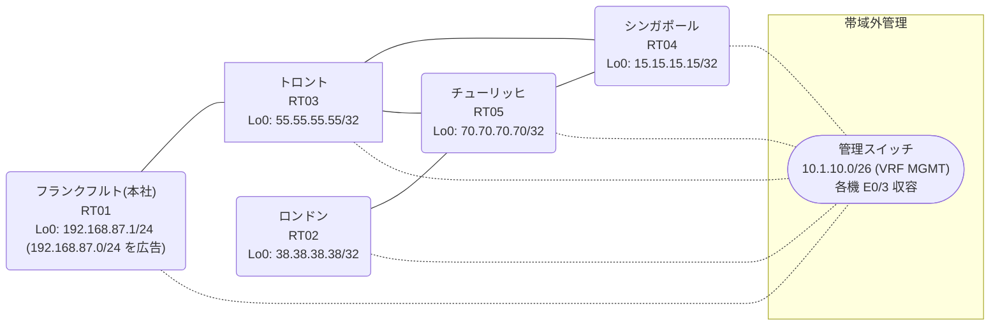

# 問題 20260828-010

> **本問は機器に接続せずに解答すること。追加の show 実行は認めない。**

## シナリオ

あなたは、ネットワークの運用を担当しています。本社の顧客のネットワークは、BGP AS 65371 の RT01 によって、広告されています。あなたの会社の内部は、BGP / EIGRP / OSPF という 3 つのドメインから構成されています。サイトと、ルーターおよびアドレスとの対応は、下記の表に示されているとおりです。いくつかの宛先への通信について、報告が上がっています。あなたは、提示されているところの情報のみを使用して、要求されている状態が満たされていない理由を、特定しなければなりません。スタティック・ルートおよび既定のルートによる迂回は、実施されてはなりません。以前の障害の対応の際に追加された設定が、一部のルーターにおいて、そのまま残されています。当該の設定の棚卸しは、行われていません。それぞれのドメインの間の再配送の設計は、維持される必要があります。`192.168.87.0/24` 宛のトラフィックが RT01 へ配送され、経路の周回が、発生していないこと。すべてのルーターが、`192.168.87.0/24` を含むところのすべての宛先へ、到達することができること。ルーティング プロトコルの種別およびプロセスの配置は、変更されることはできません。



| 拠点 | ルータ | 拠点網 / 広告網 |
|------|--------|------------------|
| シンガポール | RT04 | 15.15.15.15/32 |
| チューリッヒ | RT05 | 70.70.70.70/32 |
| トロント | RT03 | 55.55.55.55/32 |
| フランクフルト(本社) | RT01 | 192.168.87.1/24 (`192.168.87.0/24` を広告) |
| ロンドン | RT02 | 38.38.38.38/32 |

リンク一覧:
```
  RT01:E0/0(.1) ── RT03:E0/0(.2)   10.80.193.0/30
  RT03:E0/1(.1) ── RT05:E0/0(.2)   10.89.158.0/30
  RT03:E0/2(.1) ── RT04:E0/0(.2)   10.198.232.0/30
  RT05:E0/1(.1) ── RT04:E0/1(.2)   10.204.209.0/30
  RT05:E0/2(.1) ── RT02:E0/0(.2)   10.116.252.0/30
```

## 出力

```
RT05# show running-config | section router
router eigrp 732
 network 10.89.158.0 0.0.0.3
 redistribute ospf 71 metric 100000 100 255 1 1500
router ospf 71
 router-id 70.70.70.70
 redistribute eigrp 732
 network 10.116.252.0 0.0.0.3 area 0
 network 10.204.209.0 0.0.0.3 area 0
 network 70.70.70.70 0.0.0.0 area 0
```
```
RT01# show running-config | section router
router bgp 65371
 bgp router-id 192.168.87.1
 bgp log-neighbor-changes
 network 192.168.87.0
 neighbor 10.80.193.2 remote-as 65371
```
```
RT03# show ip route
Gateway of last resort is not set
      10.0.0.0/8 is variably subnetted, 8 subnets, 2 masks
C        10.80.193.0/30 is directly connected, Ethernet0/0
L        10.80.193.2/32 is directly connected, Ethernet0/0
C        10.89.158.0/30 is directly connected, Ethernet0/1
L        10.89.158.1/32 is directly connected, Ethernet0/1
O        10.116.252.0/30 [110/30] via 10.198.232.2, 00:03:50, Ethernet0/2
C        10.198.232.0/30 is directly connected, Ethernet0/2
L        10.198.232.1/32 is directly connected, Ethernet0/2
O        10.204.209.0/30 [110/20] via 10.198.232.2, 00:03:50, Ethernet0/2
      15.0.0.0/32 is subnetted, 1 subnets
O        15.15.15.15 [110/11] via 10.198.232.2, 00:03:50, Ethernet0/2
      38.0.0.0/32 is subnetted, 1 subnets
O        38.38.38.38 [110/31] via 10.198.232.2, 00:03:50, Ethernet0/2
      55.0.0.0/32 is subnetted, 1 subnets
C        55.55.55.55 is directly connected, Loopback0
      70.0.0.0/32 is subnetted, 1 subnets
O        70.70.70.70 [110/21] via 10.198.232.2, 00:03:50, Ethernet0/2
D EX  192.168.87.0/24 [170/307200] via 10.89.158.2, 00:03:30, Ethernet0/1
```
```
RT03# show ip protocols | include Routing Protocol|Distance
Routing Protocol is "application"
    Gateway         Distance      Last Update
  Distance: (default is 4)
Routing Protocol is "eigrp 732"
      Distance: internal 90 external 170
    Gateway         Distance      Last Update
  Distance: internal 90 external 170
Routing Protocol is "ospf 71"
    Gateway         Distance      Last Update
  Distance: intra-area 110 inter-area 110 external 212
Routing Protocol is "bgp 65371"
    Gateway         Distance      Last Update
  Distance: external 20 internal 200 local 200
```
```
RT03# show running-config | section router
router eigrp 732
 timers active-time 5
 network 10.89.158.0 0.0.0.3
 passive-interface Loopback0
router ospf 71
 router-id 55.55.55.55
 redistribute eigrp 732
 redistribute bgp 65371
 network 10.198.232.0 0.0.0.3 area 0
 network 55.55.55.55 0.0.0.0 area 0
 distance ospf external 212
router bgp 65371
 bgp router-id 55.55.55.55
 bgp log-neighbor-changes
 bgp redistribute-internal
 network 55.55.55.55 mask 255.255.255.255
 redistribute ospf 71
 neighbor 10.80.193.1 remote-as 65371
```
```
RT03# show ip prefix-list
ip prefix-list PL-MIGR1: 2 entries
   seq 5 deny 192.168.87.0/24
   seq 10 permit 0.0.0.0/0 le 32
```
```
RT02# traceroute 192.168.87.1 probe 1 timeout 1 ttl 1 8
Type escape sequence to abort.
Tracing the route to 192.168.87.1
VRF info: (vrf in name/id, vrf out name/id)
  1 10.116.252.1 1 msec
  2 10.204.209.2 2 msec
  3 10.198.232.1 21 msec
  4 10.89.158.2 7 msec
  5 10.204.209.2 2 msec
  6 10.198.232.1 4 msec
  7 10.89.158.2 2 msec
  8 10.204.209.2 26 msec
```
```
RT03# show route-map
route-map RM-MIGR1, deny, sequence 10
  Match clauses:
    ip address prefix-lists: PL-MIGR1 
  Set clauses:
  Policy routing matches: 0 packets, 0 bytes
route-map RM-MIGR1, permit, sequence 20
  Match clauses:
  Set clauses:
  Policy routing matches: 0 packets, 0 bytes
```
```
RT03# show access-lists
Standard IP access list 29
    10 deny   192.168.87.0
    20 permit any
```
```
RT03# show ip bgp
BGP table version is 10, local router ID is 55.55.55.55
Status codes: s suppressed, d damped, h history, * valid, > best, i - internal, 
              r RIB-failure, S Stale, m multipath, b backup-path, f RT-Filter, 
              x best-external, a additional-path, c RIB-compressed, 
              t secondary path, L long-lived-stale,
Origin codes: i - IGP, e - EGP, ? - incomplete
RPKI validation codes: V valid, I invalid, N Not found

     Network          Next Hop            Metric LocPrf Weight Path
 *>   10.116.252.0/30  10.198.232.2            30         32768 ?
 *>   10.198.232.0/30  0.0.0.0                  0         32768 ?
 *>   10.204.209.0/30  10.198.232.2            20         32768 ?
 *>   15.15.15.15/32   10.198.232.2            11         32768 ?
 *>   38.38.38.38/32   10.198.232.2            31         32768 ?
 *>   55.55.55.55/32   0.0.0.0                  0         32768 i
 *>   70.70.70.70/32   10.198.232.2            21         32768 ?
 r>i  192.168.87.0     10.80.193.1              0    100      0 i
```
```
RT04# show running-config | section router
router ospf 71
 router-id 15.15.15.15
 timers throttle spf 50 200 5000
 passive-interface Loopback0
 network 10.198.232.0 0.0.0.3 area 0
 network 10.204.209.0 0.0.0.3 area 0
 network 15.15.15.15 0.0.0.0 area 0
```

## 設問

次のうち、正しいものは、どれですか。

## 選択肢
A. RT03 の router bgp 65371 配下から「bgp redistribute-internal」を削除する

B. RT05 の router eigrp 732 配下に「distance eigrp 90 205」を設定する

C. RT03 の router ospf 71 配下の「redistribute bgp 65371 ...」に `192.168.87.0/24` を deny する route-map を適用する

D. RT03 で「clear ip bgp *」および「clear ip route *」を実行する

E. RT03 の router ospf 71 配下の残存する distance の値をさらに引き上げ、clear ip route * を実行する

F. RT03 の router bgp 65371 配下に「distance bgp 20 165 165」を設定し、clear ip route * を実行する
