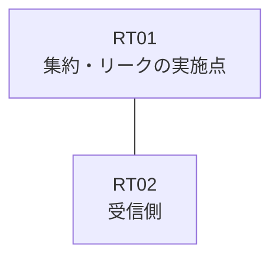

# 問題 20260830-001

> **本問は機器に接続せずに解答すること。追加の show 実行は認めない。**

## トポロジ

あなたの組織は、下記に示されているところのネットワークを運用しています。拠点のルータ RT01 は、複数のループバック・インターフェイスによって、サービスのためのアドレスのブロック 172.25.26.0/30 を収容しています。RT01 と RT02 は、1本のリンクによって直接に接続されており、そして、EIGRP 200 が構成されています。



| 対象 | 内容 |
|------|------|
| RT01 のループバック | 172.25.26.1, 172.25.26.2, 172.25.26.3 |
| RT01 の運用系ループバック | 10.234.182.132 |
| RT01 ⇔ RT02 のリンク | 10.54.24.0/24（RT01=10.54.24.1 / RT02=10.54.24.2・GigabitEthernet0/1） |

## 要件

1. ブロックの内部の明細のルートは、広告されてはなりません。
2. ただし、監視のためのホストである 172.25.26.3 (/32) の明細のルートは、集約とともに、受信されなければなりません。
3. 運用のためのループバック 10.234.182.132 (/32) は、引き続き受信される必要があります。
4. インターフェイスにおける集約の構成は、過去の障害の経緯という理由により、認められていません。
5. RT02 に対して、ブロック 172.25.26.0/30 は、集約のルートとして広告されなければなりません。
6. インタフェースの IP アドレッシングは、変更されることはできません。

## 現在の状態

一部の通信が、意図されているとおりに動作していない、という報告があります。あなたは、示されているところの出力および構成に基づいて、その構成が、下記において記述されているとおりに動作していない理由を、判断する必要があります。

```
RT02# show ip route eigrp | begin Gateway
Gateway of last resort is not set
      10.0.0.0/32 is subnetted, 1 subnets
D        10.234.182.132 [90/409600] via 10.54.24.1, 00:14:45, GigabitEthernet0/1
      172.25.0.0/16 is variably subnetted, 4 subnets, 2 masks
D        172.25.26.0/30 [90/409600] via 10.54.24.1, 00:14:45, GigabitEthernet0/1
D        172.25.26.1/32 [90/409600] via 10.54.24.1, 00:14:45, GigabitEthernet0/1
D        172.25.26.2/32 [90/409600] via 10.54.24.1, 00:14:45, GigabitEthernet0/1
D        172.25.26.3/32 [90/409600] via 10.54.24.1, 00:14:45, GigabitEthernet0/1
```

## 設定抜粋

```
RT01# show running-config
Building configuration...
!
interface Loopback0
 ip address 172.25.26.1 255.255.255.255
interface Loopback1
 ip address 172.25.26.2 255.255.255.255
interface Loopback2
 ip address 172.25.26.3 255.255.255.255
interface Loopback10
 ip address 10.234.182.132 255.255.255.255
interface GigabitEthernet0/1
 description === to RT02 ===
 ip address 10.54.24.1 255.255.255.252
 ip summary-address eigrp 200 172.25.26.0 255.255.255.252 leak-map RM-LEAK
!
router eigrp 200
 network 172.25.26.1 0.0.0.0
 network 172.25.26.2 0.0.0.0
 network 172.25.26.3 0.0.0.0
 network 10.234.182.132 0.0.0.0
 network 10.54.24.0 0.0.0.3
!
ip prefix-list PL-LEAK seq 5 permit 172.25.26.0/30 le 32
ip prefix-list PL-MON seq 5 permit 172.25.26.3/32
!
route-map MON-LEAK permit 10
 match ip address prefix-list PL-LEAK
route-map RM-LEAK permit 10
!
```

## 設問

次のうち、正しいものは、どれですか。

## 選択肢
A. 対象のループバックのネットワークが、EIGRP のプロセスへ参加させられていない

B. ルート・マップが参照しているところの名前のリストが、定義されていない

C. leak-map が参照しているところの名前のルート・マップが、定義されていない

D. ルート・マップの permit のエントリに、match のステートメントが存在しない

E. distribute-list によって、当該のインターフェイスからの広告がフィルタされている

F. EIGRP の auto-summary が有効にされており、明細の広告に影響している
