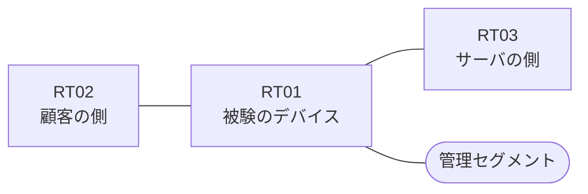

# 問題 20260830-003

> **本問は機器に接続せずに解答すること。追加の show 実行は認めない。**

## シナリオ

あなたの組織は、下記に示されているところのネットワークを運用しています。ある企業のネットワークにおいて、RT01 は、顧客の側のネットワークと、サーバの側のネットワークとの間に、配置されています。`10.103.9.0/24` からの通信は、許可されてはなりません。アクセス・リストは、顧客の側のインターフェイスである `Ethernet1/0` において、着信の方向に適用される必要があります。RT01 において、`10.103.8.0/24`、`10.103.10.0/24`、`10.103.12.0/24`、`10.103.14.0/24` のネットワークからの通信のみが、許可されなければなりません。`10.103.11.0/24` からの通信は、許可されることはできません。アクセス・リストのエントリは、1行で構成されなければなりません。インタフェースの IP アドレッシングは、変更されることはできません。



| 区間 | 被験デバイス側のインターフェイス | ネットワーク |
|------|----------------------------------|--------------|
| RT02（顧客の側） ⇔ RT01 | `Ethernet1/0` | 10.103.253.0/24 |
| RT01 ⇔ RT03（サーバの側） | `Ethernet1/1` | 10.103.254.0/24 |
| RT01 ⇔ 管理セグメント | `Ethernet1/2` | 10.103.255.0/24 |


## 設問

次のうち、正しいものは、どれですか。

## 選択肢
**A.**
```
access-list 50 permit 10.103.8.0 0.0.6.255
```

**B.**
```
access-list 50 permit 10.103.8.0 255.255.249.0
```

**C.**
```
access-list 50 permit 10.103.8.0 0.0.7.255
```

**D.**
```
access-list 50 permit 10.103.9.0 0.0.6.255
```

**E.**
```
access-list 50 permit 10.103.8.0 0.0.4.255
```

**F.**
```
access-list 50 permit 10.103.8.0 0.0.0.255
access-list 50 permit 10.103.10.0 0.0.0.255
access-list 50 permit 10.103.12.0 0.0.0.255
access-list 50 permit 10.103.14.0 0.0.0.255
```

**G.**
```
access-list 50 deny 10.103.9.0 0.0.0.255
access-list 50 deny 10.103.11.0 0.0.0.255
access-list 50 deny 10.103.13.0 0.0.0.255
access-list 50 deny 10.103.15.0 0.0.0.255
access-list 50 permit 10.103.8.0 0.0.7.255
```
