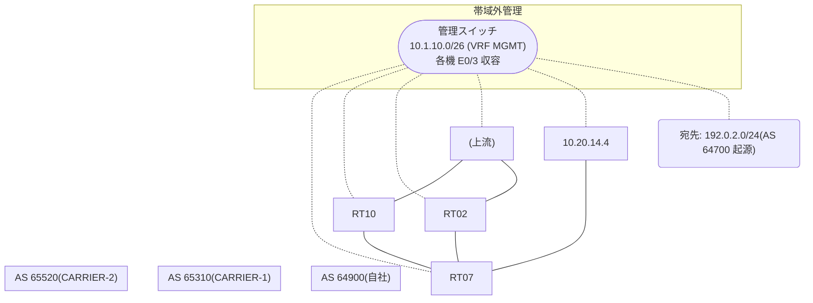

# 問題 20260830-004

> **本問は機器に接続せずに解答すること。追加の show 実行は認めない。**

## シナリオ

あなたは、ネットワークの運用を担当しています。自社のルーター RT07 は、外部のネットワーク 192.0.2.0/24 への到達性を、複数の経路を通じて、確立しています。 CARRIER-2 とも、接続されています。 一部の経路は、自 AS 内の境界ルータから、iBGP で、学習されています。運用チームは、AS 全体のトラフィックを CARRIER-1 経由とすることを意図して、境界ルータ RT10 に、示されているところの設定を、投入しました。しかしながら、RT07 のベストパスは、変更されていません。示されているところの出力、および、構成に基づいて、判断すること。なお、機器の構成は、示されている抜粋のほかは、既定値である。



## 出力

```
RT07# show ip bgp
BGP table version is 28, local router ID is 91.91.91.91
Status codes: s suppressed, d damped, h history, * valid, > best, i - internal, 
              r RIB-failure, S Stale, m multipath, b backup-path, f RT-Filter, 
              x best-external, a additional-path, c RIB-compressed, 
              t secondary path, L long-lived-stale,
Origin codes: i - IGP, e - EGP, ? - incomplete
RPKI validation codes: V valid, I invalid, N Not found

     Network          Next Hop            Metric LocPrf Weight Path
 *>   192.0.2.0        10.20.14.4                             0 65520 64700 i
 * i                   9.6.6.6                       100      0 65310 65310 64700 64700 i
 * i                   2.5.5.5                       100      0 65310 64700 i
```
```
RT07# show ip bgp 192.0.2.0
BGP routing table entry for 192.0.2.0/24, version 28
Paths: (3 available, best #1, table default)
  Advertised to update-groups:
     4         
  Refresh Epoch 2
  65520 64700
    10.20.14.4 from 10.20.14.4 (45.45.45.45)
      Origin IGP, localpref 100, valid, external, best
      rx pathid: 0, tx pathid: 0x0
      Updated on Apr 19 2026 17:22:03 UTC
  Refresh Epoch 1
  65310 65310 64700 64700
    9.6.6.6 (metric 101) from 9.6.6.6 (9.6.6.6)
      Origin IGP, localpref 100, valid, internal
      rx pathid: 0, tx pathid: 0
      Updated on Apr 19 2026 16:28:56 UTC
  Refresh Epoch 2
  65310 64700
    2.5.5.5 (metric 11) from 2.5.5.5 (2.5.5.5)
      Origin IGP, localpref 100, valid, internal
      rx pathid: 0, tx pathid: 0
      Updated on Apr 19 2026 15:17:07 UTC
```
```
RT07# show running-config | section router bgp
router bgp 64900
 bgp router-id 91.91.91.91
 bgp log-neighbor-changes
 neighbor 2.5.5.5 remote-as 64900
 neighbor 2.5.5.5 update-source Loopback0
 neighbor 9.6.6.6 remote-as 64900
 neighbor 9.6.6.6 update-source Loopback0
 neighbor 10.20.14.4 remote-as 65520
 !
 address-family ipv4
  neighbor 2.5.5.5 activate
  neighbor 9.6.6.6 activate
  neighbor 10.20.14.4 activate
 exit-address-family
```
```
RT10# show running-config | section router bgp
router bgp 64900
 bgp router-id 2.5.5.5
 neighbor 91.91.91.91 remote-as 64900
 neighbor 91.91.91.91 update-source Loopback0
 neighbor 10.20.25.2 remote-as 65310
 !
 address-family ipv4
  neighbor 91.91.91.91 activate
  neighbor 91.91.91.91 next-hop-self
  neighbor 10.20.25.2 activate
  neighbor 10.20.25.2 weight 35000
 exit-address-family
```

## 設問

この事象の原因である可能性が、最も高いものは、どれですか。(1つを選択してください)

## 選択肢
A. MED は、異なる隣接 AS から受信した経路の間では、既定では比較されない

B. LOCAL_PREF は iBGP でのみ交換される属性であり、eBGP の近隣には送信されない

C. weight は、それを設定したルータのローカルでのみ有効であり、iBGP の近隣には伝播しない

D. 設定変更後に BGP セッションの再評価(clear)が行われていない
