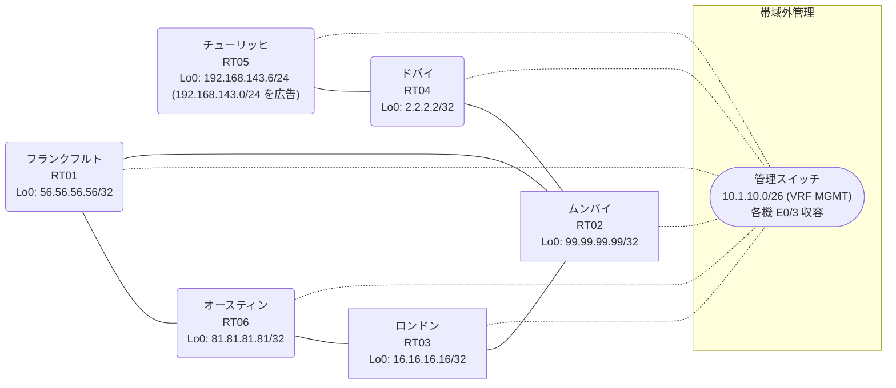

# 問題 20260830-005

> **本問は機器に接続せずに解答すること。追加の show 実行は認めない。**

## トポロジ

あなたの組織は、下記に示されているところのネットワークを運用しています。あなたの会社のネットワークは、OSPF のドメインと EIGRP のドメインとが、2 つの境界のルーターによって接続され、そして、それらは境界において接続されています。顧客のネットワーク `192.168.143.0/24` は、チューリッヒ のサイトにおいて、別のルーティング・プロトコルによって学習され、そして、再配送によって、社内へ持ち込まれています。ルーティングの設計の詳細は、示されているところのコンフィギュレーションから、読み取られることが、期待されています。



| 拠点 | ルータ | 拠点網 / 広告網 |
|------|--------|------------------|
| オースティン | RT06 | 81.81.81.81/32 |
| チューリッヒ | RT05 | 192.168.143.6/24 (`192.168.143.0/24` を広告) |
| ドバイ | RT04 | 2.2.2.2/32 |
| フランクフルト | RT01 | 56.56.56.56/32 |
| ムンバイ | RT02 | 99.99.99.99/32 |
| ロンドン | RT03 | 16.16.16.16/32 |

リンク一覧:
```
  RT06:E0/0(.1) ── RT01:E0/0(.2)   172.16.113.0/24
  RT06:E0/1(.1) ── RT03:E0/0(.3)   172.16.189.0/24
  RT01:E0/1(.2) ── RT02:E0/0(.4)   172.16.117.0/24
  RT03:E0/1(.3) ── RT02:E0/1(.4)   172.16.40.0/24
  RT02:E0/2(.4) ── RT04:E0/0(.5)   172.16.62.0/24
  RT04:E0/1(.5) ── RT05:E0/0(.6)   172.16.149.0/24
```

## 要件

1. すべてのサイトから、`192.168.143.0/24` を含むところのすべての宛先へ、到達することができること。
2. `192.168.143.0/24` 宛のパケットが、広告元である RT05 の方向へ転送され、そして、転送のループが存在していないこと。
3. 本作業は、日中の時間帯において実施されるという理由により、対象外であるところのデバイスに対する構成の変更は、許可されていません。
4. スタティック ルートおよび既定のルートによる迂回は、実施されることはできません。
5. 是正は、経路の出自に対するマーキングによって、実装される必要があります。
6. 既存の相互再配送の設計が、削除または停止されることはできません。

## 現在の状態

いくつかの宛先への通信について、報告が上がっています。あなたは、示されているところの出力および構成に基づいて、その構成が、下記において記述されているとおりに動作していない理由を、判断する必要があります。

```
RT06# show ip route
Gateway of last resort is not set
      2.0.0.0/32 is subnetted, 1 subnets
O E2     2.2.2.2 [110/20] via 172.16.189.3, 00:07:50, Ethernet0/1
                 [110/20] via 172.16.113.2, 00:07:50, Ethernet0/0
      16.0.0.0/32 is subnetted, 1 subnets
O        16.16.16.16 [110/11] via 172.16.189.3, 00:07:50, Ethernet0/1
      56.0.0.0/32 is subnetted, 1 subnets
O        56.56.56.56 [110/11] via 172.16.113.2, 00:07:50, Ethernet0/0
      81.0.0.0/32 is subnetted, 1 subnets
C        81.81.81.81 is directly connected, Loopback0
      99.0.0.0/32 is subnetted, 1 subnets
O E2     99.99.99.99 [110/20] via 172.16.189.3, 00:07:50, Ethernet0/1
                     [110/20] via 172.16.113.2, 00:07:50, Ethernet0/0
      172.16.0.0/16 is variably subnetted, 8 subnets, 2 masks
O E2     172.16.40.0/24 [110/20] via 172.16.189.3, 00:07:50, Ethernet0/1
                        [110/20] via 172.16.113.2, 00:07:50, Ethernet0/0
O E2     172.16.62.0/24 [110/20] via 172.16.189.3, 00:07:50, Ethernet0/1
                        [110/20] via 172.16.113.2, 00:07:50, Ethernet0/0
C        172.16.113.0/24 is directly connected, Ethernet0/0
L        172.16.113.1/32 is directly connected, Ethernet0/0
O E2     172.16.117.0/24 [110/20] via 172.16.189.3, 00:07:50, Ethernet0/1
                         [110/20] via 172.16.113.2, 00:07:50, Ethernet0/0
O E2     172.16.149.0/24 [110/20] via 172.16.189.3, 00:07:50, Ethernet0/1
                         [110/20] via 172.16.113.2, 00:07:50, Ethernet0/0
C        172.16.189.0/24 is directly connected, Ethernet0/1
L        172.16.189.1/32 is directly connected, Ethernet0/1
O E2  192.168.143.0/24 [110/20] via 172.16.189.3, 00:07:50, Ethernet0/1
```
```
RT02# show ip protocols | include Routing Protocol|Distance
Routing Protocol is "application"
    Gateway         Distance      Last Update
  Distance: (default is 4)
Routing Protocol is "eigrp 71"
      Distance: internal 90 external 170
    Gateway         Distance      Last Update
  Distance: internal 90 external 170
```
```
RT02# show ip eigrp topology 192.168.143.0 255.255.255.0
EIGRP-IPv4 Topology Entry for AS(71)/ID(99.99.99.99) for 192.168.143.0/24
  State is Passive, Query origin flag is 1, 1 Successor(s), FD is 281856
  Descriptor Blocks:
  172.16.117.2 (Ethernet0/0), from 172.16.117.2, Send flag is 0x0
      Composite metric is (281856/2816), route is External
      Vector metric:
        Minimum bandwidth is 10000 Kbit
        Total delay is 1010 microseconds
        Reliability is 255/255
        Load is 1/255
        Minimum MTU is 1500
        Hop count is 1
        Originating router is 56.56.56.56
      External data:
        AS number of route is 83
        External protocol is OSPF, external metric is 20
        Administrator tag is 0 (0x00000000)
  172.16.62.5 (Ethernet0/2), from 172.16.62.5, Send flag is 0x0
      Composite metric is (307456/281856), route is External
      Vector metric:
        Minimum bandwidth is 10000 Kbit
        Total delay is 2010 microseconds
        Reliability is 255/255
        Load is 1/255
        Minimum MTU is 1500
        Hop count is 2
        Originating router is 192.168.143.6
      External data:
        AS number of route is 0
        External protocol is RIP, external metric is 0
        Administrator tag is 0 (0x00000000)
```
```
RT02# show ip route
Gateway of last resort is not set
      2.0.0.0/32 is subnetted, 1 subnets
D        2.2.2.2 [90/409600] via 172.16.62.5, 00:07:56, Ethernet0/2
      16.0.0.0/32 is subnetted, 1 subnets
D EX     16.16.16.16 [170/281856] via 172.16.117.2, 00:07:08, Ethernet0/0
                     [170/281856] via 172.16.40.3, 00:07:08, Ethernet0/1
      56.0.0.0/32 is subnetted, 1 subnets
D EX     56.56.56.56 [170/281856] via 172.16.117.2, 00:07:08, Ethernet0/0
                     [170/281856] via 172.16.40.3, 00:07:08, Ethernet0/1
      81.0.0.0/32 is subnetted, 1 subnets
D EX     81.81.81.81 [170/281856] via 172.16.117.2, 00:07:12, Ethernet0/0
                     [170/281856] via 172.16.40.3, 00:07:12, Ethernet0/1
      99.0.0.0/32 is subnetted, 1 subnets
C        99.99.99.99 is directly connected, Loopback0
      172.16.0.0/16 is variably subnetted, 9 subnets, 2 masks
C        172.16.40.0/24 is directly connected, Ethernet0/1
L        172.16.40.4/32 is directly connected, Ethernet0/1
C        172.16.62.0/24 is directly connected, Ethernet0/2
L        172.16.62.4/32 is directly connected, Ethernet0/2
D EX     172.16.113.0/24 [170/281856] via 172.16.117.2, 00:07:12, Ethernet0/0
                         [170/281856] via 172.16.40.3, 00:07:12, Ethernet0/1
C        172.16.117.0/24 is directly connected, Ethernet0/0
L        172.16.117.4/32 is directly connected, Ethernet0/0
D        172.16.149.0/24 [90/307200] via 172.16.62.5, 00:07:56, Ethernet0/2
D EX     172.16.189.0/24 [170/281856] via 172.16.117.2, 00:07:12, Ethernet0/0
                         [170/281856] via 172.16.40.3, 00:07:12, Ethernet0/1
D EX  192.168.143.0/24 [170/281856] via 172.16.117.2, 00:07:08, Ethernet0/0
```
```
RT06# traceroute 192.168.143.6 probe 1 timeout 1 ttl 1 8
Type escape sequence to abort.
Tracing the route to 192.168.143.6
VRF info: (vrf in name/id, vrf out name/id)
  1 172.16.189.3 1 msec
  2 172.16.40.4 1 msec
  3 172.16.117.2 1 msec
  4 172.16.113.1 1 msec
  5 172.16.189.3 2 msec
  6 172.16.40.4 1 msec
  7 172.16.117.2 2 msec
  8 172.16.113.1 1 msec
```
```
RT04# show ip route
Gateway of last resort is not set
      2.0.0.0/32 is subnetted, 1 subnets
C        2.2.2.2 is directly connected, Loopback0
      16.0.0.0/32 is subnetted, 1 subnets
D EX     16.16.16.16 [170/307456] via 172.16.62.4, 00:08:07, Ethernet0/0
      56.0.0.0/32 is subnetted, 1 subnets
D EX     56.56.56.56 [170/307456] via 172.16.62.4, 00:07:25, Ethernet0/0
      81.0.0.0/32 is subnetted, 1 subnets
D EX     81.81.81.81 [170/307456] via 172.16.62.4, 00:07:30, Ethernet0/0
      99.0.0.0/32 is subnetted, 1 subnets
D        99.99.99.99 [90/409600] via 172.16.62.4, 00:08:19, Ethernet0/0
      172.16.0.0/16 is variably subnetted, 8 subnets, 2 masks
D        172.16.40.0/24 [90/307200] via 172.16.62.4, 00:08:19, Ethernet0/0
C        172.16.62.0/24 is directly connected, Ethernet0/0
L        172.16.62.5/32 is directly connected, Ethernet0/0
D EX     172.16.113.0/24 [170/307456] via 172.16.62.4, 00:07:30, Ethernet0/0
D        172.16.117.0/24 [90/307200] via 172.16.62.4, 00:08:19, Ethernet0/0
C        172.16.149.0/24 is directly connected, Ethernet0/1
L        172.16.149.5/32 is directly connected, Ethernet0/1
D EX     172.16.189.0/24 [170/307456] via 172.16.62.4, 00:08:07, Ethernet0/0
D EX  192.168.143.0/24 [170/281856] via 172.16.149.6, 00:07:25, Ethernet0/1
```

## 設定抜粋

```
RT06# show running-config | section router
router ospf 83
 router-id 81.81.81.81
 network 81.81.81.81 0.0.0.0 area 0
 network 172.16.113.0 0.0.0.255 area 0
 network 172.16.189.0 0.0.0.255 area 0
```
```
RT01# show running-config | section router
router eigrp 71
 network 172.16.117.0 0.0.0.255
 redistribute ospf 83 metric 1000000 1 255 1 1500
router ospf 83
 router-id 56.56.56.56
 redistribute eigrp 71
 network 56.56.56.56 0.0.0.0 area 0
 network 172.16.113.0 0.0.0.255 area 0
```
```
RT03# show running-config | section router
router eigrp 71
 network 172.16.40.0 0.0.0.255
 redistribute ospf 83 metric 1000000 1 255 1 1500
router ospf 83
 router-id 16.16.16.16
 redistribute eigrp 71
 network 16.16.16.16 0.0.0.0 area 0
 network 172.16.189.0 0.0.0.255 area 0
```
```
RT02# show running-config | section router
router eigrp 71
 network 99.99.99.99 0.0.0.0
 network 172.16.40.0 0.0.0.255
 network 172.16.62.0 0.0.0.255
 network 172.16.117.0 0.0.0.255
```
```
RT04# show running-config | section router
router eigrp 71
 network 2.2.2.2 0.0.0.0
 network 172.16.62.0 0.0.0.255
 network 172.16.149.0 0.0.0.255
```
```
RT05# show running-config | section router
router eigrp 71
 network 172.16.149.0 0.0.0.255
 redistribute rip metric 1000000 1 255 1 1500
router rip
 version 2
 network 192.168.143.0
 no auto-summary
```

## 設問

次のうち、正しいものは、どれですか。

## 選択肢
A. RT05 の router eigrp 71 配下の `redistribute rip` の seed metric をより小さい値へ変更する

B. RT01 と RT03 の両方で、OSPF→EIGRP 再配送で `set tag 233` を付与し、EIGRP→OSPF 再配送で `match tag 233` を deny する

C. RT01 と RT03 の両方で、EIGRP→OSPF 再配送で `set tag 233` を付与し、OSPF→EIGRP 再配送で `match tag 233` を deny する

D. RT02 で `clear ip route *` を実行する

E. RT01 と RT03 の両方で、`PL-NO-FEEDBACK` に `192.168.143.0/24` を deny・他を permit で作成し、router eigrp 71 配下に `distribute-list prefix PL-NO-FEEDBACK out ospf 83` を適用する

F. RT01 でのみ、EIGRP→OSPF 再配送で `set tag 233` を付与し、OSPF→EIGRP 再配送で `match tag 233` を deny する

G. RT02 の router eigrp 71 配下に `distance eigrp 90 200` を設定する
