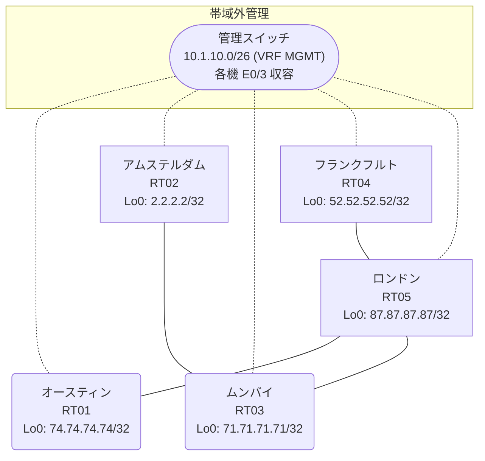

# 問題 20260831-001

> **本問は機器に接続せずに解答すること。追加の show 実行は認めない。**

## シナリオ

あなたは、下記のネットワークの保守を担当する技術者です。あなたの会社のネットワークは、複数のルーティング・ドメインが、境界のルーターによって接続され、そして、すべてのサイトのリーチアビリティが提供されている、というものです。ルーティングの設計の詳細は、示されているところのコンフィギュレーションから、読み取られることが、期待されています。各サイトのルーターと、サイトのネットワークとの対応は、下記の表に示されているとおりです。通信の一部において、想定されていない挙動が、観測されています。あなたは、提示されているところの情報のみを使用して、要求されている状態が満たされていない理由を、特定しなければなりません。EIGRP へ再配送される際の初期のメトリックは `100000 100 255 1 1500` とし、そして、それぞれの redistribute のステートメントに、直接に記述されなければなりません。再配送に対するフィルタの適用は、禁止されているところのものです。各サイトのネットワークは、ドメインをまたいで、すべてのサイトから、到達されることができること。管理のための構成に対して、変更が加えられてはなりません。スタティック ルートおよび既定のルートによる迂回は、実施されてはなりません。redistribute によって参照されるところのプロセス ID / AS 番号は、その境界に実在する隣接のドメインのものと一致させられ、そして、実在しないプロセスへの参照が、残置されてはなりません。



| 拠点 | ルータ | 拠点網 |
|------|--------|----------------------|
| アムステルダム | RT02 | `2.2.2.2/32` |
| オースティン | RT01 | `74.74.74.74/32` |
| フランクフルト | RT04 | `52.52.52.52/32` |
| ムンバイ | RT03 | `71.71.71.71/32` |
| ロンドン | RT05 | `87.87.87.87/32` |

リンク一覧:
```
  RT03:E0/0(.1) ── RT02:E0/0(.2)   10.120.188.0/30
  RT05:E0/0(.1) ── RT01:E0/0(.2)   10.64.200.0/30
  RT05:E0/1(.1) ── RT04:E0/0(.2)   10.204.170.0/30
  RT03:E0/1(.1) ── RT05:E0/2(.2)   10.122.244.0/30
```

## 出力

```
RT03# show ip prefix-list
ip prefix-list PL-BACKUP1: 2 entries
   seq 5 deny 71.71.71.71/32
   seq 10 permit 0.0.0.0/0 le 32
```
```
RT01# show ip route
Gateway of last resort is not set
      10.0.0.0/8 is variably subnetted, 4 subnets, 2 masks
C        10.64.200.0/30 is directly connected, Ethernet0/0
L        10.64.200.2/32 is directly connected, Ethernet0/0
D        10.122.244.0/30 [90/307200] via 10.64.200.1, 00:05:14, Ethernet0/0
D        10.204.170.0/30 [90/307200] via 10.64.200.1, 00:05:14, Ethernet0/0
      52.0.0.0/32 is subnetted, 1 subnets
D        52.52.52.52 [90/435200] via 10.64.200.1, 00:05:02, Ethernet0/0
      71.0.0.0/32 is subnetted, 1 subnets
D        71.71.71.71 [90/435200] via 10.64.200.1, 00:05:14, Ethernet0/0
      74.0.0.0/32 is subnetted, 1 subnets
C        74.74.74.74 is directly connected, Loopback0
      87.0.0.0/32 is subnetted, 1 subnets
D        87.87.87.87 [90/409600] via 10.64.200.1, 00:05:14, Ethernet0/0
```
```
RT02# show ip route
Gateway of last resort is not set
      2.0.0.0/32 is subnetted, 1 subnets
C        2.2.2.2 is directly connected, Loopback0
      10.0.0.0/8 is variably subnetted, 5 subnets, 2 masks
O E2     10.64.200.0/30 [110/20] via 10.120.188.1, 00:04:11, Ethernet0/0
C        10.120.188.0/30 is directly connected, Ethernet0/0
L        10.120.188.2/32 is directly connected, Ethernet0/0
O E2     10.122.244.0/30 [110/20] via 10.120.188.1, 00:04:11, Ethernet0/0
O E2     10.204.170.0/30 [110/20] via 10.120.188.1, 00:04:11, Ethernet0/0
      52.0.0.0/32 is subnetted, 1 subnets
O E2     52.52.52.52 [110/20] via 10.120.188.1, 00:04:11, Ethernet0/0
      71.0.0.0/32 is subnetted, 1 subnets
O        71.71.71.71 [110/11] via 10.120.188.1, 00:04:11, Ethernet0/0
      74.0.0.0/32 is subnetted, 1 subnets
O E2     74.74.74.74 [110/20] via 10.120.188.1, 00:04:11, Ethernet0/0
      87.0.0.0/32 is subnetted, 1 subnets
O E2     87.87.87.87 [110/20] via 10.120.188.1, 00:04:11, Ethernet0/0
```
```
RT03# show access-lists
Standard IP access list 66
    10 deny   71.71.71.71
    20 permit any
```
```
RT04# show running-config | section router
router eigrp 596
 network 10.204.170.0 0.0.0.3
 network 52.52.52.52 0.0.0.0
```
```
RT03# show route-map
route-map RM-BACKUP1, deny, sequence 10
  Match clauses:
    ip address prefix-lists: PL-BACKUP1 
  Set clauses:
  Policy routing matches: 0 packets, 0 bytes
route-map RM-BACKUP1, permit, sequence 20
  Match clauses:
  Set clauses:
  Policy routing matches: 0 packets, 0 bytes
```
```
RT05# show running-config | section router
router eigrp 596
 network 10.64.200.0 0.0.0.3
 network 10.122.244.0 0.0.0.3
 network 10.204.170.0 0.0.0.3
 network 87.87.87.87 0.0.0.0
```
```
RT05# show ip route
Gateway of last resort is not set
      10.0.0.0/8 is variably subnetted, 6 subnets, 2 masks
C        10.64.200.0/30 is directly connected, Ethernet0/0
L        10.64.200.1/32 is directly connected, Ethernet0/0
C        10.122.244.0/30 is directly connected, Ethernet0/2
L        10.122.244.2/32 is directly connected, Ethernet0/2
C        10.204.170.0/30 is directly connected, Ethernet0/1
L        10.204.170.1/32 is directly connected, Ethernet0/1
      52.0.0.0/32 is subnetted, 1 subnets
D        52.52.52.52 [90/409600] via 10.204.170.2, 00:04:25, Ethernet0/1
      71.0.0.0/32 is subnetted, 1 subnets
D        71.71.71.71 [90/409600] via 10.122.244.1, 00:04:37, Ethernet0/2
      74.0.0.0/32 is subnetted, 1 subnets
D        74.74.74.74 [90/409600] via 10.64.200.2, 00:04:34, Ethernet0/0
      87.0.0.0/32 is subnetted, 1 subnets
C        87.87.87.87 is directly connected, Loopback0
```
```
RT02# show running-config | section router
router ospf 85
 router-id 2.2.2.2
 timers throttle spf 50 200 5000
 passive-interface Loopback0
 network 2.2.2.2 0.0.0.0 area 0
 network 10.120.188.0 0.0.0.3 area 0
```
```
RT01# show running-config | section router
router eigrp 596
 network 10.64.200.0 0.0.0.3
 network 74.74.74.74 0.0.0.0
 passive-interface Loopback0
```
```
RT03# show running-config | section router
router eigrp 596
 network 10.122.244.0 0.0.0.3
 network 71.71.71.71 0.0.0.0
 redistribute ospf 92 match internal external 1 external 2 metric 100000 100 255 1 1500
router ospf 85
 router-id 71.71.71.71
 redistribute eigrp 596
 passive-interface Loopback0
 network 10.120.188.0 0.0.0.3 area 0
 network 71.71.71.71 0.0.0.0 area 0
```

## 設問

次のうち、正しいものは、どれですか。

## 選択肢
A. RT03 の route-map RM-BACKUP1 が対象の経路を拒否している

B. RT03 の router eigrp 596 配下に redistribute が設定されていない

C. RT05 の router eigrp 596 に Loopback0 の network 文が設定されていない

D. RT03 の redistribute に適用された route-map が特定の拠点網を deny している

E. RT03 の router eigrp 596 配下の redistribute が、実在しないプロセス/AS を参照している

F. RT03 と RT05 側ドメインの間のリンクで MTU が一致していない
