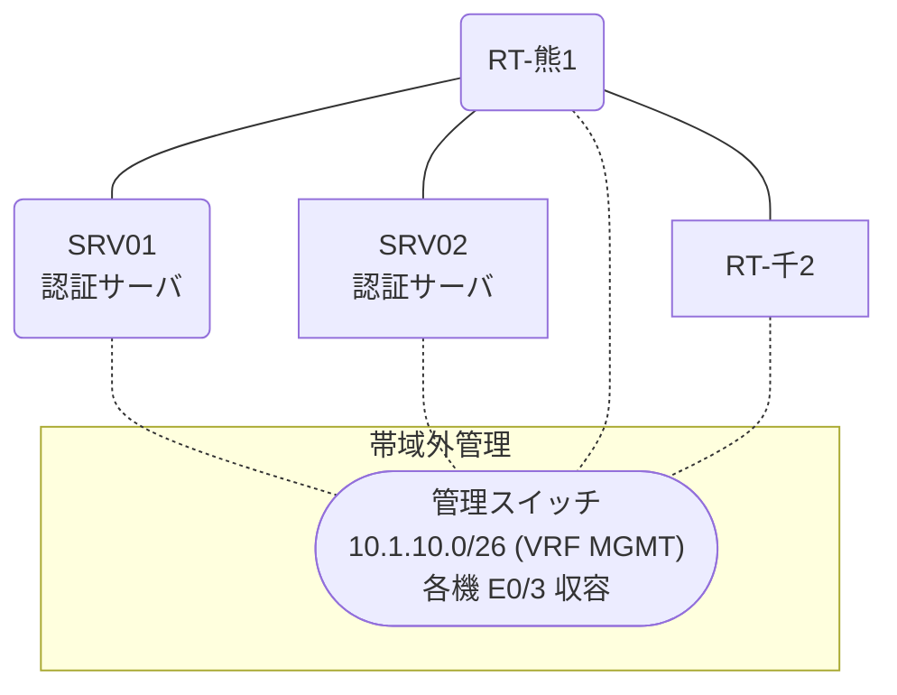

# 問題 20260831-002

> **本問は機器に接続せずに解答すること。追加の show 実行は認めない。**

## シナリオ

あなたの組織は、下記に示されているところのネットワークを運用しています。2 つの拠点のルータが、共通の認証サーバ群を用いて、管理者の認証を行うように構成されています。一方のルータはサーバと直結しており、他方はそのルーターを経由してサーバに到達します。通信の一部において、想定されていない挙動が、観測されています。示されているところの出力および構成に基づいて、要求されているところの動作が得られていない理由が、判断されなければなりません。熊本・千葉 の両拠点で、利用者 netadmin が権限レベル 15 で機器を操作できること。認証は認証サーバ群 NOC-RADIUS を用いること。既定の方式リストは変更しないこと。



### 認証サーバの仕様

| 項目 | SRV01 | SRV02 |
|---|---|---|
| アドレス | 10.99.8.2 | 10.99.9.2 |
| 待受ポート | 1812 / 1813 | 1645 / 1646 |
| 共有鍵 | Ccnp-Aaa-77 | Ccnp-Aaa-77 |
| 受理する送信元 | 10.5.0.1 ・ 10.5.0.2 | 同左 |
| 台帳 | netadmin(15) ・ monitor-op(1) ・ SUZUKI(15) | 同左 |
| 現在の稼働状態 | 保守作業のため停止中 | 稼働中 |

### ルータのアドレス

| ルータ | Loopback0 | 認証サーバ方向のインタフェース |
|---|---|---|
| RT-熊1(熊本) | 10.5.0.1 | Ethernet0/0 = 10.99.8.1 |
| RT-千2(千葉) | 10.5.0.2 | Ethernet0/0 = 10.54.12.2 |

## 出力

```
RT-熊1# show running-config | section aaa
aaa new-model
!
radius server RAD1
 address ipv4 10.99.8.2 auth-port 1812 acct-port 1813
 key Ccnp-Aaa-77
!
radius server RAD2
 address ipv4 10.99.9.2 auth-port 1645 acct-port 1646
 key Ccnp-Aaa-77
!
aaa group server radius NOC-RADIUS
 server name RAD1
 server name RAD2
 deadtime 5
!
aaa authentication login default group NOC-RADIUS local
aaa authentication login CONSOLE local
aaa authorization exec default group NOC-RADIUS local
aaa authorization exec CONSOLE local
aaa authorization console
!
ip radius source-interface Loopback0
radius-server timeout 2
radius-server retransmit 2
radius-server dead-criteria time 2 tries 1
!
username backup-adm privilege 15 secret 5 $1$xxxx
username SUZUKI privilege 15 secret 5 $1$yyyy
!
line con 0
 exec-timeout 0 0
 logging synchronous
 login authentication CONSOLE
 authorization exec CONSOLE
line vty 0 4
 exec-timeout 0 0
 transport input ssh
line vty 5 15
 exec-timeout 0 0
 transport input ssh
```
```
RT-千2# show running-config | section aaa
aaa new-model
!
radius server RAD1
 address ipv4 10.99.8.2 auth-port 1812 acct-port 1813
 key Ccnp-Aaa-77
!
radius server RAD2
 address ipv4 10.99.9.2 auth-port 1645 acct-port 1646
 key Ccnp-Aaa-77
!
aaa group server radius NOC-RADIUS
 server name RAD1
 server name RAD2
 deadtime 5
!
aaa authentication login default group NOC-RADIUS local
aaa authentication login CONSOLE local
aaa authorization exec CONSOLE local
aaa authorization console
!
ip radius source-interface Loopback0
radius-server timeout 2
radius-server retransmit 2
radius-server dead-criteria time 2 tries 1
!
username backup-adm privilege 15 secret 5 $1$xxxx
username SUZUKI privilege 15 secret 5 $1$yyyy
!
line con 0
 exec-timeout 0 0
 logging synchronous
 login authentication CONSOLE
 authorization exec CONSOLE
line vty 0 4
 exec-timeout 0 0
 transport input ssh
line vty 5 15
 exec-timeout 0 0
 transport input ssh
```

## 設問

次のうち、正しいものは、どれですか。

## 選択肢
**A.**
```
熊本: User authentication request was rejected by server. (1 回目 約 6 秒 / 2 回目以降 即時)
千葉: User authentication request was rejected by server. (1 回目 約 6 秒 / 2 回目以降 即時)
```
**B.**
```
熊本: User was successfully authenticated. (1 回目 約 6 秒 / 2 回目以降 即時)
千葉: No authoritative response from any server. (1 回目 約 12 秒 / 2 回目以降 即時)
```
**C.**
```
熊本: User was successfully authenticated. (1 回目 約 6 秒 / 2 回目以降 即時)
千葉: User was successfully authenticated. (1 回目 約 6 秒 / 2 回目以降 即時)
```
**D.**
```
熊本: User was successfully authenticated. (1 回目 約 6 秒 / 2 回目以降 即時)
千葉: User was successfully authenticated. (1 回目 約 6 秒 / 2 回目以降 約 6 秒)
```
