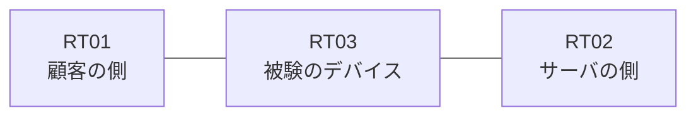

# 問題 20260831-003

> **本問は機器に接続せずに解答すること。追加の show 実行は認めない。**

## シナリオ

あなたは、下記のネットワークの保守を担当する技術者です。ある企業のネットワークにおいて、RT03 は、顧客の側のネットワークと、サーバの側のネットワークとの間に配置されており、IPv6 によって運用されています。ルーティング・プロトコルの種別およびプロセスの配置は、変更されることはできません。RT03 において、`2001:DB8:EE:30::/64`、`2001:DB8:EE:31::/64`、`2001:DB8:EE:32::/64` のネットワークからの通信のみが、`2001:DB8:EE:FF::10` の TCP ポート 22 に到達できなければなりません。`2001:DB8:EE:35::/64` からの通信は、許可されることはできません。拒否のエントリを使用してはなりません。




## 設問

次のうち、正しいものは、どれですか。

## 選択肢
**A.**
```
sequence 10 deny ipv6 2001:DB8:EE:33::/64 any
sequence 20 permit ipv6 2001:DB8:EE:30::/62 any
```

**B.**
```
sequence 10 permit ipv6 2001:DB8:EE:30::/62 0.0.3.255 any
```

**C.**
```
sequence 10 permit ipv6 2001:DB8:EE:30::/62 any
```

**D.**
```
sequence 10 permit ipv6 2001:DB8:EE:30::/64 any
sequence 20 permit ipv6 2001:DB8:EE:31::/64 any
sequence 30 permit ipv6 2001:DB8:EE:32::/64 any
```

**E.**
```
sequence 10 permit ipv6 2001:DB8:EE:30::/63 any
```

**F.**
```
sequence 10 permit ipv6 2001:DB8:EE:30::/61 any
```
