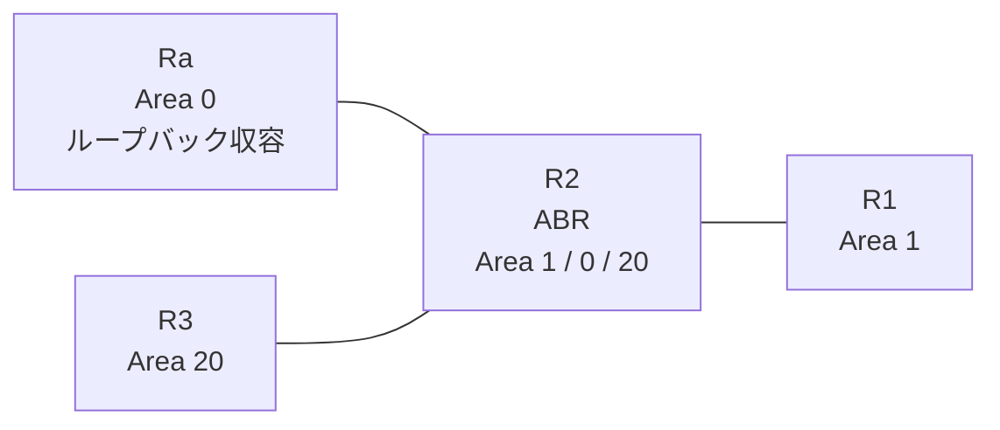

# 問題 20260831-005

> **本問は機器に接続せずに解答すること。追加の show 実行は認めない。**

## シナリオ

あなたの組織は、下記に示されているところのネットワークを運用しています。拠点の集約ルータ Ra は、サービスのためのプレフィックスを、4つのループバック インターフェイスによって収容しています。R2 は、エリア 1・エリア 0・エリア 20 を接続するところの ABR であり、そして、すべてのルータにおいて、OSPFv3 のプロセス 100 が構成されています。ユーザーから、通信に関する事象が、報告されています。あなたは、提示されているところの情報のみを使用して、要求されている状態が満たされていない理由を、特定しなければなりません。この制御は、エリア 1 に今後追加されるところの、いかなるルータに対しても、等しく適用される必要があります。エリア 20 においては、2001:DB8:A:A::/64 を除くいかなるルートの受信にも、影響が及んではなりません。スタティック ルートおよび既定のルートによる迂回は、実施されてはなりません。エリア 1 へ配布されるループバック由来のエリア間のルートは、2001:DB8:A:A::/64 および 2001:DB8:B:B::/64 に限定される必要があります。リンクのネットワークのルートは、引き続き受信される必要があります。ただし、2001:DB8:A:A::/64 のルートは、障害の対応という理由により、**すべてのエリアにおいて**、一時的に停止されなければなりません。



| 区間 | インターフェイス | ネットワーク | エリア |
|------|------------------|--------------|--------|
| R1 ⇔ R2 | E0/0 | 2001:DB8:6:E::/64 | 1 |
| R2 ⇔ Ra | E0/1 | 2001:DB8:2:8::/64 | 0 |
| R2 ⇔ R3 | E0/2 | 2001:DB8:1:A::/64 | 20 |

- R1 の E0/0 セカンダリ: 2001:DB8:6:7::/64（Area 1）
- Ra のループバック: 2001:DB8:A:A::/64, 2001:DB8:B:B::/64, 2001:DB8:C:C::/64, 2001:DB8:D:D::/64（Area 0）

## 出力

```
R2# show running-config
Building configuration...
!
interface Ethernet0/0
 no ip address
 ipv6 address 2001:DB8:6:E::2/64
 ipv6 enable
 ipv6 ospf 100 area 1
!
interface Ethernet0/1
 no ip address
 ipv6 address 2001:DB8:2:8::2/64
 ipv6 enable
 ipv6 ospf 100 area 0
!
interface Ethernet0/2
 no ip address
 ipv6 address 2001:DB8:1:A::2/64
 ipv6 enable
 ipv6 ospf 100 area 20
!
router ospfv3 100
 router-id 2.2.2.2
 !
 address-family ipv6 unicast
  area 0 filter-list prefix PL-STOP out
  area 1 filter-list prefix PL10 in
 exit-address-family
!
ipv6 prefix-list PL-CORE seq 5 permit 2001:DB8:8::/45 le 64
!
ipv6 prefix-list PL-LO seq 5 permit 2001:DB8:A:A::/64
!
ipv6 prefix-list PL-STOP seq 5 deny 2001:DB8:A:A::/64
ipv6 prefix-list PL-STOP seq 10 permit ::/0 le 128
!
ipv6 prefix-list PL10 seq 5 permit 2001:DB8:A::/47 le 63
ipv6 prefix-list PL10 seq 10 permit 2001:DB8:2:8::/64
ipv6 prefix-list PL10 seq 15 permit 2001:DB8:1:A::/64
!
```

## 設問

次のうち、正しいものは、どれですか。

## 選択肢
**A.**
```
R1# show ipv6 route ospf | include ^O|via
OI  2001:DB8:1:A::/64 [110/20]
     via FE80::A8BB:CCFF:FE01:2D00, Ethernet0/0
OI  2001:DB8:2:8::/64 [110/20]
     via FE80::A8BB:CCFF:FE01:2D00, Ethernet0/0
OI  2001:DB8:B:B::/64 [110/21]
     via FE80::A8BB:CCFF:FE01:2D00, Ethernet0/0
OI  2001:DB8:C:C::/64 [110/21]
     via FE80::A8BB:CCFF:FE01:2D00, Ethernet0/0
OI  2001:DB8:D:D::/64 [110/21]
     via FE80::A8BB:CCFF:FE01:2D00, Ethernet0/0
```
**B.**
```
R1# show ipv6 route ospf | include ^O|via
OI  2001:DB8:1:A::/64 [110/20]
     via FE80::A8BB:CCFF:FE01:2D00, Ethernet0/0
OI  2001:DB8:2:8::/64 [110/20]
     via FE80::A8BB:CCFF:FE01:2D00, Ethernet0/0
OI  2001:DB8:A:A::/64 [110/21]
     via FE80::A8BB:CCFF:FE01:2D00, Ethernet0/0
OI  2001:DB8:B:B::/64 [110/21]
     via FE80::A8BB:CCFF:FE01:2D00, Ethernet0/0
OI  2001:DB8:C:C::/64 [110/21]
     via FE80::A8BB:CCFF:FE01:2D00, Ethernet0/0
OI  2001:DB8:D:D::/64 [110/21]
     via FE80::A8BB:CCFF:FE01:2D00, Ethernet0/0
```
**C.**
```
R1# show ipv6 route ospf | include ^O|via
OI  2001:DB8:1:A::/64 [110/20]
     via FE80::A8BB:CCFF:FE01:2D00, Ethernet0/0
OI  2001:DB8:2:8::/64 [110/20]
     via FE80::A8BB:CCFF:FE01:2D00, Ethernet0/0
```
**D.**
```
R1# show ipv6 route ospf | include ^O|via
OI  2001:DB8:1:A::/64 [110/20]
     via FE80::A8BB:CCFF:FE01:2D00, Ethernet0/0
OI  2001:DB8:2:8::/64 [110/20]
     via FE80::A8BB:CCFF:FE01:2D00, Ethernet0/0
OI  2001:DB8:B:B::/64 [110/21]
     via FE80::A8BB:CCFF:FE01:2D00, Ethernet0/0
```
