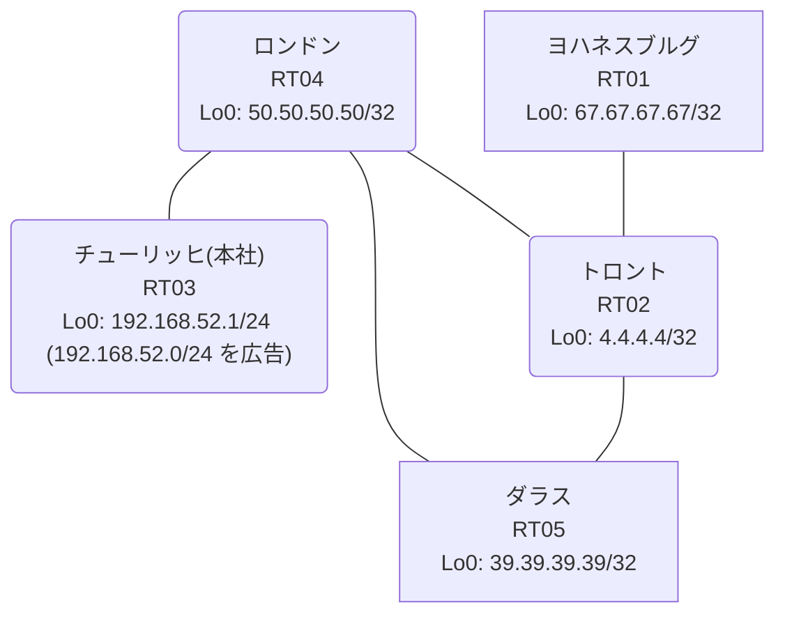

# 問題 20260831-006

> **本問は機器に接続せずに解答すること。追加の show 実行は認めない。**

## トポロジ

あなたは、ネットワークの運用を担当しています。本社の顧客のネットワークは、BGP AS 65309 の RT03 によって、広告されています。あなたの会社の内部は、BGP / EIGRP / OSPF という 3 つのドメインから構成されています。サイトと、ルーターおよびアドレスとの対応は、下記の表に示されているとおりです。



| 拠点 | ルータ | 拠点網 / 広告網 |
|------|--------|------------------|
| ダラス | RT05 | 39.39.39.39/32 |
| チューリッヒ(本社) | RT03 | 192.168.52.1/24 (`192.168.52.0/24` を広告) |
| トロント | RT02 | 4.4.4.4/32 |
| ヨハネスブルグ | RT01 | 67.67.67.67/32 |
| ロンドン | RT04 | 50.50.50.50/32 |

リンク一覧:
```
  RT03:E0/0(.1) ── RT04:E0/0(.2)   10.197.13.0/30
  RT04:E0/1(.1) ── RT02:E0/0(.2)   10.124.24.0/30
  RT04:E0/2(.1) ── RT05:E0/0(.2)   10.81.174.0/30
  RT02:E0/1(.1) ── RT05:E0/1(.2)   10.67.252.0/30
  RT02:E0/2(.1) ── RT01:E0/0(.2)   10.34.130.0/30
```

## 要件

1. 本作業は、日中の時間帯において実施されるという理由により、対象外であるところのデバイスに対する構成の変更は、許可されていません。
2. `192.168.52.0/24` 宛のトラフィックが RT03 へ配送され、経路の周回が、発生していないこと。
3. それぞれのドメインの間の再配送の設計は、維持される必要があります。
4. 経路の遮断は、当該の経路の出自に基づいて、実施されなければなりません。
5. 顧客のネットワーク `192.168.52.0/24` を含むすべての宛先への到達可能性が、すべてのサイトにおいて、確保されていること。
6. 管理距離の変更は、監査のポリシーによって、禁止されているところのものです。

## 現在の状態

いくつかの宛先への通信について、報告が上がっています。あなたは、示されているところの出力および構成に基づいて、その構成が、下記において記述されているとおりに動作していない理由を、判断する必要があります。

```
RT04# show ip route
Gateway of last resort is not set
      4.0.0.0/32 is subnetted, 1 subnets
O        4.4.4.4 [110/21] via 10.81.174.2, 00:03:49, Ethernet0/2
      10.0.0.0/8 is variably subnetted, 8 subnets, 2 masks
O        10.34.130.0/30 [110/30] via 10.81.174.2, 00:03:49, Ethernet0/2
O        10.67.252.0/30 [110/20] via 10.81.174.2, 00:03:49, Ethernet0/2
C        10.81.174.0/30 is directly connected, Ethernet0/2
L        10.81.174.1/32 is directly connected, Ethernet0/2
C        10.124.24.0/30 is directly connected, Ethernet0/1
L        10.124.24.1/32 is directly connected, Ethernet0/1
C        10.197.13.0/30 is directly connected, Ethernet0/0
L        10.197.13.2/32 is directly connected, Ethernet0/0
      39.0.0.0/32 is subnetted, 1 subnets
O        39.39.39.39 [110/11] via 10.81.174.2, 00:03:49, Ethernet0/2
      50.0.0.0/32 is subnetted, 1 subnets
C        50.50.50.50 is directly connected, Loopback0
      67.0.0.0/32 is subnetted, 1 subnets
O        67.67.67.67 [110/31] via 10.81.174.2, 00:03:49, Ethernet0/2
D EX  192.168.52.0/24 [170/307200] via 10.124.24.2, 00:03:46, Ethernet0/1
```
```
RT04# show route-map
route-map RM-BACKUP1, deny, sequence 10
  Match clauses:
    ip address prefix-lists: PL-BACKUP1 
  Set clauses:
  Policy routing matches: 0 packets, 0 bytes
route-map RM-BACKUP1, permit, sequence 20
  Match clauses:
  Set clauses:
  Policy routing matches: 0 packets, 0 bytes
```
```
RT04# show ip prefix-list
ip prefix-list PL-BACKUP1: 2 entries
   seq 5 deny 67.67.67.67/32
   seq 10 permit 0.0.0.0/0 le 32
```
```
RT04# show access-lists
Standard IP access list 80
    10 deny   67.67.67.67
    20 permit any
```
```
RT04# show ip bgp
BGP table version is 10, local router ID is 50.50.50.50
Status codes: s suppressed, d damped, h history, * valid, > best, i - internal, 
              r RIB-failure, S Stale, m multipath, b backup-path, f RT-Filter, 
              x best-external, a additional-path, c RIB-compressed, 
              t secondary path, L long-lived-stale,
Origin codes: i - IGP, e - EGP, ? - incomplete
RPKI validation codes: V valid, I invalid, N Not found

     Network          Next Hop            Metric LocPrf Weight Path
 *>   4.4.4.4/32       10.81.174.2             21         32768 ?
 *>   10.34.130.0/30   10.81.174.2             30         32768 ?
 *>   10.67.252.0/30   10.81.174.2             20         32768 ?
 *>   10.81.174.0/30   0.0.0.0                  0         32768 ?
 *>   39.39.39.39/32   10.81.174.2             11         32768 ?
 *>   50.50.50.50/32   0.0.0.0                  0         32768 i
 *>   67.67.67.67/32   10.81.174.2             31         32768 ?
 r>i  192.168.52.0     10.197.13.1              0    100      0 i
```
```
RT04# show ip protocols | include Routing Protocol|Distance
Routing Protocol is "application"
    Gateway         Distance      Last Update
  Distance: (default is 4)
Routing Protocol is "eigrp 170"
      Distance: internal 90 external 170
    Gateway         Distance      Last Update
  Distance: internal 90 external 170
Routing Protocol is "ospf 78"
    Gateway         Distance      Last Update
  Distance: (default is 110)
Routing Protocol is "bgp 65309"
    Gateway         Distance      Last Update
  Distance: external 20 internal 200 local 200
```
```
RT01# traceroute 192.168.52.1 probe 1 timeout 1 ttl 1 8
Type escape sequence to abort.
Tracing the route to 192.168.52.1
VRF info: (vrf in name/id, vrf out name/id)
  1 10.34.130.1 1 msec
  2 10.67.252.2 2 msec
  3 10.81.174.1 2 msec
  4 10.124.24.2 1 msec
  5 10.67.252.2 11 msec
  6 10.81.174.1 2 msec
  7 10.124.24.2 3 msec
  8 10.67.252.2 3 msec
```

## 設定抜粋

```
RT04# show running-config | section router
router eigrp 170
 timers active-time 5
 network 10.124.24.0 0.0.0.3
 passive-interface Loopback0
router ospf 78
 router-id 50.50.50.50
 redistribute eigrp 170
 redistribute bgp 65309
 network 10.81.174.0 0.0.0.3 area 0
 network 50.50.50.50 0.0.0.0 area 0
router bgp 65309
 bgp router-id 50.50.50.50
 bgp log-neighbor-changes
 bgp redistribute-internal
 network 50.50.50.50 mask 255.255.255.255
 redistribute ospf 78
 neighbor 10.197.13.1 remote-as 65309
```
```
RT02# show running-config | section router
router eigrp 170
 network 10.124.24.0 0.0.0.3
 redistribute ospf 78 metric 100000 100 255 1 1500
router ospf 78
 router-id 4.4.4.4
 redistribute eigrp 170
 network 4.4.4.4 0.0.0.0 area 0
 network 10.34.130.0 0.0.0.3 area 0
 network 10.67.252.0 0.0.0.3 area 0
```
```
RT05# show running-config | section router
router ospf 78
 router-id 39.39.39.39
 passive-interface Loopback0
 network 10.67.252.0 0.0.0.3 area 0
 network 10.81.174.0 0.0.0.3 area 0
 network 39.39.39.39 0.0.0.0 area 0
```
```
RT03# show running-config | section router
router bgp 65309
 bgp router-id 192.168.52.1
 bgp log-neighbor-changes
 network 192.168.52.0
 neighbor 10.197.13.2 remote-as 65309
```

## 設問

次のうち、正しいものは、どれですか。

## 選択肢
**A.**
```
route-map RM-ORIGIN permit 10
 set tag 65309
router ospf 78
 redistribute bgp 65309 route-map RM-ORIGIN
```

**B.**
```
! RT04
route-map RM-ORIGIN permit 10
 set tag 65309
router ospf 78
 redistribute bgp 65309 route-map RM-ORIGIN
! RT02
route-map RM-NOBACK deny 10
 match tag 65309
route-map RM-NOBACK permit 20
router eigrp 170
 redistribute ospf 78 route-map RM-NOBACK
```

**C.**
```
! RT02 側で両方向の redistribute に deny route-map を適用
route-map RM-BLK deny 10
 match ip address prefix-list PL-BLK
route-map RM-BLK permit 20
```

**D.**
```
router bgp 65309
 no bgp redistribute-internal
```

**E.**
```
ip prefix-list PL-BLOCK seq 5 deny 192.168.52.0/24
ip prefix-list PL-BLOCK seq 10 permit 0.0.0.0/0 le 32
router eigrp 170
 distribute-list prefix PL-BLOCK in
```

**F.**
```
router bgp 65309
 distance bgp 20 165 165
end
clear ip route *
```

**G.**
```
! RT02
route-map RM-MARK permit 10
 set tag 65309
router eigrp 170
 redistribute ospf 78 route-map RM-MARK
! RT04
route-map RM-DROP deny 10
 match tag 65309
route-map RM-DROP permit 20
router ospf 78
 redistribute bgp 65309 route-map RM-DROP
```
