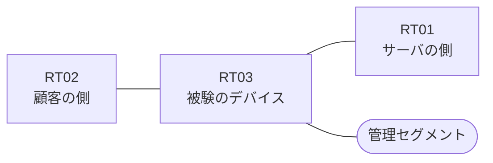

# 問題 20260831-008

> **本問は機器に接続せずに解答すること。追加の show 実行は認めない。**

## シナリオ

あなたは、下記のネットワークの保守を担当する技術者です。ある企業のネットワークにおいて、RT03 は、顧客の側のネットワークと、サーバの側のネットワークとの間に、配置されています。いくつかの宛先への通信について、報告が上がっています。あなたは、示されているところの出力および構成に基づいて、その構成が、下記において記述されているとおりに動作していない理由を、判断する必要があります。管理のための構成に対して、変更が加えられてはなりません。示されているところのアクセス・リストの適用は、変更されることはできません。サーバの側のネットワークから、顧客の側のネットワークへ**新たに開始される**通信は、許可されてはなりません。RT03 において、`10.174.96.0/24`、`10.174.97.0/24`、`10.174.98.0/24`、`10.174.99.0/24`、`10.174.100.0/24`、`10.174.101.0/24`、`10.174.102.0/24` のネットワークから、サーバである `172.17.39.26` の TCP ポート 3389 への通信は、セッションを確立できなければなりません。顧客の側のインターフェイスである `Ethernet0/0` と、サーバの側のインターフェイスである `Ethernet0/1` の双方において、着信の方向にアクセス・リストが適用されています。



| 区間 | 被験デバイス側のインターフェイス | ネットワーク |
|------|----------------------------------|--------------|
| RT02（顧客の側） ⇔ RT03 | `Ethernet0/0` | 10.174.253.0/24 |
| RT03 ⇔ RT01（サーバの側） | `Ethernet0/1` | 10.174.254.0/24 |
| RT03 ⇔ 管理セグメント | `Ethernet0/2` | 10.174.255.0/24 |

## 出力

観測 | TCP セッション
--- | ---
送信元が 10.174.96.0/24 のネットワークにあるホストから、172.17.39.26 の TCP ポート 3389 宛ての通信 | 確立できる
送信元が 10.174.97.0/24 のネットワークにあるホストから、172.17.39.26 の TCP ポート 3389 宛ての通信 | 確立できる
送信元が 10.174.98.0/24 のネットワークにあるホストから、172.17.39.26 の TCP ポート 3389 宛ての通信 | 確立できない
送信元が 10.174.99.0/24 のネットワークにあるホストから、172.17.39.26 の TCP ポート 3389 宛ての通信 | 確立できない
送信元が 10.174.100.0/24 のネットワークにあるホストから、172.17.39.26 の TCP ポート 3389 宛ての通信 | 確立できない
送信元が 10.174.101.0/24 のネットワークにあるホストから、172.17.39.26 の TCP ポート 3389 宛ての通信 | 確立できない
送信元が 10.174.102.0/24 のネットワークにあるホストから、172.17.39.26 の TCP ポート 3389 宛ての通信 | 確立できない
送信元が 10.174.103.0/24 のネットワークにあるホストから、172.17.39.26 の TCP ポート 3389 宛ての通信 | 確立できない
送信元が 10.174.105.0/24 のネットワークにあるホストから、172.17.39.26 の TCP ポート 3389 宛ての通信 | 確立できない
送信元が 10.174.250.0/24 のネットワークにあるホストから、172.17.39.26 の TCP ポート 3389 宛ての通信 | 確立できない
送信元が 10.174.96.0/24 のネットワークにあるホストから、172.17.39.26 の TCP ポート 25 宛ての通信 | 確立できない
送信元が 10.174.96.0/24 のネットワークにあるホストから、172.17.39.109 の TCP ポート 3389 宛ての通信 | 確立できない

```
RT03# show ip access-lists
Extended IP access list 150
    10 permit tcp 10.174.96.0 0.0.0.255 host 172.17.39.26 eq 3389
    20 permit tcp 10.174.97.0 0.0.0.255 host 172.17.39.26 eq 3389
    30 permit tcp 10.174.98.0 0.0.0.255 host 172.17.39.26 eq 3389
    40 permit tcp 10.174.99.0 0.0.0.255 host 172.17.39.26 eq 3389
    50 permit tcp 10.174.100.0 0.0.0.255 host 172.17.39.26 eq 3389
    60 permit tcp 10.174.101.0 0.0.0.255 host 172.17.39.26 eq 3389
    70 permit tcp 10.174.102.0 0.0.0.255 host 172.17.39.26 eq 3389
Extended IP access list 120
    10 permit tcp host 172.17.39.26 eq 3389 10.174.96.0 0.0.1.255 established
```
```
RT03# show running-config | section ^interface
interface Ethernet0/0
 description === to RT02 ===
 ip address 10.174.253.1 255.255.255.0
 ip access-group 150 in
interface Ethernet0/1
 description === to RT01 ===
 ip address 10.174.254.1 255.255.255.0
 ip access-group 120 in
interface Ethernet0/2
 description === management ===
 ip address 10.174.255.1 255.255.255.0
```

## 設問

次のうち、正しいものは、どれですか。

## 選択肢
A. インターフェイスが管理上シャットダウンされている

B. 戻りの通信を許可するアクセス・リストに、established のキーワードを伴うエントリが存在しない

C. 戻りの通信を許可するアクセス・リストの範囲が、対象としているネットワークの一部しか含んでいない

D. ルーティング・プロトコルの隣接関係が確立されていない

E. 宛先として any が指定されているため、当該のサーバ以外への通信までが許可されている

F. アクセス・リストが、顧客の側ではなくサーバの側のインターフェイスに、着信の方向で適用されている
