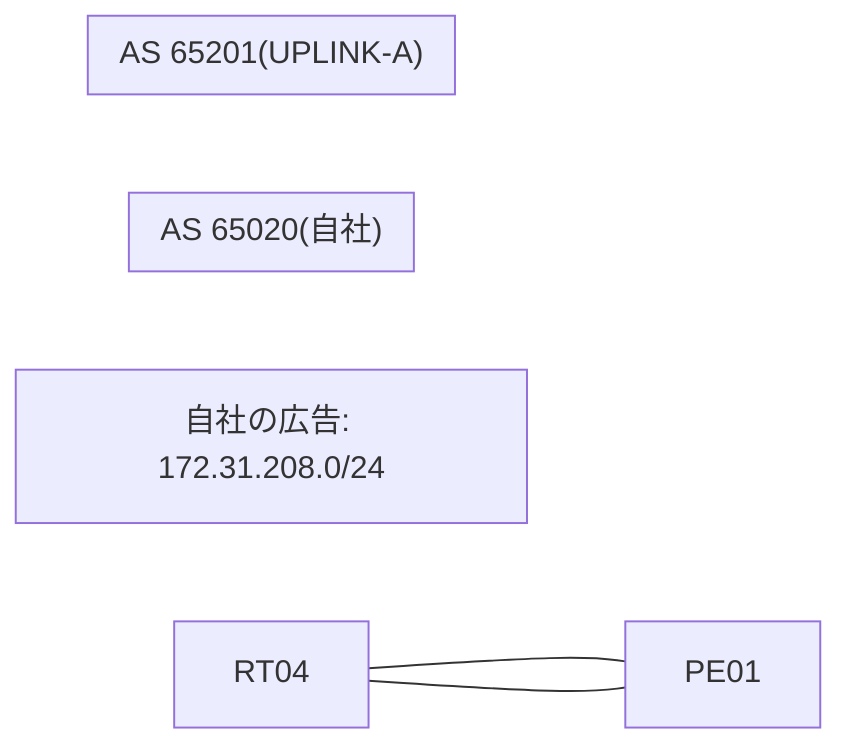

# 問題 20260831-009

> **本問は機器に接続せずに解答すること。追加の show 実行は認めない。**

## トポロジ

あなたの組織は、下記に示されているところのネットワークを運用しています。自社のルータ RT04 は、外部のネットワーク 172.29.40.0/24 への到達性を、複数の経路を通じて、確立しています。 UPLINK-A とは、2 本のリンクで、接続されています。 自社は、172.31.208.0/24 を、両方のリンクを通じて、広告しています。



## 要件

1. 示されているところの出力、および、構成に基づいて、判断すること。
2. なお、機器の構成は、示されている抜粋のほかは、既定値である。

## 現在の状態

運用チームは、戻りのトラフィックを 10.24.13.3 側のリンクへ移すことを意図して、示されているところの MED を、設定しました。対向 AS の機器において、値が受信されていることは、確認できています。しかしながら、トラフィックは、変更されていません。

PE01 の抜粋は、対向 AS の運用者から、提供を受けたものです。

```
PE01# show ip bgp 172.31.208.0
BGP routing table entry for 172.31.208.0/24, version 42
Paths: (2 available, best #2, table default)
  Advertised to update-groups:
     3         
  Refresh Epoch 1
  65020
    10.24.13.1 from 10.24.13.1 (189.189.189.189)
      Origin IGP, metric 10, localpref 100, valid, external
      rx pathid: 0, tx pathid: 0
      Updated on Jul 4 2026 13:09:14 UTC
  Refresh Epoch 4
  65020
    10.24.12.1 from 10.24.12.1 (189.189.189.189)
      Origin IGP, metric 200, localpref 300, valid, external, best
      rx pathid: 0, tx pathid: 0x0
      Updated on Jul 4 2026 13:05:07 UTC
```
```
RT04# show ip bgp
BGP table version is 39, local router ID is 189.189.189.189
Status codes: s suppressed, d damped, h history, * valid, > best, i - internal, 
              r RIB-failure, S Stale, m multipath, b backup-path, f RT-Filter, 
              x best-external, a additional-path, c RIB-compressed, 
              t secondary path, L long-lived-stale,
Origin codes: i - IGP, e - EGP, ? - incomplete
RPKI validation codes: V valid, I invalid, N Not found

     Network          Next Hop            Metric LocPrf Weight Path
 *    172.29.40.0/24   10.24.13.3                             0 65201 64830 i
 *>                    10.24.12.2                             0 65201 64830 i
```

## 設定抜粋

```
RT04# show running-config | section router bgp
router bgp 65020
 bgp router-id 189.189.189.189
 bgp log-neighbor-changes
 neighbor 10.24.12.2 remote-as 65201
 neighbor 10.24.13.3 remote-as 65201
 !
 address-family ipv4
  neighbor 10.24.12.2 activate
  neighbor 10.24.12.2 route-map RM-MED-A out
  neighbor 10.24.13.3 activate
  neighbor 10.24.13.3 route-map RM-MED-B out
 exit-address-family
```
```
RT04# show running-config | section route-map
route-map RM-MED-A permit 10
 set metric 200
!
route-map RM-MED-B permit 10
 set metric 10
```

## 設問

この事象の原因である可能性が、最も高いものは、どれですか。(1つを選択してください)

## 選択肢
A. LOCAL_PREF は iBGP でのみ交換される属性であり、eBGP の近隣には送信されない

B. 対向 AS 側で LOCAL_PREF による優先制御が行われており、MED はベストパス選択のより後の段でしか評価されない

C. MED は、異なる隣接 AS から受信した経路の間では、既定では比較されない

D. 設定変更後に BGP セッションの再評価(clear)が行われていない
