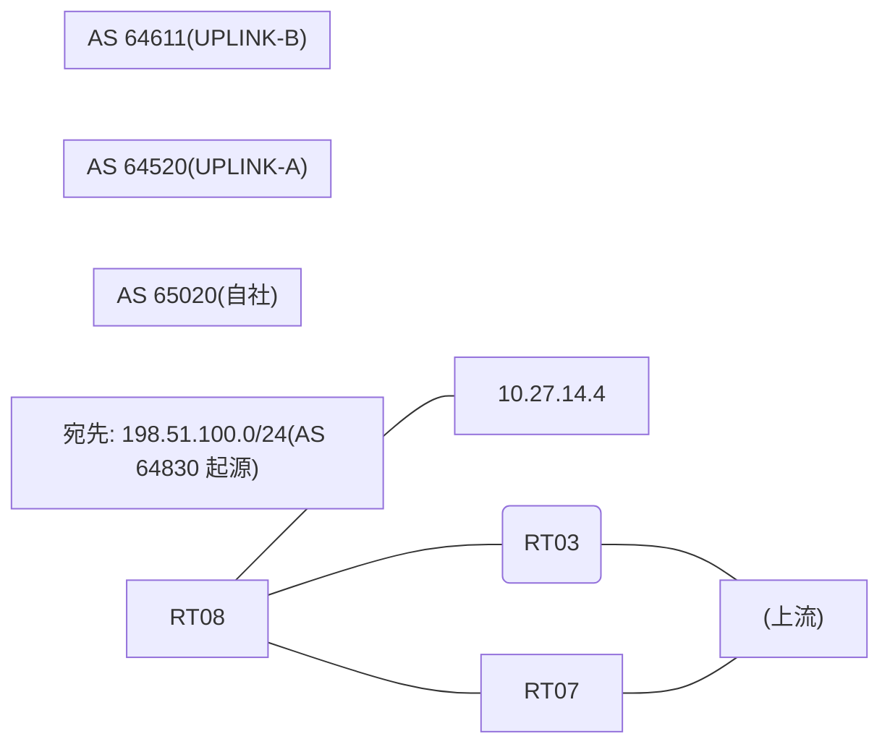

# 問題 20260831-010

> **本問は機器に接続せずに解答すること。追加の show 実行は認めない。**

## シナリオ

あなたは、下記のネットワークの保守を担当する技術者です。自社のルータ RT08 は、外部のネットワーク 198.51.100.0/24 への到達性を、複数の経路を通じて、確立しています。 UPLINK-B とも、接続されています。 一部の経路は、自 AS 内の境界ルータから、iBGP で、学習されています。ベストパスの選出の結果について、その根拠が、確認されようとしています。示されているところの出力、および、構成に基づいて、判断すること。なお、機器の構成は、示されている抜粋のほかは、既定値である。



## 出力

```
RT08# show ip bgp
BGP table version is 5, local router ID is 241.241.241.241
Status codes: s suppressed, d damped, h history, * valid, > best, i - internal, 
              r RIB-failure, S Stale, m multipath, b backup-path, f RT-Filter, 
              x best-external, a additional-path, c RIB-compressed, 
              t secondary path, L long-lived-stale,
Origin codes: i - IGP, e - EGP, ? - incomplete
RPKI validation codes: V valid, I invalid, N Not found

     Network          Next Hop            Metric LocPrf Weight Path
 *>   198.51.100.0     10.27.14.4             500             0 64611 64830 i
 * i                   8.6.6.6                       100      0 64520 64520 64830 64830 i
 * i                   2.5.5.5                 10    100      0 64520 64830 i
```
```
RT08# show ip bgp 198.51.100.0
BGP routing table entry for 198.51.100.0/24, version 5
Paths: (3 available, best #1, table default)
  Advertised to update-groups:
     1         
  Refresh Epoch 3
  64611 64830
    10.27.14.4 from 10.27.14.4 (242.242.242.242)
      Origin IGP, metric 500, localpref 100, valid, external, best
      rx pathid: 0, tx pathid: 0x0
      Updated on Jul 7 2026 11:38:03 UTC
  Refresh Epoch 2
  64520 64520 64830 64830
    8.6.6.6 (metric 101) from 8.6.6.6 (8.6.6.6)
      Origin IGP, localpref 100, valid, internal
      rx pathid: 0, tx pathid: 0
      Updated on Jul 7 2026 11:30:56 UTC
  Refresh Epoch 3
  64520 64830
    2.5.5.5 (metric 11) from 2.5.5.5 (2.5.5.5)
      Origin IGP, metric 10, localpref 100, valid, internal
      rx pathid: 0, tx pathid: 0
      Updated on Jul 7 2026 10:23:07 UTC
```
```
RT08# show running-config | section router bgp
router bgp 65020
 bgp router-id 241.241.241.241
 bgp log-neighbor-changes
 neighbor 2.5.5.5 remote-as 65020
 neighbor 2.5.5.5 update-source Loopback0
 neighbor 8.6.6.6 remote-as 65020
 neighbor 8.6.6.6 update-source Loopback0
 neighbor 10.27.14.4 remote-as 64611
 !
 address-family ipv4
  neighbor 2.5.5.5 activate
  neighbor 8.6.6.6 activate
  neighbor 10.27.14.4 activate
 exit-address-family
```

## 設問

示されているところの出力において、ベストパスの選出を決定づけた要素は、どれですか。(1つを選択してください)

## 選択肢
A. next-hop への IGP メトリック(小さいほうが優先)

B. MED(小さいほうが優先)

C. AS-PATH 長(短いほうが優先)

D. eBGP > iBGP

E. next-hop の解決可否(そもそも候補に入らない)
