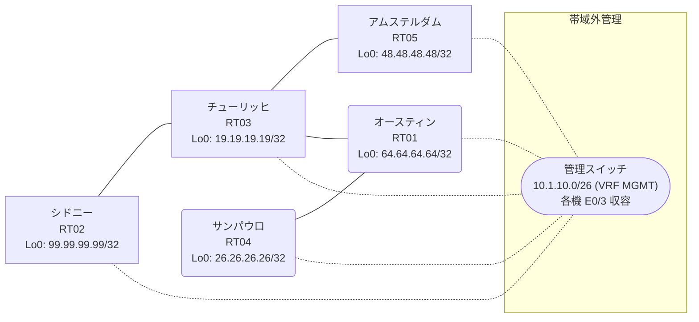

# 問題 20260905-001

> **本問は機器に接続せずに解答すること。追加の show 実行は認めない。**

## トポロジ

あなたは、下記のネットワークの保守を担当する技術者です。あなたの会社のネットワークは、複数のルーティング ドメインが、境界のルーターによって接続され、そして、すべてのサイトの到達可能性が提供されている、というものです。ルーティングの設計の詳細は、示されているところのコンフィギュレーションから、読み取られることが、期待されています。各サイトのルータと、サイトのネットワークとの対応は、下記の表に示されているとおりです。



| 拠点 | ルータ | 拠点網 |
|------|--------|----------------------|
| アムステルダム | RT05 | `48.48.48.48/32` |
| オースティン | RT01 | `64.64.64.64/32` |
| サンパウロ | RT04 | `26.26.26.26/32` |
| シドニー | RT02 | `99.99.99.99/32` |
| チューリッヒ | RT03 | `19.19.19.19/32` |

リンク一覧:
```
  RT03:E0/0(.1) ── RT05:E0/0(.2)   10.237.252.0/30
  RT03:E0/1(.1) ── RT01:E0/0(.2)   10.89.116.0/30
  RT01:E0/1(.1) ── RT04:E0/0(.2)   10.171.116.0/30
  RT03:E0/2(.1) ── RT02:E0/0(.2)   10.131.93.0/30
```

## 要件

1. 管理のための構成に対して、変更が加えられてはなりません。
2. redistribute の参照先は、実在する隣接のプロセス/AS に限定され、無効な参照のステートメントが、コンフィギュレーションに残されることはできません。
3. 再配送される経路の、選択的な制限は、実施されてはなりません。
4. EIGRP へのルートの注入におけるシード メトリックは、プロセスの配下の default-metric `100000 100 255 1 1500` によって、与えられなければなりません。
5. すべてのルーターのループバック・インターフェイス 0 (/32) が、すべてのドメインの間で、相互に到達可能であること。

## 現在の状態

ユーザーから、通信に関する事象が、報告されています。示されているところの出力および構成に基づいて、要求されているところの動作が得られていない理由が、判断されなければなりません。

```
RT01# show ip route
Gateway of last resort is not set
      10.0.0.0/8 is variably subnetted, 6 subnets, 2 masks
C        10.89.116.0/30 is directly connected, Ethernet0/0
L        10.89.116.2/32 is directly connected, Ethernet0/0
D EX     10.131.93.0/30 [170/307200] via 10.89.116.1, 00:04:30, Ethernet0/0
C        10.171.116.0/30 is directly connected, Ethernet0/1
L        10.171.116.1/32 is directly connected, Ethernet0/1
D EX     10.237.252.0/30 [170/307200] via 10.89.116.1, 00:04:30, Ethernet0/0
      19.0.0.0/32 is subnetted, 1 subnets
D        19.19.19.19 [90/409600] via 10.89.116.1, 00:04:30, Ethernet0/0
      26.0.0.0/32 is subnetted, 1 subnets
D        26.26.26.26 [90/409600] via 10.171.116.2, 00:04:25, Ethernet0/1
      48.0.0.0/32 is subnetted, 1 subnets
D EX     48.48.48.48 [170/307200] via 10.89.116.1, 00:03:46, Ethernet0/0
      64.0.0.0/32 is subnetted, 1 subnets
C        64.64.64.64 is directly connected, Loopback0
```
```
RT05# show ip route
Gateway of last resort is not set
      10.0.0.0/8 is variably subnetted, 5 subnets, 2 masks
O E2     10.89.116.0/30 [110/20] via 10.237.252.1, 00:04:05, Ethernet0/0
O        10.131.93.0/30 [110/20] via 10.237.252.1, 00:04:05, Ethernet0/0
O E2     10.171.116.0/30 [110/20] via 10.237.252.1, 00:04:05, Ethernet0/0
C        10.237.252.0/30 is directly connected, Ethernet0/0
L        10.237.252.2/32 is directly connected, Ethernet0/0
      19.0.0.0/32 is subnetted, 1 subnets
O        19.19.19.19 [110/11] via 10.237.252.1, 00:04:05, Ethernet0/0
      26.0.0.0/32 is subnetted, 1 subnets
O E2     26.26.26.26 [110/20] via 10.237.252.1, 00:04:05, Ethernet0/0
      48.0.0.0/32 is subnetted, 1 subnets
C        48.48.48.48 is directly connected, Loopback0
      64.0.0.0/32 is subnetted, 1 subnets
O E2     64.64.64.64 [110/20] via 10.237.252.1, 00:04:05, Ethernet0/0
      99.0.0.0/32 is subnetted, 1 subnets
O        99.99.99.99 [110/21] via 10.237.252.1, 00:04:05, Ethernet0/0
```
```
RT02# show ip route
Gateway of last resort is not set
      10.0.0.0/8 is variably subnetted, 5 subnets, 2 masks
O E2     10.89.116.0/30 [110/20] via 10.131.93.1, 00:04:29, Ethernet0/0
C        10.131.93.0/30 is directly connected, Ethernet0/0
L        10.131.93.2/32 is directly connected, Ethernet0/0
O E2     10.171.116.0/30 [110/20] via 10.131.93.1, 00:04:29, Ethernet0/0
O        10.237.252.0/30 [110/20] via 10.131.93.1, 00:04:22, Ethernet0/0
      19.0.0.0/32 is subnetted, 1 subnets
O        19.19.19.19 [110/11] via 10.131.93.1, 00:04:29, Ethernet0/0
      26.0.0.0/32 is subnetted, 1 subnets
O E2     26.26.26.26 [110/20] via 10.131.93.1, 00:04:29, Ethernet0/0
      48.0.0.0/32 is subnetted, 1 subnets
O        48.48.48.48 [110/21] via 10.131.93.1, 00:04:18, Ethernet0/0
      64.0.0.0/32 is subnetted, 1 subnets
O E2     64.64.64.64 [110/20] via 10.131.93.1, 00:04:29, Ethernet0/0
      99.0.0.0/32 is subnetted, 1 subnets
C        99.99.99.99 is directly connected, Loopback0
```
```
RT03# show route-map
route-map RM-SVC, deny, sequence 10
  Match clauses:
    ip address prefix-lists: PL-SVC 
  Set clauses:
  Policy routing matches: 0 packets, 0 bytes
route-map RM-SVC, permit, sequence 20
  Match clauses:
  Set clauses:
  Policy routing matches: 0 packets, 0 bytes
route-map RM-MIGR1, deny, sequence 10
  Match clauses:
    ip address prefix-lists: PL-MIGR1 
  Set clauses:
  Policy routing matches: 0 packets, 0 bytes
route-map RM-MIGR1, permit, sequence 20
  Match clauses:
  Set clauses:
  Policy routing matches: 0 packets, 0 bytes
```
```
RT03# show ip prefix-list
ip prefix-list PL-MIGR1: 2 entries
   seq 5 deny 19.19.19.19/32
   seq 10 permit 0.0.0.0/0 le 32
ip prefix-list PL-SVC: 1 entries
   seq 5 permit 99.99.99.99/32
```
```
RT03# show access-lists
Standard IP access list 10
    10 deny   19.19.19.19
    20 permit any
```

## 設定抜粋

```
RT01# show running-config | section router
router eigrp 739
 timers active-time 5
 network 10.89.116.0 0.0.0.3
 network 10.171.116.0 0.0.0.3
 network 64.64.64.64 0.0.0.0
 passive-interface Loopback0
```
```
RT02# show running-config | section router
router ospf 67
 router-id 99.99.99.99
 timers throttle spf 50 200 5000
 passive-interface Loopback0
 network 10.131.93.0 0.0.0.3 area 0
 network 99.99.99.99 0.0.0.0 area 0
```
```
RT03# show running-config | section router
router eigrp 739
 default-metric 100000 100 255 1 1500
 network 10.89.116.0 0.0.0.3
 network 19.19.19.19 0.0.0.0
 redistribute ospf 67 match internal external 1 external 2 route-map RM-SVC
router ospf 67
 router-id 19.19.19.19
 timers throttle spf 50 200 5000
 redistribute eigrp 739
 passive-interface Loopback0
 network 10.131.93.0 0.0.0.3 area 0
 network 10.237.252.0 0.0.0.3 area 0
 network 19.19.19.19 0.0.0.0 area 0
```
```
RT04# show running-config | section router
router eigrp 739
 network 10.171.116.0 0.0.0.3
 network 26.26.26.26 0.0.0.0
```
```
RT05# show running-config | section router
router ospf 67
 router-id 48.48.48.48
 network 10.237.252.0 0.0.0.3 area 0
 network 48.48.48.48 0.0.0.0 area 0
```

## 設問

次のうち、正しいものは、どれですか。

## 選択肢
A. RT01 の router eigrp 739 配下で「no passive-interface <上流IF>」を設定する

B. route-map RM-SVC のシーケンス 10 を deny から permit に変更する

C. RT03 の router eigrp 739 配下で redistribute から route-map RM-SVC を外し、route-map / prefix-list を削除する

D. RT03 で「clear ip route *」を実行する

E. RT03 の router ospf 67 配下の redistribute にも route-map RM-SVC を適用する

F. ip prefix-list PL-SVC に「seq 10 permit 0.0.0.0/0 le 32」を追加する
