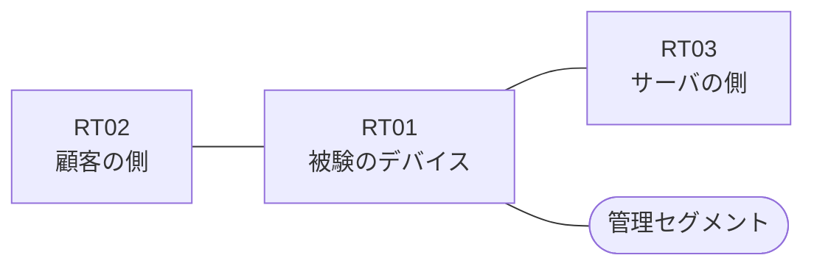

# 問題 20260905-003

> **本問は機器に接続せずに解答すること。追加の show 実行は認めない。**

## トポロジ

あなたは、ネットワークの運用を担当しています。ある企業のネットワークにおいて、RT01 は、顧客の側のネットワークと、サーバの側のネットワークとの間に、配置されています。



| 区間 | 被験デバイス側のインターフェイス | ネットワーク |
|------|----------------------------------|--------------|
| RT02（顧客の側） ⇔ RT01 | `Ethernet2/0` | 10.187.253.0/24 |
| RT01 ⇔ RT03（サーバの側） | `Ethernet2/1` | 10.187.254.0/24 |
| RT01 ⇔ 管理セグメント | `Ethernet2/2` | 10.187.255.0/24 |

## 要件

1. 対象としていないネットワークが、一致の対象に含まれてはなりません。また、拒否のエントリを使用してはなりません。
2. ルーティング プロトコルの種別およびプロセスの配置は、変更されてはなりません。
3. アクセス・リストは、顧客の側のインターフェイスである `Ethernet2/0` において、着信の方向に適用されなければなりません。
4. 当該のサーバの他のポートへの通信、および当該のサーバ以外の宛先への通信は、許可されることはできません。
5. `10.187.3.0/24` からの通信は、許可されることはできません。
6. `10.187.5.0/24` からの通信は、許可されることはできません。
7. RT01 において、`10.187.0.0/24`、`10.187.1.0/24`、`10.187.2.0/24` のネットワークからの通信のみが、サーバである `172.23.119.16` の TCP ポート 22 に到達できなければなりません。

## 現在の状態

```
RT01# show logging | include SEC-6
%SEC-6-IPACCESSLOGP: list FILTER-IN denied tcp 10.187.5.7(19319) -> 172.23.119.16(22), 1 packet
```

## 設定抜粋

```
RT01# show ip access-lists FILTER-IN
Extended IP access list FILTER-IN
    10 deny   tcp 10.187.5.0 0.0.0.255 host 172.23.119.16 eq 22 log
    20 deny   tcp 10.187.3.0 0.0.0.255 host 172.23.119.16 eq 22
    30 permit ip any any
```

## 設問

示されているところの記録および構成から読み取ることができるものは、どれですか。(2つを選択してください)

## 選択肢
A. 記録に現れていない通信は、いずれも許可されたものである。

B. 拒否のエントリのうち、`log` のキーワードを伴うものは1つだけである。

C. `10.187.3.7` からの通信は、許可された。

D. `10.187.0.7` からの通信は、拒否された。

E. `10.187.5.7` からの通信は、アクセス・リストによって拒否された。
