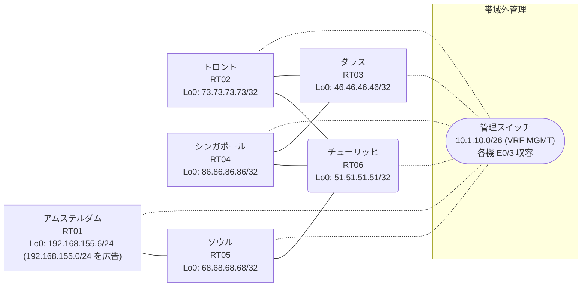

# 問題 20260905-005

> **本問は機器に接続せずに解答すること。追加の show 実行は認めない。**

## トポロジ

あなたは、下記のネットワークの保守を担当する技術者です。あなたの会社のネットワークは、OSPF のドメインと EIGRP のドメインとが、2 つの境界のルータによって接続され、そして、それらは境界において接続されています。顧客のネットワーク `192.168.155.0/24` は、アムステルダム のサイトにおいて、別のルーティング プロトコルによって学習され、そして、再配送によって、社内へ持ち込まれています。ルーティングの設計の詳細は、示されているところのコンフィギュレーションから、読み取られることが、期待されています。



| 拠点 | ルータ | 拠点網 / 広告網 |
|------|--------|------------------|
| アムステルダム | RT01 | 192.168.155.6/24 (`192.168.155.0/24` を広告) |
| シンガポール | RT04 | 86.86.86.86/32 |
| ソウル | RT05 | 68.68.68.68/32 |
| ダラス | RT03 | 46.46.46.46/32 |
| チューリッヒ | RT06 | 51.51.51.51/32 |
| トロント | RT02 | 73.73.73.73/32 |

リンク一覧:
```
  RT03:E0/0(.1) ── RT02:E0/0(.2)   172.16.45.0/24
  RT03:E0/1(.1) ── RT04:E0/0(.3)   172.16.97.0/24
  RT02:E0/1(.2) ── RT06:E0/0(.4)   172.16.112.0/24
  RT04:E0/1(.3) ── RT06:E0/1(.4)   172.16.152.0/24
  RT06:E0/2(.4) ── RT05:E0/0(.5)   172.16.91.0/24
  RT05:E0/1(.5) ── RT01:E0/0(.6)   172.16.87.0/24
```

## 要件

1. 本作業は、日中の時間帯において実施されるという理由により、対象外であるところのデバイスに対する構成の変更は、許可されていません。
2. 既存の相互再配送の設計が、削除または停止されることはできません。
3. スタティック・ルートおよび既定のルートによる迂回は、実施されてはなりません。
4. スタティック・ルートおよび既定のルートによる迂回は、実施されてはなりません。
5. `192.168.155.0/24` 宛のパケットが、広告元である RT01 の方向へ転送され、そして、転送のループが存在していないこと。
6. 顧客のネットワーク `192.168.155.0/24` への到達可能性が、すべてのサイトにおいて、確保されていること。
7. フィルタの新設は、変更の凍結により、使用することができません。是正は、管理距離の調整のみによって、実装されなければなりません。

## 現在の状態

ユーザーから、通信に関する事象が、報告されています。あなたは、提示されているところの情報のみを使用して、要求されている状態が満たされていない理由を、特定しなければなりません。

```
RT06# show ip route
Gateway of last resort is not set
      46.0.0.0/32 is subnetted, 1 subnets
D EX     46.46.46.46 [170/281856] via 172.16.152.3, 00:04:11, Ethernet0/1
                     [170/281856] via 172.16.112.2, 00:04:11, Ethernet0/0
      51.0.0.0/32 is subnetted, 1 subnets
C        51.51.51.51 is directly connected, Loopback0
      68.0.0.0/32 is subnetted, 1 subnets
D        68.68.68.68 [90/409600] via 172.16.91.5, 00:04:41, Ethernet0/2
      73.0.0.0/32 is subnetted, 1 subnets
D EX     73.73.73.73 [170/281856] via 172.16.152.3, 00:04:11, Ethernet0/1
                     [170/281856] via 172.16.112.2, 00:04:11, Ethernet0/0
      86.0.0.0/32 is subnetted, 1 subnets
D EX     86.86.86.86 [170/281856] via 172.16.152.3, 00:04:06, Ethernet0/1
                     [170/281856] via 172.16.112.2, 00:04:06, Ethernet0/0
      172.16.0.0/16 is variably subnetted, 9 subnets, 2 masks
D EX     172.16.45.0/24 [170/281856] via 172.16.152.3, 00:04:11, Ethernet0/1
                        [170/281856] via 172.16.112.2, 00:04:11, Ethernet0/0
D        172.16.87.0/24 [90/307200] via 172.16.91.5, 00:04:41, Ethernet0/2
C        172.16.91.0/24 is directly connected, Ethernet0/2
L        172.16.91.4/32 is directly connected, Ethernet0/2
D EX     172.16.97.0/24 [170/281856] via 172.16.152.3, 00:04:14, Ethernet0/1
                        [170/281856] via 172.16.112.2, 00:04:14, Ethernet0/0
C        172.16.112.0/24 is directly connected, Ethernet0/0
L        172.16.112.4/32 is directly connected, Ethernet0/0
C        172.16.152.0/24 is directly connected, Ethernet0/1
L        172.16.152.4/32 is directly connected, Ethernet0/1
D EX  192.168.155.0/24 [170/281856] via 172.16.152.3, 00:04:11, Ethernet0/1
```
```
RT06# show ip eigrp topology 192.168.155.0 255.255.255.0
EIGRP-IPv4 Topology Entry for AS(73)/ID(51.51.51.51) for 192.168.155.0/24
  State is Passive, Query origin flag is 1, 1 Successor(s), FD is 281856
  Descriptor Blocks:
  172.16.152.3 (Ethernet0/1), from 172.16.152.3, Send flag is 0x0
      Composite metric is (281856/2816), route is External
      Vector metric:
        Minimum bandwidth is 10000 Kbit
        Total delay is 1010 microseconds
        Reliability is 255/255
        Load is 1/255
        Minimum MTU is 1500
        Hop count is 1
        Originating router is 86.86.86.86
      External data:
        AS number of route is 66
        External protocol is OSPF, external metric is 20
        Administrator tag is 0 (0x00000000)
  172.16.91.5 (Ethernet0/2), from 172.16.91.5, Send flag is 0x0
      Composite metric is (307456/281856), route is External
      Vector metric:
        Minimum bandwidth is 10000 Kbit
        Total delay is 2010 microseconds
        Reliability is 255/255
        Load is 1/255
        Minimum MTU is 1500
        Hop count is 2
        Originating router is 192.168.155.6
      External data:
        AS number of route is 0
        External protocol is RIP, external metric is 0
        Administrator tag is 0 (0x00000000)
```
```
RT05# show ip route
Gateway of last resort is not set
      46.0.0.0/32 is subnetted, 1 subnets
D EX     46.46.46.46 [170/307456] via 172.16.91.4, 00:04:31, Ethernet0/0
      51.0.0.0/32 is subnetted, 1 subnets
D        51.51.51.51 [90/409600] via 172.16.91.4, 00:05:04, Ethernet0/0
      68.0.0.0/32 is subnetted, 1 subnets
C        68.68.68.68 is directly connected, Loopback0
      73.0.0.0/32 is subnetted, 1 subnets
D EX     73.73.73.73 [170/307456] via 172.16.91.4, 00:05:04, Ethernet0/0
      86.0.0.0/32 is subnetted, 1 subnets
D EX     86.86.86.86 [170/307456] via 172.16.91.4, 00:04:24, Ethernet0/0
      172.16.0.0/16 is variably subnetted, 8 subnets, 2 masks
D EX     172.16.45.0/24 [170/307456] via 172.16.91.4, 00:05:04, Ethernet0/0
C        172.16.87.0/24 is directly connected, Ethernet0/1
L        172.16.87.5/32 is directly connected, Ethernet0/1
C        172.16.91.0/24 is directly connected, Ethernet0/0
L        172.16.91.5/32 is directly connected, Ethernet0/0
D EX     172.16.97.0/24 [170/307456] via 172.16.91.4, 00:04:31, Ethernet0/0
D        172.16.112.0/24 [90/307200] via 172.16.91.4, 00:05:04, Ethernet0/0
D        172.16.152.0/24 [90/307200] via 172.16.91.4, 00:05:04, Ethernet0/0
D EX  192.168.155.0/24 [170/281856] via 172.16.87.6, 00:04:29, Ethernet0/1
```
```
RT03# show ip route
Gateway of last resort is not set
      46.0.0.0/32 is subnetted, 1 subnets
C        46.46.46.46 is directly connected, Loopback0
      51.0.0.0/32 is subnetted, 1 subnets
O E2     51.51.51.51 [110/20] via 172.16.97.3, 00:04:47, Ethernet0/1
                     [110/20] via 172.16.45.2, 00:04:49, Ethernet0/0
      68.0.0.0/32 is subnetted, 1 subnets
O E2     68.68.68.68 [110/20] via 172.16.97.3, 00:04:47, Ethernet0/1
                     [110/20] via 172.16.45.2, 00:04:49, Ethernet0/0
      73.0.0.0/32 is subnetted, 1 subnets
O        73.73.73.73 [110/11] via 172.16.45.2, 00:04:49, Ethernet0/0
      86.0.0.0/32 is subnetted, 1 subnets
O        86.86.86.86 [110/11] via 172.16.97.3, 00:04:47, Ethernet0/1
      172.16.0.0/16 is variably subnetted, 8 subnets, 2 masks
C        172.16.45.0/24 is directly connected, Ethernet0/0
L        172.16.45.1/32 is directly connected, Ethernet0/0
O E2     172.16.87.0/24 [110/20] via 172.16.97.3, 00:04:47, Ethernet0/1
                        [110/20] via 172.16.45.2, 00:04:49, Ethernet0/0
O E2     172.16.91.0/24 [110/20] via 172.16.97.3, 00:04:47, Ethernet0/1
                        [110/20] via 172.16.45.2, 00:04:49, Ethernet0/0
C        172.16.97.0/24 is directly connected, Ethernet0/1
L        172.16.97.1/32 is directly connected, Ethernet0/1
O E2     172.16.112.0/24 [110/20] via 172.16.97.3, 00:04:47, Ethernet0/1
                         [110/20] via 172.16.45.2, 00:04:49, Ethernet0/0
O E2     172.16.152.0/24 [110/20] via 172.16.97.3, 00:04:47, Ethernet0/1
                         [110/20] via 172.16.45.2, 00:04:49, Ethernet0/0
O E2  192.168.155.0/24 [110/20] via 172.16.45.2, 00:04:49, Ethernet0/0
```
```
RT06# show ip protocols | include Routing Protocol|Distance
Routing Protocol is "application"
    Gateway         Distance      Last Update
  Distance: (default is 4)
Routing Protocol is "eigrp 73"
      Distance: internal 90 external 170
    Gateway         Distance      Last Update
  Distance: internal 90 external 170
```
```
RT03# traceroute 192.168.155.6 probe 1 timeout 1 ttl 1 8
Type escape sequence to abort.
Tracing the route to 192.168.155.6
VRF info: (vrf in name/id, vrf out name/id)
  1 172.16.45.2 2 msec
  2 172.16.112.4 2 msec
  3 172.16.152.3 2 msec
  4 172.16.97.1 1 msec
  5 172.16.45.2 15 msec
  6 172.16.112.4 37 msec
  7 172.16.152.3 2 msec
  8 172.16.97.1 2 msec
```

## 設定抜粋

```
RT03# show running-config | section router
router ospf 66
 router-id 46.46.46.46
 network 46.46.46.46 0.0.0.0 area 0
 network 172.16.45.0 0.0.0.255 area 0
 network 172.16.97.0 0.0.0.255 area 0
```
```
RT02# show running-config | section router
router eigrp 73
 network 172.16.112.0 0.0.0.255
 redistribute ospf 66 metric 1000000 1 255 1 1500
router ospf 66
 router-id 73.73.73.73
 redistribute eigrp 73
 network 73.73.73.73 0.0.0.0 area 0
 network 172.16.45.0 0.0.0.255 area 0
```
```
RT04# show running-config | section router
router eigrp 73
 network 172.16.152.0 0.0.0.255
 redistribute ospf 66 metric 1000000 1 255 1 1500
router ospf 66
 router-id 86.86.86.86
 redistribute eigrp 73
 network 86.86.86.86 0.0.0.0 area 0
 network 172.16.97.0 0.0.0.255 area 0
```
```
RT06# show running-config | section router
router eigrp 73
 network 51.51.51.51 0.0.0.0
 network 172.16.91.0 0.0.0.255
 network 172.16.112.0 0.0.0.255
 network 172.16.152.0 0.0.0.255
```
```
RT05# show running-config | section router
router eigrp 73
 network 68.68.68.68 0.0.0.0
 network 172.16.87.0 0.0.0.255
 network 172.16.91.0 0.0.0.255
```
```
RT01# show running-config | section router
router eigrp 73
 network 172.16.87.0 0.0.0.255
 redistribute rip metric 1000000 1 255 1 1500
router rip
 version 2
 network 192.168.155.0
 no auto-summary
```

## 設問

次のうち、正しいものは、どれですか。

## 選択肢
A. RT06 で `clear ip route *` を実行する

B. RT06 の router eigrp 73 配下に `distance eigrp 90 200` を設定する

C. RT02 でのみ、router ospf 66 配下に `distance ospf external 180` を設定する

D. RT01 の router eigrp 73 配下の `redistribute rip` の seed metric をより小さい値へ変更する

E. RT02 と RT04 の両方で、router ospf 66 配下に `distance ospf external 180` を設定する

F. RT02 と RT04 の両方で、`access-list 19 deny 192.168.155.0 0.0.0.255` / `permit any` を作成し、router eigrp 73 配下に `distribute-list 19 out ospf 66` を適用する
