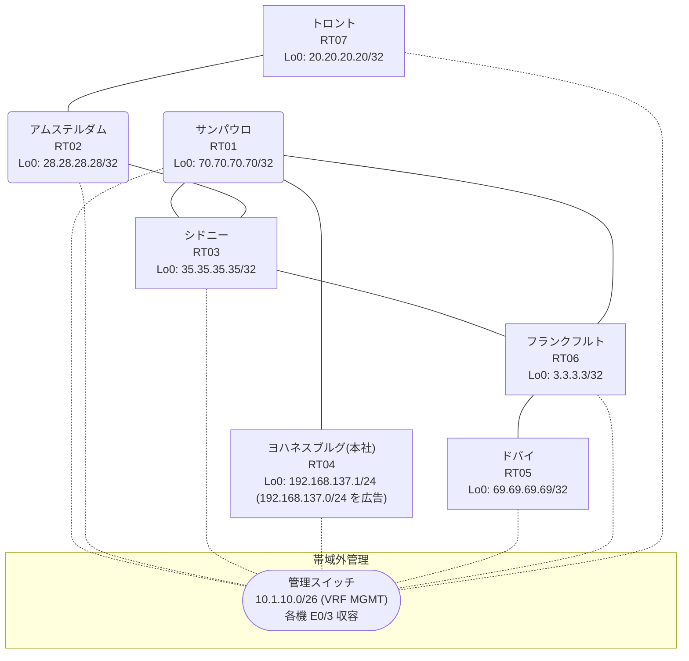

# 問題 20260906-001

> **本問は機器に接続せずに解答すること。追加の show 実行は認めない。**

## トポロジ

あなたの組織は、下記に示されているところのネットワークを運用しています。本社の顧客のネットワークは、BGP AS 64740 の RT04 によって、広告されています。あなたの会社の内部は、BGP / EIGRP / OSPF という 3 つのドメインから構成されています。サイトと、ルータおよびアドレスとの対応は、下記の表に示されているとおりです。



| 拠点 | ルータ | 拠点網 / 広告網 |
|------|--------|------------------|
| アムステルダム | RT02 | 28.28.28.28/32 |
| サンパウロ | RT01 | 70.70.70.70/32 |
| シドニー | RT03 | 35.35.35.35/32 |
| トロント | RT07 | 20.20.20.20/32 |
| ドバイ | RT05 | 69.69.69.69/32 |
| フランクフルト | RT06 | 3.3.3.3/32 |
| ヨハネスブルグ(本社) | RT04 | 192.168.137.1/24 (`192.168.137.0/24` を広告) |

リンク一覧:
```
  RT04:E0/0(.1) ── RT01:E0/0(.2)   10.64.112.0/30
  RT01:E0/1(.1) ── RT06:E0/0(.2)   10.100.113.0/30
  RT01:E0/2(.1) ── RT03:E0/0(.2)   10.99.248.0/30
  RT06:E0/1(.1) ── RT03:E0/1(.2)   10.99.6.0/30
  RT03:E0/2(.1) ── RT02:E0/0(.2)   10.214.101.0/30
  RT02:E0/1(.1) ── RT07:E0/0(.2)   10.60.204.0/30
  RT06:E0/2(.1) ── RT05:E0/0(.2)   10.233.224.0/30
```

## 要件

1. 顧客のネットワーク `192.168.137.0/24` を含むすべての宛先への到達可能性が、すべてのサイトにおいて、確保されていること。
2. スタティック・ルートおよび既定のルートによる迂回は、実施されることはできません。
3. `192.168.137.0/24` 宛のパケットが、広告元である RT04 の方向へ転送され、そして、転送のループが存在していないこと。
4. ルーティング・プロトコルの種別およびプロセスの配置は、変更されてはなりません。
5. 既存の再配送の設計が、変更または撤去されることはできません。スタティック・ルートによる回避も、許可されていません。
6. distance コマンドによる管理距離の操作は、監査のポリシー上、使用されることができません。
7. 遮断の条件は、プレフィックスの列挙によるものであってはならず、その経路がどこから来たものであるか、という属性によって、表現されなければなりません。

## 現在の状態

一部の通信が、意図されているとおりに動作していない、という報告があります。あなたは、提示されているところの情報のみを使用して、要求されている状態が満たされていない理由を、特定しなければなりません。

```
RT01# show ip route
Gateway of last resort is not set
      3.0.0.0/32 is subnetted, 1 subnets
O        3.3.3.3 [110/21] via 10.99.248.2, 00:04:43, Ethernet0/2
      10.0.0.0/8 is variably subnetted, 10 subnets, 2 masks
O        10.60.204.0/30 [110/30] via 10.99.248.2, 00:04:44, Ethernet0/2
C        10.64.112.0/30 is directly connected, Ethernet0/0
L        10.64.112.2/32 is directly connected, Ethernet0/0
O        10.99.6.0/30 [110/20] via 10.99.248.2, 00:05:01, Ethernet0/2
C        10.99.248.0/30 is directly connected, Ethernet0/2
L        10.99.248.1/32 is directly connected, Ethernet0/2
C        10.100.113.0/30 is directly connected, Ethernet0/1
L        10.100.113.1/32 is directly connected, Ethernet0/1
O        10.214.101.0/30 [110/20] via 10.99.248.2, 00:05:01, Ethernet0/2
O        10.233.224.0/30 [110/30] via 10.99.248.2, 00:04:38, Ethernet0/2
      20.0.0.0/32 is subnetted, 1 subnets
O        20.20.20.20 [110/31] via 10.99.248.2, 00:04:25, Ethernet0/2
      28.0.0.0/32 is subnetted, 1 subnets
O        28.28.28.28 [110/21] via 10.99.248.2, 00:04:44, Ethernet0/2
      35.0.0.0/32 is subnetted, 1 subnets
O        35.35.35.35 [110/11] via 10.99.248.2, 00:05:01, Ethernet0/2
      69.0.0.0/32 is subnetted, 1 subnets
O        69.69.69.69 [110/31] via 10.99.248.2, 00:04:33, Ethernet0/2
      70.0.0.0/32 is subnetted, 1 subnets
C        70.70.70.70 is directly connected, Loopback0
D EX  192.168.137.0/24 [170/307200] via 10.100.113.2, 00:04:16, Ethernet0/1
```
```
RT01# show route-map
route-map RM-MIGR1, deny, sequence 10
  Match clauses:
    ip address prefix-lists: PL-MIGR1 
  Set clauses:
  Policy routing matches: 0 packets, 0 bytes
route-map RM-MIGR1, permit, sequence 20
  Match clauses:
  Set clauses:
  Policy routing matches: 0 packets, 0 bytes
route-map RM-MIGR2, deny, sequence 10
  Match clauses:
    ip address prefix-lists: PL-MIGR2 
  Set clauses:
  Policy routing matches: 0 packets, 0 bytes
route-map RM-MIGR2, permit, sequence 20
  Match clauses:
  Set clauses:
  Policy routing matches: 0 packets, 0 bytes
```
```
RT01# show ip prefix-list
ip prefix-list PL-MIGR1: 2 entries
   seq 5 deny 28.28.28.28/32
   seq 10 permit 0.0.0.0/0 le 32
ip prefix-list PL-MIGR2: 2 entries
   seq 5 deny 3.3.3.3/32
   seq 10 permit 0.0.0.0/0 le 32
```
```
RT01# show access-lists
Standard IP access list 46
    10 deny   3.3.3.3
    20 permit any
Standard IP access list 73
    10 deny   28.28.28.28
    20 permit any
```
```
RT01# show ip bgp
BGP table version is 14, local router ID is 70.70.70.70
Status codes: s suppressed, d damped, h history, * valid, > best, i - internal, 
              r RIB-failure, S Stale, m multipath, b backup-path, f RT-Filter, 
              x best-external, a additional-path, c RIB-compressed, 
              t secondary path, L long-lived-stale,
Origin codes: i - IGP, e - EGP, ? - incomplete
RPKI validation codes: V valid, I invalid, N Not found

     Network          Next Hop            Metric LocPrf Weight Path
 *>   3.3.3.3/32       10.99.248.2             21         32768 ?
 *>   10.60.204.0/30   10.99.248.2             30         32768 ?
 *>   10.99.6.0/30     10.99.248.2             20         32768 ?
 *>   10.99.248.0/30   0.0.0.0                  0         32768 ?
 *>   10.214.101.0/30  10.99.248.2             20         32768 ?
 *>   10.233.224.0/30  10.99.248.2             30         32768 ?
 *>   20.20.20.20/32   10.99.248.2             31         32768 ?
 *>   28.28.28.28/32   10.99.248.2             21         32768 ?
 *>   35.35.35.35/32   10.99.248.2             11         32768 ?
 *>   69.69.69.69/32   10.99.248.2             31         32768 ?
 *>   70.70.70.70/32   0.0.0.0                  0         32768 i
 r>i  192.168.137.0    10.64.112.1              0    100      0 i
```
```
RT01# show ip protocols | include Routing Protocol|Distance
Routing Protocol is "application"
    Gateway         Distance      Last Update
  Distance: (default is 4)
Routing Protocol is "eigrp 284"
      Distance: internal 90 external 170
    Gateway         Distance      Last Update
  Distance: internal 90 external 170
Routing Protocol is "ospf 42"
    Gateway         Distance      Last Update
  Distance: (default is 110)
Routing Protocol is "bgp 64740"
    Gateway         Distance      Last Update
  Distance: external 20 internal 200 local 200
```
```
RT07# traceroute 192.168.137.1 probe 1 timeout 1 ttl 1 8
Type escape sequence to abort.
Tracing the route to 192.168.137.1
VRF info: (vrf in name/id, vrf out name/id)
  1 10.60.204.1 1 msec
  2 10.214.101.1 1 msec
  3 10.99.248.1 3 msec
  4 10.100.113.2 3 msec
  5 10.99.6.2 3 msec
  6 10.99.248.1 2 msec
  7 10.100.113.2 3 msec
  8 10.99.6.2 3 msec
```

## 設定抜粋

```
RT01# show running-config | section router
router eigrp 284
 network 10.100.113.0 0.0.0.3
 passive-interface Loopback0
router ospf 42
 router-id 70.70.70.70
 redistribute eigrp 284
 redistribute bgp 64740
 network 10.99.248.0 0.0.0.3 area 0
 network 70.70.70.70 0.0.0.0 area 0
router bgp 64740
 bgp router-id 70.70.70.70
 bgp log-neighbor-changes
 bgp redistribute-internal
 network 70.70.70.70 mask 255.255.255.255
 redistribute ospf 42
 neighbor 10.64.112.1 remote-as 64740
```
```
RT06# show running-config | section router
router eigrp 284
 network 10.100.113.0 0.0.0.3
 redistribute ospf 42 metric 100000 100 255 1 1500
router ospf 42
 router-id 3.3.3.3
 redistribute eigrp 284
 network 3.3.3.3 0.0.0.0 area 0
 network 10.99.6.0 0.0.0.3 area 0
 network 10.233.224.0 0.0.0.3 area 0
```
```
RT03# show running-config | section router
router ospf 42
 router-id 35.35.35.35
 passive-interface Loopback0
 network 10.99.6.0 0.0.0.3 area 0
 network 10.99.248.0 0.0.0.3 area 0
 network 10.214.101.0 0.0.0.3 area 0
 network 35.35.35.35 0.0.0.0 area 0
```
```
RT04# show running-config | section router
router bgp 64740
 bgp router-id 192.168.137.1
 bgp log-neighbor-changes
 network 192.168.137.0
 neighbor 10.64.112.2 remote-as 64740
```

## 設問

次のうち、正しいものは、どれですか。

## 選択肢
**A.**
```
router bgp 64740
 distance bgp 20 165 165
end
clear ip route *
```

**B.**
```
router bgp 64740
 no bgp redistribute-internal
```

**C.**
```
! RT01
route-map RM-ORIGIN permit 10
 set tag 64740
router ospf 42
 redistribute bgp 64740 route-map RM-ORIGIN
! RT06
route-map RM-NOBACK deny 10
 match tag 64740
route-map RM-NOBACK permit 20
router eigrp 284
 redistribute ospf 42 route-map RM-NOBACK
```

**D.**
```
route-map RM-ORIGIN permit 10
 set tag 64740
router ospf 42
 redistribute bgp 64740 route-map RM-ORIGIN
```

**E.**
```
ip prefix-list PL-BLOCK seq 5 deny 192.168.137.0/24
ip prefix-list PL-BLOCK seq 10 permit 0.0.0.0/0 le 32
router eigrp 284
 distribute-list prefix PL-BLOCK in
```

**F.**
```
! RT06
route-map RM-MARK permit 10
 set tag 64740
router eigrp 284
 redistribute ospf 42 route-map RM-MARK
! RT01
route-map RM-DROP deny 10
 match tag 64740
route-map RM-DROP permit 20
router ospf 42
 redistribute bgp 64740 route-map RM-DROP
```

**G.**
```
! RT06 側で両方向の redistribute に deny route-map を適用
route-map RM-BLK deny 10
 match ip address prefix-list PL-BLK
route-map RM-BLK permit 20
```
