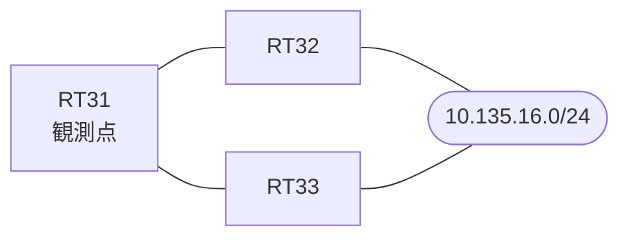

# 問題 20260906-005

> **本問は機器に接続せずに解答すること。追加の show 実行は認めない。**

## シナリオ

あなたの組織は、下記に示されているところのネットワークを運用しています。拠点のルータ RT31 は、複数の隣接するルータを経由して、10.135.16.0/24 への経路を学習しています。ネットワークは単一の OSPF のドメインとして運用されており、そして、RT31 は当該のプレフィックスを複数の経路によって受け取っています。経路の選好に関する挙動のレビューが、実施されています。現在の最良の経路のメトリックは、悪化させられてはなりません。既存の隣接関係は、維持されなければなりません。RT31 における 10.135.16.0/24 への転送のパスは、運用の設計の意図と一致していなければなりません。スタティック・ルートおよび既定のルートによる迂回は、実施されることはできません。構成の変更は、対象のルータ自身においてのみ、実施されなければなりません。構成の変更は、1 箇所に限られなければなりません。



| 対象 | 内容 |
|------|------|
| RT31 ⇔ RT32 | Ethernet0/0・10.238.2.0/24（RT31 側の OSPF のコスト = 20） |
| RT31 ⇔ RT33 | Ethernet0/1・10.238.3.0/24（RT31 側の OSPF のコスト = 40） |
| RT32 | 外部の経路を再配送しているルータ（ASBR） |
| RT33 | 外部の経路を再配送しているルータ（ASBR） |

## 出力

```
RT31# show ip ospf database external 10.135.16.0
OSPF Router with ID (1.1.1.1) (Process ID 10)

		Type-5 AS External Link States
  LS age: 301
  Options: (No TOS-capability, DC, Upward)
  LS Type: AS External Link
  Link State ID: 10.135.16.0 (External Network Number )
  Advertising Router: 2.2.2.2
  LS Seq Number: 80000006
  Checksum: 0xF972
  Length: 36
  Network Mask: /24
	Metric Type: 1 (Comparable directly to link state metric)
	MTID: 0 
	Metric: 30 
	Forward Address: 0.0.0.0
	External Route Tag: 0

  LS age: 238
  Options: (No TOS-capability, DC, Upward)
  LS Type: AS External Link
  Link State ID: 10.135.16.0 (External Network Number )
  Advertising Router: 3.3.3.3
  LS Seq Number: 80000003
  Checksum: 0xA5A2
  Length: 36
  Network Mask: /24
	Metric Type: 1 (Comparable directly to link state metric)
	MTID: 0 
	Metric: 25 
	Forward Address: 0.0.0.0
	External Route Tag: 0
```
```
RT31# show ip ospf border-routers
OSPF Router with ID (1.1.1.1) (Process ID 10)


		Base Topology (MTID 0)

Internal Router Routing Table
Codes: i - Intra-area route, I - Inter-area route

i 2.2.2.2 [20] via 10.238.2.2, Ethernet0/0, ASBR, Area 0, SPF 21
i 3.3.3.3 [40] via 10.238.3.3, Ethernet0/1, ASBR, Area 0, SPF 21
```
```
RT31# show running-config | section router ospf
router ospf 10
 router-id 1.1.1.1
 network 10.238.2.0 0.0.0.255 area 0
 network 10.238.3.0 0.0.0.255 area 0
```
```
RT31# show running-config | section interface
interface Ethernet0/0
 description === to RT32 ===
 ip address 10.238.2.1 255.255.255.0
 ip ospf cost 20
interface Ethernet0/1
 description === to RT33 ===
 ip address 10.238.3.1 255.255.255.0
 ip ospf cost 40
```

## 設問

RT33(10.238.3.3)経由の経路が RT31 において選好されるようにするために、実施されなければならない変更は、どれですか。(1つを選択してください)

## 選択肢
A. RT31 の Ethernet0/0 の OSPF のコストを 36 へ上げる

B. RT33 における再配送のメトリックを 9 へ下げる

C. RT33 における再配送を、外部タイプ 1(metric-type 1)へ変更する

D. RT31 の Ethernet0/1 の OSPF のコストを 24 へ下げる

E. RT31 において、外部の経路のアドミニストレーティブ・ディスタンスを 105 へ変更する
