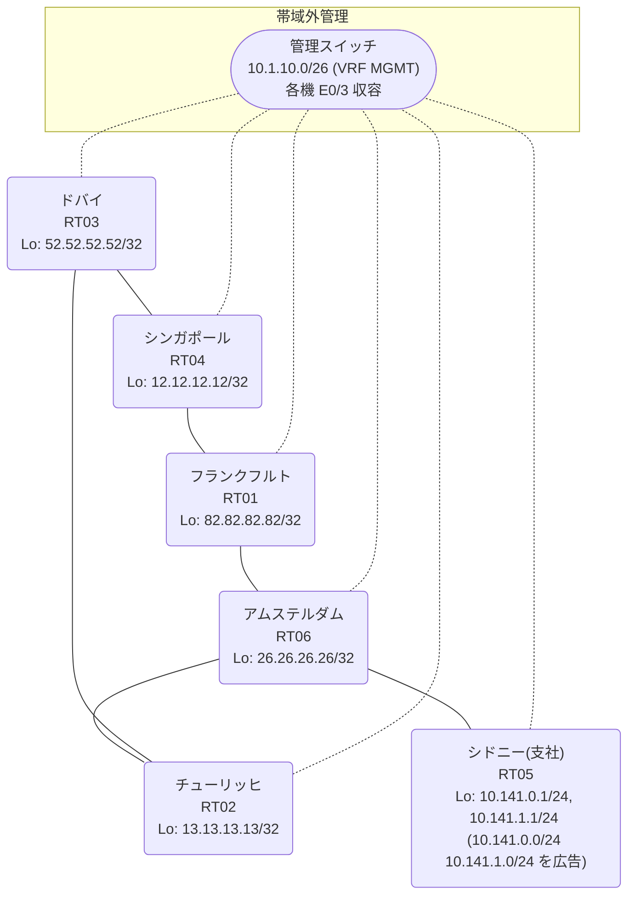

# 問題 20260906-006

> **本問は機器に接続せずに解答すること。追加の show 実行は認めない。**

## シナリオ

あなたは、ネットワークの運用を担当しています。あなたの会社のネットワークは、支社のドメインと、本社のコアのドメイン(OSPF)とが、2 台の境界のルータによって接続され、そして、それらは境界において接続されています。支社のネットワーク `10.141.0.0/24` および `10.141.1.0/24` は、RT05 によって、広告されています。どちらの境界が失われた場合においても、通信が継続されることができるように、設計されています。ルーティングの設計の詳細は、示されているところの出力から、読み取られることが、期待されています。一部の通信が、意図されているとおりに動作していない、という報告があります。あなたは、提示されているところの情報のみを使用して、要求されている状態が満たされていない理由を、特定しなければなりません。スタティック・ルートおよび既定のルートによる迂回は、実施されることはできません。二点相互再配送による、冗長の設計が、維持されなければなりません。支社のネットワーク `10.141.0.0/24` / `10.141.1.0/24` への到達可能性が、すべてのサイトにおいて、確保されていること。支社のネットワーク宛のトラフィックが RT05 へ配送され、経路の周回が、発生していないこと。ルーティング プロトコルの種別およびプロセスの配置は、変更されることはできません。



| 拠点 | ルータ | Loopback / 広告網 |
|------|--------|--------------------|
| アムステルダム | RT06 | 26.26.26.26/32 |
| シドニー(支社) | RT05 | 10.141.0.1/24, 10.141.1.1/24 (`10.141.0.0/24` `10.141.1.0/24` を広告) |
| シンガポール | RT04 | 12.12.12.12/32 |
| チューリッヒ | RT02 | 13.13.13.13/32 |
| ドバイ | RT03 | 52.52.52.52/32 |
| フランクフルト | RT01 | 82.82.82.82/32 |

リンク一覧:
```
  RT05:E0/0(.2) ── RT06:E0/0(.1)   10.136.219.0/30
  RT06:E0/1(.1) ── RT02:E0/0(.2)   10.136.47.0/30
  RT06:E0/2(.1) ── RT01:E0/0(.2)   10.151.75.0/30
  RT02:E0/1(.1) ── RT03:E0/0(.2)   172.16.105.0/30
  RT03:E0/1(.1) ── RT04:E0/0(.2)   172.16.2.0/30
  RT01:E0/1(.1) ── RT04:E0/1(.2)   172.16.239.0/30
```

## 出力

```
RT06# show ip route
Gateway of last resort is not set
      10.0.0.0/8 is variably subnetted, 8 subnets, 3 masks
C        10.136.47.0/30 is directly connected, Ethernet0/1
L        10.136.47.1/32 is directly connected, Ethernet0/1
C        10.136.219.0/30 is directly connected, Ethernet0/0
L        10.136.219.1/32 is directly connected, Ethernet0/0
R        10.141.0.0/24 [120/1] via 10.151.75.2, 00:00:13, Ethernet0/2
                       [120/1] via 10.136.219.2, 00:00:08, Ethernet0/0
R        10.141.1.0/24 [120/1] via 10.151.75.2, 00:00:13, Ethernet0/2
                       [120/1] via 10.136.219.2, 00:00:08, Ethernet0/0
C        10.151.75.0/30 is directly connected, Ethernet0/2
L        10.151.75.1/32 is directly connected, Ethernet0/2
      12.0.0.0/32 is subnetted, 1 subnets
R        12.12.12.12 [120/1] via 10.151.75.2, 00:00:13, Ethernet0/2
                     [120/1] via 10.136.47.2, 00:00:12, Ethernet0/1
      13.0.0.0/32 is subnetted, 1 subnets
R        13.13.13.13 [120/1] via 10.151.75.2, 00:00:13, Ethernet0/2
                     [120/1] via 10.136.47.2, 00:00:12, Ethernet0/1
      26.0.0.0/32 is subnetted, 1 subnets
C        26.26.26.26 is directly connected, Loopback0
      52.0.0.0/32 is subnetted, 1 subnets
R        52.52.52.52 [120/1] via 10.151.75.2, 00:00:13, Ethernet0/2
                     [120/1] via 10.136.47.2, 00:00:12, Ethernet0/1
      82.0.0.0/32 is subnetted, 1 subnets
R        82.82.82.82 [120/1] via 10.151.75.2, 00:00:13, Ethernet0/2
                     [120/1] via 10.136.47.2, 00:00:12, Ethernet0/1
      172.16.0.0/30 is subnetted, 3 subnets
R        172.16.2.0 [120/1] via 10.151.75.2, 00:00:13, Ethernet0/2
                    [120/1] via 10.136.47.2, 00:00:12, Ethernet0/1
R        172.16.105.0 [120/1] via 10.151.75.2, 00:00:13, Ethernet0/2
                      [120/1] via 10.136.47.2, 00:00:12, Ethernet0/1
R        172.16.239.0 [120/1] via 10.151.75.2, 00:00:13, Ethernet0/2
                      [120/1] via 10.136.47.2, 00:00:12, Ethernet0/1
```
```
RT02# show ip route 10.141.0.0
Routing entry for 10.141.0.0/24
  Known via "rip", distance 120, metric 2
  Redistributing via ospf 1, rip
  Advertised by ospf 1 subnets
  Last update from 10.136.47.1 on Ethernet0/0, 00:00:06 ago
  Routing Descriptor Blocks:
  * 10.136.47.1, from 10.136.47.1, 00:00:06 ago, via Ethernet0/0
      Route metric is 2, traffic share count is 1
```
```
RT03# traceroute 10.141.0.1 probe 1 timeout 1 ttl 1 8
Type escape sequence to abort.
Tracing the route to 10.141.0.1
VRF info: (vrf in name/id, vrf out name/id)
  1 172.16.105.1 10 msec
  2 10.136.47.1 2 msec
  3 10.151.75.2 2 msec
  4 172.16.239.2 1 msec
  5 172.16.2.1 2 msec
  6 172.16.105.1 2 msec
  7 10.136.47.1 2 msec
  8 10.151.75.2 17 msec
```
```
RT02# show running-config | section router
router ospf 1
 router-id 13.13.13.13
 redistribute rip
 network 13.13.13.13 0.0.0.0 area 0
 network 172.16.105.0 0.0.0.3 area 0
router rip
 version 2
 redistribute ospf 1 metric 1
 network 10.0.0.0
 network 13.0.0.0
 no auto-summary
```
```
RT01# show running-config | section router
router ospf 1
 router-id 82.82.82.82
 redistribute rip
 network 82.82.82.82 0.0.0.0 area 0
 network 172.16.239.0 0.0.0.3 area 0
router rip
 version 2
 redistribute ospf 1 metric 1
 network 10.0.0.0
 network 82.0.0.0
 no auto-summary
```

## 設問

次のうち、正しいものは、どれですか。

## 選択肢
A. RT05 が支社網を広告しておらず、正規の経路が存在しない

B. RT02 と RT01 の間で OSPF の隣接が確立しておらず、経路情報が同期していない

C. 等コストの複数経路による正常な負荷分散であり、事象は仕様どおりである

D. RT06 において、再注入された経路の管理距離が、正規の経路のそれより小さい

E. 境界の OSPF→RIP の再配送でメトリックが無限大となり、経路が広告されていない

F. RT06 が、境界で再注入された経路を、RT05 からの正規の経路と等価に扱っている
