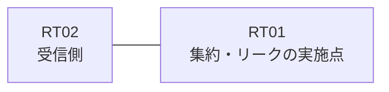

# 問題 20260906-007

> **本問は機器に接続せずに解答すること。追加の show 実行は認めない。**

## シナリオ

あなたの組織は、下記に示されているところのネットワークを運用しています。拠点のルータ RT01 は、複数のループバック・インターフェイスによって、サービスのためのアドレスのブロック 192.168.14.0/30 を収容しています。RT01 と RT02 は、1本のリンクによって直接に接続されており、そして、EIGRP 100 が構成されています。ユーザーから、通信に関する事象が、報告されています。示されているところの出力および構成に基づいて、要求されているところの動作が得られていない理由が、判断されなければなりません。運用のためのループバック 10.236.196.246 (/32) は、引き続き受信される必要があります。ブロックのループバックのインターフェイスを、network のステートメントによって EIGRP へ参加させることは、認められていません。本作業は、日中の時間帯において実施されるという理由により、対象外であるところのデバイスに対する構成の変更は、許可されていません。ただし、監視のためのホストである 192.168.14.3 (/32) の明細のルートは、集約とともに、受信されなければなりません。ブロックの内部の明細のルートは、広告されてはなりません。RT02 に対して、ブロック 192.168.14.0/30 は、集約のルートとして広告されなければなりません。



| 対象 | 内容 |
|------|------|
| RT01 のループバック | 192.168.14.1, 192.168.14.2, 192.168.14.3 |
| RT01 の運用系ループバック | 10.236.196.246 |
| RT01 ⇔ RT02 のリンク | 10.203.31.0/24（RT01=10.203.31.1 / RT02=10.203.31.2・Ethernet0/0） |

## 出力

```
RT01# show running-config
Building configuration...
!
interface Loopback0
 ip address 192.168.14.1 255.255.255.255
interface Loopback1
 ip address 192.168.14.2 255.255.255.255
interface Loopback2
 ip address 192.168.14.3 255.255.255.255
interface Loopback10
 ip address 10.236.196.246 255.255.255.255
interface Ethernet0/0
 description === to RT02 ===
 ip address 10.203.31.1 255.255.255.252
 ip summary-address eigrp 100 192.168.14.0 255.255.255.252 leak-map RM-LEAK
!
router eigrp 100
 network 10.236.196.246 0.0.0.0
 network 10.203.31.0 0.0.0.3
 redistribute connected route-map RM-LEAK
!
ip prefix-list MON32 seq 5 permit 192.168.14.3/32
ip prefix-list PL01 seq 5 permit 192.168.14.0/30 le 32
access-list 10 permit 192.168.14.1
access-list 20 permit 192.168.14.1
!
route-map RM-LEAK permit 10
 match ip address 20
route-map RMAP01 permit 10
 match ip address prefix-list PL01
!
```

## 設問

次のうち、正しいものは、どれですか。

## 選択肢
**A.**
```
RT02# show ip route eigrp | begin Gateway
Gateway of last resort is not set
      10.0.0.0/32 is subnetted, 1 subnets
D        10.236.196.246 [90/409600] via 10.203.31.1, 00:02:30, Ethernet0/0
      192.168.14.0/32 is subnetted, 1 subnets
D EX     192.168.14.1 [170/409600] via 10.203.31.1, 00:02:30, Ethernet0/0
```
**B.**
```
RT02# show ip route eigrp | begin Gateway
Gateway of last resort is not set
      10.0.0.0/32 is subnetted, 1 subnets
D        10.236.196.246 [90/409600] via 10.203.31.1, 00:02:30, Ethernet0/0
      192.168.14.0/24 is variably subnetted, 2 subnets, 2 masks
D        192.168.14.0/30 [90/409600] via 10.203.31.1, 00:02:30, Ethernet0/0
D EX     192.168.14.1/32 [170/409600] via 10.203.31.1, 00:02:30, Ethernet0/0
```
**C.**
```
RT02# show ip route eigrp | begin Gateway
Gateway of last resort is not set
      10.0.0.0/32 is subnetted, 1 subnets
D        10.236.196.246 [90/409600] via 10.203.31.1, 00:02:30, Ethernet0/0
      192.168.14.0/30 is subnetted, 1 subnets
D        192.168.14.0 [90/409600] via 10.203.31.1, 00:02:30, Ethernet0/0
```
**D.**
```
RT02# show ip route eigrp | begin Gateway
Gateway of last resort is not set
      10.0.0.0/32 is subnetted, 1 subnets
D        10.236.196.246 [90/409600] via 10.203.31.1, 00:02:30, Ethernet0/0
      192.168.14.0/24 is variably subnetted, 2 subnets, 2 masks
D        192.168.14.0/30 [90/409600] via 10.203.31.1, 00:02:30, Ethernet0/0
D        192.168.14.3/32 [90/409600] via 10.203.31.1, 00:02:30, Ethernet0/0
```
