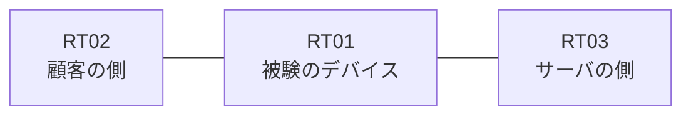

# 問題 20260906-009

> **本問は機器に接続せずに解答すること。追加の show 実行は認めない。**

## シナリオ

あなたの組織は、下記に示されているところのネットワークを運用しています。ある企業のネットワークにおいて、RT01 は、顧客の側のネットワークと、サーバの側のネットワークとの間に、配置されています。RT01 は、RT03 および RT02 の両方から、ルーティング・プロトコルによってルートを学習しています。要求されているところの動作が、得られていない、ということが、報告されています。原因として、**アクセス・リストにエントリが1つも存在しない** と **参照されているアクセス・リストが定義されていない** と **名前付きの拡張のアクセス・リストが指定されており、フィルタ自体が適用されていない** の 3 つが、想定されています。機器の構成は、まだ取得されていません。プレフィックスの長さが異なるルートは、区別して扱われなければなりません。ルート マップを使用してはなりません。RT01 は、`10.185.40.0/24`、`10.185.41.0/24`、`10.185.42.0/24` のネットワークのルートのみを、ルーティング テーブルに保持する必要があります。インタフェースの IP アドレッシングは、変更されてはなりません。



| 区間 | 被験デバイス側のインターフェイス | ネットワーク |
|------|----------------------------------|--------------|
| RT02（顧客の側） ⇔ RT01 | — | 10.185.253.0/24 |
| RT01 ⇔ RT03（サーバの側） | — | 10.185.254.0/24 |

## 出力

```
RT01# show ip route eigrp | begin Gateway
Gateway of last resort is not set

      10.185.0.0/16 is variably subnetted, 5 subnets, 2 masks
D        10.185.40.0/24 [90/409600] via 10.185.254.2, 00:04:11, Ethernet0/1
D        10.185.41.0/24 [90/409600] via 10.185.254.2, 00:04:11, Ethernet0/1
D        10.185.42.0/24 [90/409600] via 10.185.254.2, 00:04:11, Ethernet0/1
D        10.185.40.0/28 [90/409600] via 10.185.253.3, 00:04:11, Ethernet0/1
D        10.185.45.0/24 [90/409600] via 10.185.254.2, 00:04:11, Ethernet0/1
```

## 設問

この事象の原因を特定するために、次に取得するべき出力として、最も多くの候補を除外できるものは、どれですか。(1つを選択してください)

## 選択肢
A. RT01 における `show ip route eigrp`

B. RT01 における `show ip interface Ethernet0/0`

C. RT01 における `show ip protocols`

D. RT01 における `show ip access-lists`

E. RT01 における `show running-config | include distribute-list`
