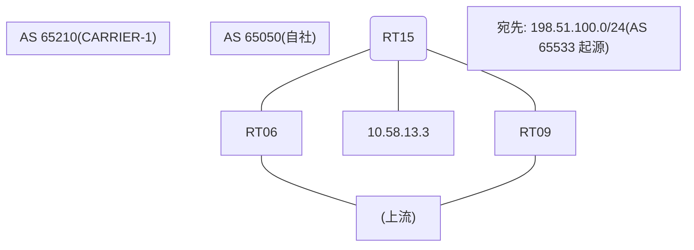

# 問題 20260906-010

> **本問は機器に接続せずに解答すること。追加の show 実行は認めない。**

## シナリオ

あなたの組織は、下記に示されているところのネットワークを運用しています。自社のルータ RT15 は、外部のネットワーク 198.51.100.0/24 への到達性を、複数の経路を通じて、確立しています。 CARRIER-1 とは、接続されています。 一部の経路は、自 AS 内の境界ルーターから、iBGP で、学習されています。ベストパスの選出の結果について、その根拠が、確認されようとしています。示されているところの出力、および、構成に基づいて、判断すること。なお、機器の構成は、示されている抜粋のほかは、既定値である。



## 出力

```
RT15# show ip bgp
BGP table version is 51, local router ID is 193.193.193.193
Status codes: s suppressed, d damped, h history, * valid, > best, i - internal, 
              r RIB-failure, S Stale, m multipath, b backup-path, f RT-Filter, 
              x best-external, a additional-path, c RIB-compressed, 
              t secondary path, L long-lived-stale,
Origin codes: i - IGP, e - EGP, ? - incomplete
RPKI validation codes: V valid, I invalid, N Not found

     Network          Next Hop            Metric LocPrf Weight Path
 *    198.51.100.0     10.58.13.3                             0 65210 65210 65533 65533 i
 *>i                   9.5.5.5                       100      0 65210 65533 i
 * i                   8.6.6.6                       100      0 65210 65533 i
```
```
RT15# show ip bgp 198.51.100.0
BGP routing table entry for 198.51.100.0/24, version 51
Paths: (3 available, best #2, table default)
  Advertised to update-groups:
     2         
  Refresh Epoch 4
  65210 65210 65533 65533
    10.58.13.3 from 10.58.13.3 (22.22.22.22)
      Origin IGP, localpref 100, valid, external
      rx pathid: 0, tx pathid: 0
      Updated on Jul 22 2026 08:39:56 UTC
  Refresh Epoch 2
  65210 65533
    9.5.5.5 (metric 11) from 9.5.5.5 (80.80.80.80)
      Origin IGP, localpref 100, valid, internal, best
      rx pathid: 0, tx pathid: 0x0
      Updated on Jul 22 2026 07:44:14 UTC
  Refresh Epoch 1
  65210 65533
    8.6.6.6 (metric 101) from 8.6.6.6 (73.73.73.73)
      Origin IGP, localpref 100, valid, internal
      rx pathid: 0, tx pathid: 0
      Updated on Jul 22 2026 06:56:07 UTC
```
```
RT15# show running-config | section router bgp
router bgp 65050
 bgp router-id 193.193.193.193
 bgp log-neighbor-changes
 neighbor 8.6.6.6 remote-as 65050
 neighbor 8.6.6.6 update-source Loopback0
 neighbor 9.5.5.5 remote-as 65050
 neighbor 9.5.5.5 update-source Loopback0
 neighbor 10.58.13.3 remote-as 65210
 !
 address-family ipv4
  neighbor 8.6.6.6 activate
  neighbor 9.5.5.5 activate
  neighbor 10.58.13.3 activate
 exit-address-family
```

## 設問

示されているところの出力において、ベストパスの選出を決定づけた要素は、どれですか。(1つを選択してください)

## 選択肢
A. 送り手の BGP ルータ ID(小さいほうが優先)

B. next-hop への IGP メトリック(小さいほうが優先)

C. LOCAL_PREF(大きいほうが優先)

D. 最も古い経路(eBGP 同士のタイ)

E. MED(小さいほうが優先)
