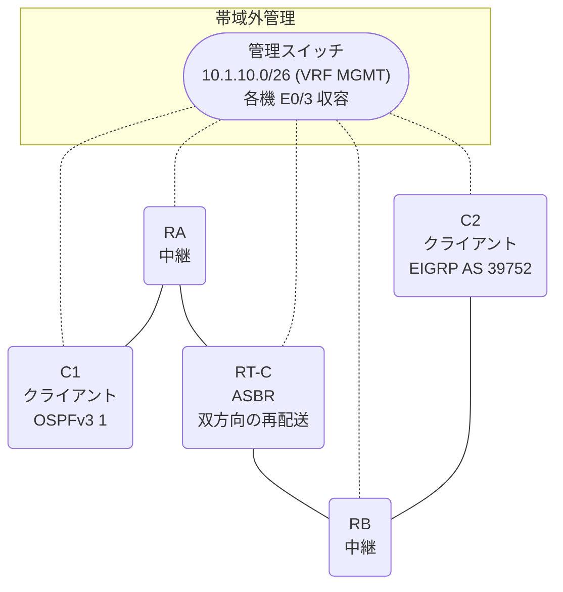

# 問題 20260906-011

> **本問は機器に接続せずに解答すること。追加の show 実行は認めない。**

## トポロジ

あなたは、下記のネットワークの保守を担当する技術者です。クライアントである C1 は OSPFv3 の ドメイン に、そして、C2 は EIGRP の ドメイン に、それぞれ収容されています。RT-C は、2 つの ドメイン の境界に位置しており、双方向の 再配送 が構成されています。



| ルータ | 位置づけ | 参加プロトコル |
|--------|----------|----------------|
| C1 | クライアント | OSPFv3 1 area 0 |
| RA | 中継 | OSPFv3 1 area 0 |
| RT-C | **ASBR(2 つの ドメイン の 境界)** | 双方向の 再配送 |
| RB | 中継 | EIGRP LAB AS 39752 |
| C2 | クライアント | EIGRP LAB AS 39752 |

リンク一覧:
```
  (a) C1:Et0/0         ── RA:Et0/1                  2001:DB8:A:1:1::/64   C1 = 2001:DB8:A:1:1::2
  (b) RA:Et0/0         ── RT-C:GigabitEthernet0/0   2001:DB8:2:AA::/64
  (c) RT-C:Ethernet0/1 ── RB:Et0/0                  2001:DB8:AA:B::/64
  (d) RB:Et0/1         ── C2:Et0/0                  2001:DB8:B:1::/64     C2 = 2001:DB8:B:1::2
```

OSPFv3 の ドメイン には、RA によって注入されたところの 外部の ルート `2001:DB8:20:1::/64` が存在する。

## 要件

1. C1 と C2 は、相互に 通信 できなければなりません。
2. OSPFv3 の ドメイン に存在するところの 外部の ルートも、 EIGRP の ドメイン へ 配布される必要があります。
3. ルーティング・プロトコルの種別およびプロセスの配置は、変更されてはなりません。

## 現在の状態

いくつかの宛先への通信について、報告が上がっています。あなたは、提示されているところの情報のみを使用して、要求されている状態が満たされていない理由を、特定しなければなりません。

```
C1# show ipv6 route ospf | include ^O|via
OE2 2001:DB8:B:1::/64 [110/20]
     via FE80::A8BB:CCFF:FE01:5700, Ethernet0/0
OE2 2001:DB8:20:1::/64 [110/20]
     via FE80::A8BB:CCFF:FE01:5700, Ethernet0/0
OE2 2001:DB8:AA:B::/64 [110/20]
     via FE80::A8BB:CCFF:FE01:5700, Ethernet0/0
```
```
C1# ping 2001:DB8:B:1::2
Type escape sequence to abort.
Sending 5, 100-byte ICMP Echos to 2001:DB8:B:1::2, timeout is 2 seconds:
.....
Success rate is 0 percent (0/5)

C2# ping 2001:DB8:A:1:1::2
Type escape sequence to abort.
Sending 5, 100-byte ICMP Echos to 2001:DB8:A:1:1::2, timeout is 2 seconds:

% No valid route for destination
Success rate is 0 percent (0/1)
```
```
RB# show ipv6 route eigrp | include ^D|^EX|via
EX  2001:DB8:2:AA::/64 [170/1536000]
     via FE80::A8BB:CCFF:FE01:7700, Ethernet0/0
```

## 設定抜粋

```
RT-C# show running-config
Building configuration...
!
interface GigabitEthernet0/0
 description === to RA ===
 no ip address
 ipv6 address 2001:DB8:2:AA::1/64
 ipv6 enable
 ipv6 ospf 1 area 0
!
interface Ethernet0/1
 description === to RB ===
 no ip address
 ipv6 address 2001:DB8:AA:B::1/64
 ipv6 enable
!
router eigrp LAB
 !
 address-family ipv6 unicast autonomous-system 39752
  !
  af-interface GigabitEthernet0/0
   shutdown
  exit-af-interface
  !
  topology base
   redistribute ospf 1 match internal metric 100000 100 255 1 1500 route-map RM-OSPF include-connected
  exit-af-topology
  eigrp router-id 9.5.1.1
 exit-address-family
!
router ospfv3 1
 router-id 8.3.1.5
 !
 address-family ipv6 unicast
  redistribute eigrp 39752 route-map REDIST-MAP include-connected
 exit-address-family
!
ipv6 prefix-list E5400 seq 5 permit 2001:DB8:A:1:1::/64
ipv6 prefix-list E5400 seq 10 permit 2001:DB8:B:1::/64
ipv6 prefix-list O544 seq 5 permit 2001:DB8:AA:B::/64
ipv6 prefix-list O544 seq 10 permit 2001:DB8:B:1::/64
ipv6 prefix-list PL-CORE seq 5 permit ::/0 le 64
ipv6 prefix-list PL-EIGRP seq 5 permit 2001:DB8:2:AA::/64
!
route-map EMAP01 permit 10
 match ipv6 address prefix-list PL-CORE
route-map REDIST-MAP permit 10
 match ipv6 address prefix-list O544
route-map RM-OSPF permit 10
 match ipv6 address prefix-list PL-EIGRP
!
```

## 設問

次のうち、正しいものは、どれですか。

## 選択肢
A. redistribute が参照しているところの名前の route-map が、定義されていない

B. route-map の 先頭の エントリ が、対向の クライアント の ネットワーク を拒否している

C. redistribute の ステートメント において、include-connected が指定されていない

D. C1 および C2 において、それぞれの ドメイン の ルーティング・プロトコル が構成されていない

E. RT-C と 隣接の ルータ の 間で、ルーティング・プロトコル の 隣接関係 が確立されていない

F. 一方の 方向 の プレフィックス・リスト のみが、対向の クライアント の ネットワーク を許可している
