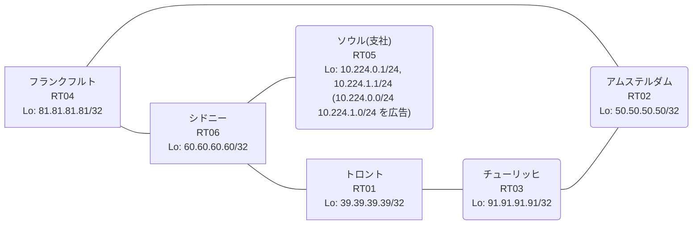

# 問題 20260906-012

> **本問は機器に接続せずに解答すること。追加の show 実行は認めない。**

## トポロジ

あなたの組織は、下記に示されているところのネットワークを運用しています。あなたの会社のネットワークは、支社のドメインと、本社のコアのドメイン(OSPF)とが、2 台の境界のルーターによって接続され、そして、それらは境界において接続されています。支社のネットワーク `10.224.0.0/24` および `10.224.1.0/24` は、RT05 によって、広告されています。どちらの境界が失われた場合においても、通信が継続されることができるように、設計されています。ルーティングの設計の詳細は、示されているところの出力から、読み取られることが、期待されています。



| 拠点 | ルータ | Loopback / 広告網 |
|------|--------|--------------------|
| アムステルダム | RT02 | 50.50.50.50/32 |
| シドニー | RT06 | 60.60.60.60/32 |
| ソウル(支社) | RT05 | 10.224.0.1/24, 10.224.1.1/24 (`10.224.0.0/24` `10.224.1.0/24` を広告) |
| チューリッヒ | RT03 | 91.91.91.91/32 |
| トロント | RT01 | 39.39.39.39/32 |
| フランクフルト | RT04 | 81.81.81.81/32 |

リンク一覧:
```
  RT05:E0/0(.2) ── RT06:E0/0(.1)   10.52.96.0/30
  RT06:E0/1(.1) ── RT01:E0/0(.2)   10.55.207.0/30
  RT06:E0/2(.1) ── RT04:E0/0(.2)   10.71.73.0/30
  RT01:E0/1(.1) ── RT03:E0/0(.2)   172.16.59.0/30
  RT03:E0/1(.1) ── RT02:E0/0(.2)   172.16.198.0/30
  RT04:E0/1(.1) ── RT02:E0/1(.2)   172.16.142.0/30
```

## 要件

1. 本作業は、日中の時間帯において実施されるという理由により、対象外であるところのデバイスに対する構成の変更は、許可されていません。
2. 支社のネットワーク宛のトラフィックが RT05 へ配送され、経路の周回が、発生していないこと。
3. すべてのサイトから、支社のネットワーク `10.224.0.0/24` および `10.224.1.0/24` を含むところの、すべての宛先へ、到達することができること。
4. スタティック・ルートおよび既定のルートによる迂回は、実施されてはなりません。
5. 二点相互再配送による、冗長の設計が、維持されなければなりません。
6. 経路の出自に基づく遮断が、両方の境界において、意図どおりに機能させられること。
7. 管理距離の変更は、変更の凍結により、使用することができません。

## 現在の状態

ユーザーから、通信に関する事象が、報告されています。あなたは、示されているところの出力および構成に基づいて、その構成が、下記において記述されているとおりに動作していない理由を、判断する必要があります。

```
RT04# show ip route 10.224.0.0
Routing entry for 10.224.0.0/24
  Known via "ospf 1", distance 110, metric 20
  Tag 100, type extern 2, forward metric 30
  Redistributing via rip
  Advertised by rip metric 5 route-map OSPF2RIP
  Last update from 172.16.142.2 on Ethernet0/1, 00:04:43 ago
  Routing Descriptor Blocks:
  * 172.16.142.2, from 39.39.39.39, 00:04:43 ago, via Ethernet0/1
      Route metric is 20, traffic share count is 1
      Route tag 100
```
```
RT06# show ip route
Gateway of last resort is not set
      10.0.0.0/8 is variably subnetted, 8 subnets, 3 masks
C        10.52.96.0/30 is directly connected, Ethernet0/0
L        10.52.96.1/32 is directly connected, Ethernet0/0
C        10.55.207.0/30 is directly connected, Ethernet0/1
L        10.55.207.1/32 is directly connected, Ethernet0/1
C        10.71.73.0/30 is directly connected, Ethernet0/2
L        10.71.73.1/32 is directly connected, Ethernet0/2
R        10.224.0.0/24 [120/1] via 10.52.96.2, 00:00:09, Ethernet0/0
R        10.224.1.0/24 [120/1] via 10.52.96.2, 00:00:09, Ethernet0/0
      39.0.0.0/32 is subnetted, 1 subnets
R        39.39.39.39 [120/1] via 10.55.207.2, 00:00:12, Ethernet0/1
      50.0.0.0/32 is subnetted, 1 subnets
R        50.50.50.50 [120/5] via 10.71.73.2, 00:00:13, Ethernet0/2
                     [120/5] via 10.55.207.2, 00:00:12, Ethernet0/1
      60.0.0.0/32 is subnetted, 1 subnets
C        60.60.60.60 is directly connected, Loopback0
      81.0.0.0/32 is subnetted, 1 subnets
R        81.81.81.81 [120/1] via 10.71.73.2, 00:00:13, Ethernet0/2
      91.0.0.0/32 is subnetted, 1 subnets
R        91.91.91.91 [120/5] via 10.71.73.2, 00:00:13, Ethernet0/2
                     [120/5] via 10.55.207.2, 00:00:12, Ethernet0/1
      172.16.0.0/30 is subnetted, 3 subnets
R        172.16.59.0 [120/5] via 10.71.73.2, 00:00:13, Ethernet0/2
                     [120/5] via 10.55.207.2, 00:00:12, Ethernet0/1
R        172.16.142.0 [120/5] via 10.71.73.2, 00:00:13, Ethernet0/2
                      [120/5] via 10.55.207.2, 00:00:12, Ethernet0/1
R        172.16.198.0 [120/5] via 10.71.73.2, 00:00:13, Ethernet0/2
                      [120/5] via 10.55.207.2, 00:00:12, Ethernet0/1
```
```
RT01# show route-map
route-map RIP2OSPF, deny, sequence 10
  Match clauses:
     tag 180 
  Set clauses:
  Policy routing matches: 0 packets, 0 bytes
route-map RIP2OSPF, permit, sequence 20
  Match clauses:
  Set clauses:
    tag 100 
  Policy routing matches: 0 packets, 0 bytes
route-map OSPF2RIP, deny, sequence 10
  Match clauses:
     tag 10 
  Set clauses:
  Policy routing matches: 0 packets, 0 bytes
route-map OSPF2RIP, permit, sequence 20
  Match clauses:
  Set clauses:
    tag 180 
  Policy routing matches: 0 packets, 0 bytes
```
```
RT04# show route-map
route-map RIP2OSPF, deny, sequence 10
  Match clauses:
     tag 180 
  Set clauses:
  Policy routing matches: 0 packets, 0 bytes
route-map RIP2OSPF, permit, sequence 20
  Match clauses:
  Set clauses:
    tag 100 
  Policy routing matches: 0 packets, 0 bytes
route-map OSPF2RIP, deny, sequence 10
  Match clauses:
     tag 10 
  Set clauses:
  Policy routing matches: 0 packets, 0 bytes
route-map OSPF2RIP, permit, sequence 20
  Match clauses:
  Set clauses:
    tag 180 
  Policy routing matches: 0 packets, 0 bytes
```
```
RT01# show ip route 10.224.0.0
Routing entry for 10.224.0.0/24
  Known via "rip", distance 120, metric 2
  Redistributing via ospf 1, rip
  Advertised by ospf 1 subnets route-map RIP2OSPF
  Last update from 10.55.207.1 on Ethernet0/0, 00:00:06 ago
  Routing Descriptor Blocks:
  * 10.55.207.1, from 10.55.207.1, 00:00:06 ago, via Ethernet0/0
      Route metric is 2, traffic share count is 1
```

## 設定抜粋

```
RT01# show running-config | section router
router ospf 1
 router-id 39.39.39.39
 redistribute rip route-map RIP2OSPF
 network 39.39.39.39 0.0.0.0 area 0
 network 172.16.59.0 0.0.0.3 area 0
router rip
 version 2
 redistribute ospf 1 metric 5 route-map OSPF2RIP
 network 10.0.0.0
 network 39.0.0.0
 no auto-summary
```
```
RT04# show running-config | section router
router ospf 1
 router-id 81.81.81.81
 redistribute rip route-map RIP2OSPF
 network 81.81.81.81 0.0.0.0 area 0
 network 172.16.142.0 0.0.0.3 area 0
router rip
 version 2
 redistribute ospf 1 metric 5 route-map OSPF2RIP
 network 10.0.0.0
 network 81.0.0.0
 no auto-summary
```

## 設問

次のうち、正しいものは、どれですか。

## 選択肢
**A.**
```
! RT01 と RT04 の両方に投入
router rip
 redistribute ospf 1 metric 20 route-map OSPF2RIP
```

**B.**
```
! RT01 と RT04 の両方に投入
route-map OSPF2RIP deny 10
 no match tag 10
 match tag 100
```

**C.**
```
! RT01 にのみ投入
route-map OSPF2RIP deny 10
 no match tag 10
 match tag 100
```

**D.**
```
! RT01 と RT04 の両方に投入
route-map RIP2OSPF deny 10
 no match tag 180
 match tag 100
```

**E.**
```
clear ip route *
```

**F.**
```
! RT01 と RT04 の両方に投入
router ospf 1
 distance ospf external 180
```
