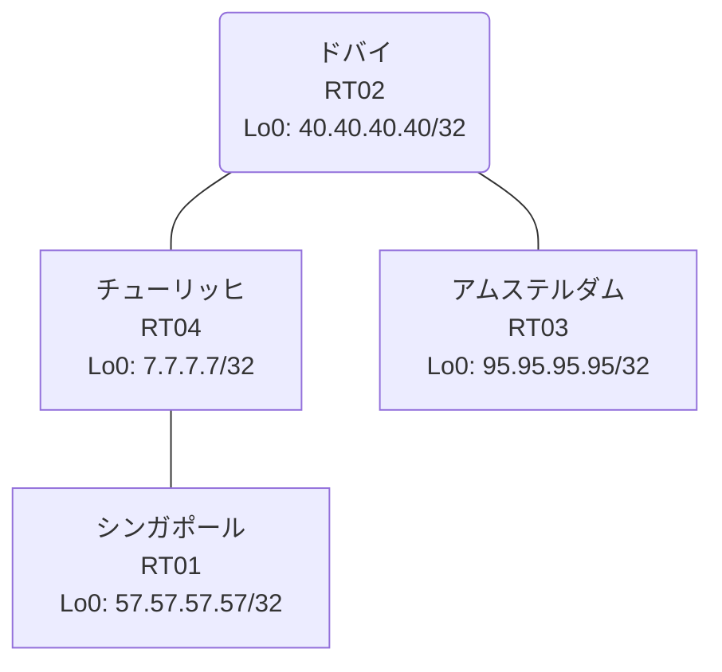

# 問題 20260906-013

> **本問は機器に接続せずに解答すること。追加の show 実行は認めない。**

## トポロジ

あなたは、下記のネットワークの保守を担当する技術者です。あなたの会社のネットワークは、複数のルーティング ドメインが、境界のルーターによって接続され、そして、すべての拠点の到達可能性が提供されている、というものです。ルーティングの設計の詳細は、示されているところのコンフィギュレーションから、読み取られることが、期待されています。各拠点のルーターと、拠点のネットワークとの対応は、下記の表に示されているとおりです。



| 拠点 | ルータ | 拠点網 |
|------|--------|----------------------|
| アムステルダム | RT03 | `95.95.95.95/32` |
| シンガポール | RT01 | `57.57.57.57/32` |
| チューリッヒ | RT04 | `7.7.7.7/32` |
| ドバイ | RT02 | `40.40.40.40/32` |

リンク一覧:
```
  RT04:E0/0(.1) ── RT01:E0/0(.2)   10.28.158.0/30
  RT02:E0/0(.1) ── RT03:E0/0(.2)   10.105.32.0/30
  RT02:E0/1(.1) ── RT04:E0/1(.2)   10.208.68.0/30
```

## 要件

1. スタティック ルートおよび既定のルートによる迂回は、実施されることはできません。
2. 再配送に対するフィルタの適用は、禁止されているところのものです。
3. redistribute によって参照されるところのプロセス ID / AS 番号は、その境界に実在する隣接のドメインのものと一致させられ、そして、実在しないプロセスへの参照が、残置されてはなりません。
4. EIGRP へ再配送される際の初期のメトリックは `10000 10 255 1 1500` とし、そして、それぞれの redistribute のステートメントに、直接に記述される必要があります。
5. いずれのサイトからも、他のすべてのサイトのネットワークへの、IP リーチアビリティが、確保されていること。

## 現在の状態

通信の一部において、想定されていない挙動が、観測されています。示されているところの出力および構成に基づいて、要求されているところの動作が得られていない理由が、判断されなければなりません。

```
RT02# show ip prefix-list
ip prefix-list PL-MIGR1: 2 entries
   seq 5 deny 57.57.57.57/32
   seq 10 permit 0.0.0.0/0 le 32
```
```
RT02# show route-map
route-map RM-MIGR1, deny, sequence 10
  Match clauses:
    ip address prefix-lists: PL-MIGR1 
  Set clauses:
  Policy routing matches: 0 packets, 0 bytes
route-map RM-MIGR1, permit, sequence 20
  Match clauses:
  Set clauses:
  Policy routing matches: 0 packets, 0 bytes
```
```
RT03# show ip route
Gateway of last resort is not set
      10.0.0.0/8 is variably subnetted, 2 subnets, 2 masks
C        10.105.32.0/30 is directly connected, Ethernet0/0
L        10.105.32.2/32 is directly connected, Ethernet0/0
      40.0.0.0/32 is subnetted, 1 subnets
D        40.40.40.40 [90/409600] via 10.105.32.1, 00:06:32, Ethernet0/0
      95.0.0.0/32 is subnetted, 1 subnets
C        95.95.95.95 is directly connected, Loopback0
```
```
RT02# show access-lists
Standard IP access list 15
    10 deny   57.57.57.57
    20 permit any
```
```
RT04# show ip route
Gateway of last resort is not set
      7.0.0.0/32 is subnetted, 1 subnets
C        7.7.7.7 is directly connected, Loopback0
      10.0.0.0/8 is variably subnetted, 5 subnets, 2 masks
C        10.28.158.0/30 is directly connected, Ethernet0/0
L        10.28.158.1/32 is directly connected, Ethernet0/0
O E2     10.105.32.0/30 [110/20] via 10.208.68.1, 00:06:05, Ethernet0/1
C        10.208.68.0/30 is directly connected, Ethernet0/1
L        10.208.68.2/32 is directly connected, Ethernet0/1
      40.0.0.0/32 is subnetted, 1 subnets
O        40.40.40.40 [110/11] via 10.208.68.1, 00:06:05, Ethernet0/1
      57.0.0.0/32 is subnetted, 1 subnets
O        57.57.57.57 [110/11] via 10.28.158.2, 00:06:03, Ethernet0/0
      95.0.0.0/32 is subnetted, 1 subnets
O E2     95.95.95.95 [110/20] via 10.208.68.1, 00:06:05, Ethernet0/1
```
```
RT01# show ip route
Gateway of last resort is not set
      7.0.0.0/32 is subnetted, 1 subnets
O        7.7.7.7 [110/11] via 10.28.158.1, 00:06:22, Ethernet0/0
      10.0.0.0/8 is variably subnetted, 4 subnets, 2 masks
C        10.28.158.0/30 is directly connected, Ethernet0/0
L        10.28.158.2/32 is directly connected, Ethernet0/0
O E2     10.105.32.0/30 [110/20] via 10.28.158.1, 00:06:22, Ethernet0/0
O        10.208.68.0/30 [110/20] via 10.28.158.1, 00:06:22, Ethernet0/0
      40.0.0.0/32 is subnetted, 1 subnets
O        40.40.40.40 [110/21] via 10.28.158.1, 00:06:22, Ethernet0/0
      57.0.0.0/32 is subnetted, 1 subnets
C        57.57.57.57 is directly connected, Loopback0
      95.0.0.0/32 is subnetted, 1 subnets
O E2     95.95.95.95 [110/20] via 10.28.158.1, 00:06:22, Ethernet0/0
```

## 設定抜粋

```
RT01# show running-config | section router
router ospf 3
 router-id 57.57.57.57
 timers throttle spf 50 200 5000
 passive-interface Loopback0
 network 10.28.158.0 0.0.0.3 area 0
 network 57.57.57.57 0.0.0.0 area 0
```
```
RT02# show running-config | section router
router eigrp 365
 network 10.105.32.0 0.0.0.3
 network 40.40.40.40 0.0.0.0
 redistribute ospf 10 match internal external 1 external 2 metric 10000 10 255 1 1500
router ospf 3
 router-id 40.40.40.40
 redistribute eigrp 365
 passive-interface Loopback0
 network 10.208.68.0 0.0.0.3 area 0
 network 40.40.40.40 0.0.0.0 area 0
```
```
RT03# show running-config | section router
router eigrp 365
 network 10.105.32.0 0.0.0.3
 network 95.95.95.95 0.0.0.0
 passive-interface Loopback0
```
```
RT04# show running-config | section router
router ospf 3
 router-id 7.7.7.7
 network 7.7.7.7 0.0.0.0 area 0
 network 10.28.158.0 0.0.0.3 area 0
 network 10.208.68.0 0.0.0.3 area 0
```

## 設問

次のうち、正しいものは、どれですか。

## 選択肢
A. RT02 の router eigrp 365 配下の redistribute が、実在しないプロセス/AS を参照している

B. RT03 の router eigrp 365 で、上流側インタフェースが passive-interface に設定されている

C. RT02 の router eigrp 365 配下に redistribute が設定されていない

D. RT02 と RT03 側ドメインの間のリンクで MTU が一致していない

E. RT02 の route-map RM-MIGR1 が対象の経路を拒否している

F. RT02 の redistribute に適用された route-map が特定の拠点網を deny している
