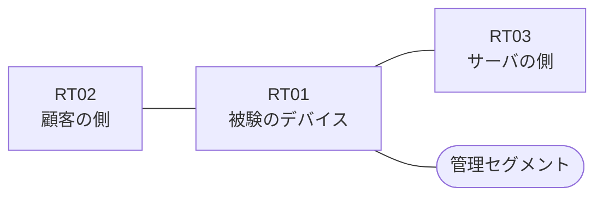

# 問題 20260906-015

> **本問は機器に接続せずに解答すること。追加の show 実行は認めない。**

## トポロジ

あなたは、ネットワークの運用を担当しています。ある企業のネットワークにおいて、RT01 は、顧客の側のネットワークと、サーバの側のネットワークとの間に、配置されています。



| 区間 | 被験デバイス側のインターフェイス | ネットワーク |
|------|----------------------------------|--------------|
| RT02（顧客の側） ⇔ RT01 | `Ethernet2/0` | 10.88.253.0/24 |
| RT01 ⇔ RT03（サーバの側） | `Ethernet2/1` | 10.88.254.0/24 |
| RT01 ⇔ 管理セグメント | `Ethernet2/2` | 10.88.255.0/24 |

## 要件

1. インタフェースの IP アドレッシングは、変更されてはなりません。
2. `10.88.29.0/24` からの通信は、許可されてはなりません。
3. 当該のサーバの他のポートへの通信、および当該のサーバ以外の宛先への通信は、許可されることはできません。
4. RT01 において、`10.88.24.0/24`、`10.88.25.0/24`、`10.88.26.0/24` のネットワークからの通信のみが、サーバである `172.24.153.17` の TCP ポート 80 に到達できなければなりません。
5. 対象としていないネットワークが、一致の対象に含まれてはなりません。また、拒否のエントリを使用してはなりません。
6. `10.88.27.0/24` からの通信は、許可されてはなりません。
7. アクセス・リストは、顧客の側のインターフェイスである `Ethernet2/0` において、着信の方向に適用されなければなりません。

## 設問

次のうち、正しいものは、どれですか。

## 選択肢
**A.**
```
access-list 120 permit tcp 10.88.24.0 0.0.7.255 host 172.24.153.17 eq www
```

**B.**
```
access-list 120 permit tcp 10.88.24.0 0.0.0.255 host 172.24.153.17 eq www
access-list 120 permit tcp 10.88.25.0 0.0.0.255 host 172.24.153.17 eq www
access-list 120 permit tcp 10.88.26.0 0.0.0.255 host 172.24.153.17 eq www
```

**C.**
```
access-list 120 permit tcp 10.88.24.0 0.0.1.255 host 172.24.153.17 eq www
```

**D.**
```
access-list 120 permit ip 10.88.24.0 0.0.3.255 host 172.24.153.17
```

**E.**
```
access-list 120 deny tcp 10.88.27.0 0.0.0.255 host 172.24.153.17 eq www
access-list 120 permit tcp 10.88.24.0 0.0.3.255 host 172.24.153.17 eq www
```

**F.**
```
access-list 120 permit tcp 10.88.24.0 0.0.5.255 host 172.24.153.17 eq www
```

**G.**
```
access-list 120 permit tcp 10.88.24.0 0.0.3.255 eq www host 172.24.153.17
```

**H.**
```
access-list 120 permit tcp 10.88.24.0 0.0.3.255 host 172.24.153.17 eq www
```
