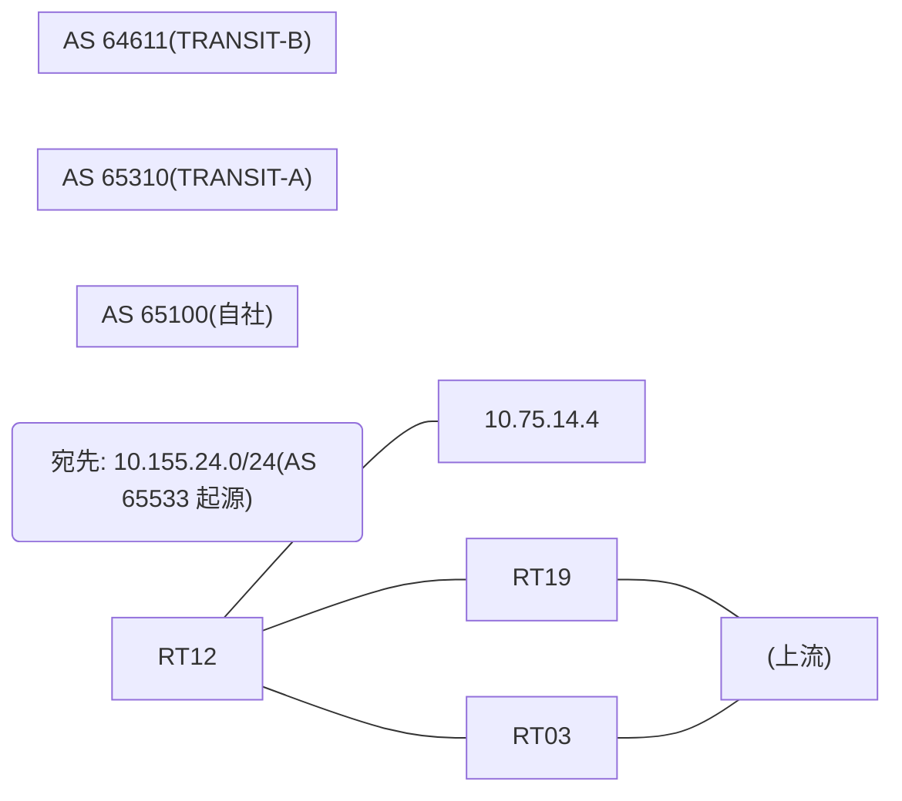

# 問題 20260906-016

> **本問は機器に接続せずに解答すること。追加の show 実行は認めない。**

## シナリオ

あなたの組織は、下記に示されているところのネットワークを運用しています。自社のルーター RT12 は、外部のネットワーク 10.155.24.0/24 への到達性を、複数の経路を通じて、確立しています。 TRANSIT-B とも、接続されています。 一部の経路は、自 AS 内の境界ルーターから、iBGP で、学習されています。現在、10.155.24.0/24 への転送は、要件に適合しないところの経路を、使用しています。RT12 における、10.155.24.0/24 への転送は、next hop 4.5.5.5 の経路を、使用すること。この変更の影響は、当該のルータに、限定されること。AS 内の、ほかのルータの経路選択を、変更してはならない。各事業者から受信するところの MED の値は、相互に調整されていない、独自の値である。経路選択の判断基準として、使用してはならない。なお、設定の投入後、変更は、適切に、反映されているものとする。



## 出力

```
RT12# show ip bgp
BGP table version is 40, local router ID is 160.160.160.160
Status codes: s suppressed, d damped, h history, * valid, > best, i - internal, 
              r RIB-failure, S Stale, m multipath, b backup-path, f RT-Filter, 
              x best-external, a additional-path, c RIB-compressed, 
              t secondary path, L long-lived-stale,
Origin codes: i - IGP, e - EGP, ? - incomplete
RPKI validation codes: V valid, I invalid, N Not found

     Network          Next Hop            Metric LocPrf Weight Path
 *>   10.155.24.0/24   10.75.14.4             500             0 64611 65533 i
 * i                   3.6.6.6                       100      0 65310 65310 65533 65533 i
 * i                   4.5.5.5                 10    100      0 65310 65533 i
```
```
RT12# show ip bgp 10.155.24.0
BGP routing table entry for 10.155.24.0/24, version 40
Paths: (3 available, best #1, table default)
  Advertised to update-groups:
     1         
  Refresh Epoch 2
  64611 65533
    10.75.14.4 from 10.75.14.4 (169.169.169.169)
      Origin IGP, metric 500, localpref 100, valid, external, best
      rx pathid: 0, tx pathid: 0x0
      Updated on May 11 2026 12:46:03 UTC
  Refresh Epoch 1
  65310 65310 65533 65533
    3.6.6.6 (metric 101) from 3.6.6.6 (3.6.6.6)
      Origin IGP, localpref 100, valid, internal
      rx pathid: 0, tx pathid: 0
      Updated on May 11 2026 13:24:56 UTC
  Refresh Epoch 2
  65310 65533
    4.5.5.5 (metric 11) from 4.5.5.5 (4.5.5.5)
      Origin IGP, metric 10, localpref 100, valid, internal
      rx pathid: 0, tx pathid: 0
      Updated on May 11 2026 12:26:07 UTC
```
```
RT12# show running-config | section router bgp
router bgp 65100
 bgp router-id 160.160.160.160
 bgp log-neighbor-changes
 neighbor 3.6.6.6 remote-as 65100
 neighbor 3.6.6.6 update-source Loopback0
 neighbor 4.5.5.5 remote-as 65100
 neighbor 4.5.5.5 update-source Loopback0
 neighbor 10.75.14.4 remote-as 64611
 !
 address-family ipv4
  neighbor 3.6.6.6 activate
  neighbor 4.5.5.5 activate
  neighbor 10.75.14.4 activate
 exit-address-family
```

## 設問

示されているところのすべての要件が満たされることを確実にするために、適用されなければならない構成は、どれですか。(1つを選択してください)

## 選択肢
**A.**
```
route-map RM-MED-A permit 10
 set metric 200
route-map RM-MED-B permit 10
 set metric 10
router bgp 65100
 address-family ipv4
  neighbor 10.75.12.2 route-map RM-MED-A out
  neighbor 10.75.13.3 route-map RM-MED-B out
```

**B.**
```
route-map RM-BACKUP-OUT permit 10
 set as-path prepend 65100 65100
router bgp 65100
 address-family ipv4
  neighbor 10.75.12.2 route-map RM-BACKUP-OUT out
```

**C.**
```
clear ip bgp * soft
```

**D.**
```
router bgp 65100
 bgp always-compare-med
```

**E.**
```
router bgp 65100
 address-family ipv4
  neighbor 4.5.5.5 weight 30000
```

**F.**
```
route-map RM-PRIMARY-IN permit 10
 set local-preference 200
router bgp 65100
 address-family ipv4
  neighbor 4.5.5.5 route-map RM-PRIMARY-IN in
```
