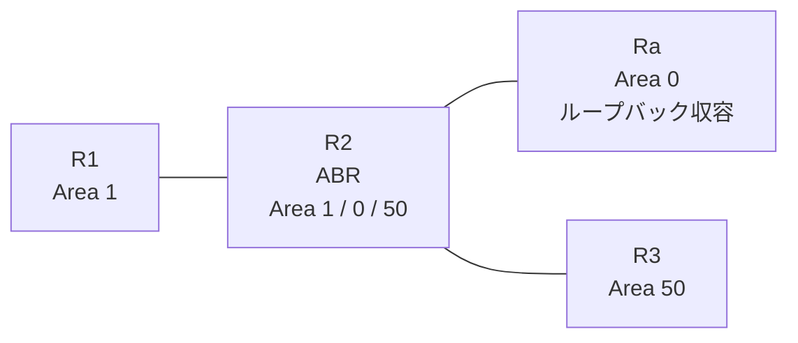

# 問題 20260906-017

> **本問は機器に接続せずに解答すること。追加の show 実行は認めない。**

## トポロジ

あなたの組織は、下記に示されているところのネットワークを運用しています。拠点の集約ルータ Ra は、サービスのためのプレフィックスを、4つのループバック インターフェイスによって収容しています。R2 は、エリア 1・エリア 0・エリア 50 を接続するところの ABR であり、そして、すべてのルーターにおいて、OSPFv3 のプロセス 10 が構成されています。



| 区間 | インターフェイス | ネットワーク | エリア |
|------|------------------|--------------|--------|
| R1 ⇔ R2 | E0/0 | 2001:DB8:2:3::/64 | 1 |
| R2 ⇔ Ra | E0/1 | 2001:DB8:7:D::/64 | 0 |
| R2 ⇔ R3 | E0/2 | 2001:DB8:6::/64 | 50 |

- R1 の E0/0 セカンダリ: 2001:DB8:6:8::/64（Area 1）
- Ra のループバック: 2001:DB8:9:9::/64, 2001:DB8:A:A::/64, 2001:DB8:B:B::/64, 2001:DB8:C:C::/64（Area 0）

## 要件

1. インタフェースの IP アドレッシングは、変更されることはできません。
2. R1 の経路テーブルから、2001:DB8:B:B::/64 のルートが、除外されなければなりません。
3. 他のいかなるルータの経路テーブルにも、影響が及んではなりません。
4. エリア 1 へ広告される LSAは、維持される必要があります。

## 現在の状態

通信の一部において、想定されていない挙動が、観測されています。示されているところの出力および構成に基づいて、要求されているところの動作が得られていない理由が、判断されなければなりません。

```
R3# show ipv6 route ospf | include ^O|via
OI  2001:DB8:2:3::/64 [110/20]
     via FE80::A8BB:CCFF:FE01:7620, Ethernet0/0
OI  2001:DB8:6:8::/64 [110/20]
     via FE80::A8BB:CCFF:FE01:7620, Ethernet0/0
OI  2001:DB8:7:D::/64 [110/20]
     via FE80::A8BB:CCFF:FE01:7620, Ethernet0/0
OI  2001:DB8:9:9::/64 [110/21]
     via FE80::A8BB:CCFF:FE01:7620, Ethernet0/0
OI  2001:DB8:A:A::/64 [110/21]
     via FE80::A8BB:CCFF:FE01:7620, Ethernet0/0
OI  2001:DB8:C:C::/64 [110/21]
     via FE80::A8BB:CCFF:FE01:7620, Ethernet0/0
```
```
R1# show ipv6 route ospf | include ^O|via
OI  2001:DB8:6::/64 [110/20]
     via FE80::A8BB:CCFF:FE01:7600, Ethernet0/0
OI  2001:DB8:7:D::/64 [110/20]
     via FE80::A8BB:CCFF:FE01:7600, Ethernet0/0
OI  2001:DB8:9:9::/64 [110/21]
     via FE80::A8BB:CCFF:FE01:7600, Ethernet0/0
OI  2001:DB8:A:A::/64 [110/21]
     via FE80::A8BB:CCFF:FE01:7600, Ethernet0/0
OI  2001:DB8:C:C::/64 [110/21]
     via FE80::A8BB:CCFF:FE01:7600, Ethernet0/0
```

## 設定抜粋

```
R2# show running-config
Building configuration...
!
interface Ethernet0/0
 no ip address
 ipv6 address 2001:DB8:2:3::2/64
 ipv6 enable
 ipv6 ospf 10 area 1
!
interface Ethernet0/1
 no ip address
 ipv6 address 2001:DB8:7:D::2/64
 ipv6 enable
 ipv6 ospf 10 area 0
!
interface Ethernet0/2
 no ip address
 ipv6 address 2001:DB8:6::2/64
 ipv6 enable
 ipv6 ospf 10 area 50
!
router ospfv3 10
 router-id 2.2.2.2
 !
 address-family ipv6 unicast
  distribute-list prefix-list PL-TYPE3 in
 exit-address-family
!
ipv6 prefix-list PL-AREA10 seq 5 permit 2001:DB8:B:B::/64
!
ipv6 prefix-list PL-CORE seq 5 permit ::/0 ge 1
!
ipv6 prefix-list PL-TYPE3 seq 5 deny 2001:DB8:B:B::/64
ipv6 prefix-list PL-TYPE3 seq 10 permit ::/0 le 128
!
ipv6 prefix-list PL10 seq 5 permit 2001:DB8:8::/45 le 64
!
```

## 設問

次のうち、正しいものは、どれですか。

## 選択肢
**A.**
```
R2(config)# ipv6 prefix-list PL-NEW seq 5 deny 2001:DB8:B:B::/64
R2(config)# ipv6 prefix-list PL-NEW seq 10 permit ::/0 le 128
R2(config)# router ospfv3 10
R2(config-router)# address-family ipv6 unicast
R2(config-router-af)# no distribute-list prefix-list PL-TYPE3 in
R2(config-router-af)# distribute-list prefix-list PL-NEW in
R2(config)# no ipv6 prefix-list PL-TYPE3
```

**B.**
```
R1(config)# ipv6 prefix-list PL-NEW seq 5 deny 2001:DB8:B:B::/64
R1(config)# ipv6 prefix-list PL-NEW seq 10 permit ::/0 le 128
R2(config)# router ospfv3 10
R2(config-router)# address-family ipv6 unicast
R2(config-router-af)# no distribute-list prefix-list PL-TYPE3 in
R1(config)# router ospfv3 10
R1(config-router)# address-family ipv6 unicast
R1(config-router-af)# distribute-list prefix-list PL-NEW in
R2(config)# no ipv6 prefix-list PL-TYPE3
```

**C.**
```
R1(config)# ipv6 prefix-list PL-NEW seq 5 deny 2001:DB8:B:B::/64
R1(config)# ipv6 prefix-list PL-NEW seq 10 permit ::/0
R2(config)# router ospfv3 10
R2(config-router)# address-family ipv6 unicast
R2(config-router-af)# no distribute-list prefix-list PL-TYPE3 in
R1(config)# router ospfv3 10
R1(config-router)# address-family ipv6 unicast
R1(config-router-af)# distribute-list prefix-list PL-NEW in
R2(config)# no ipv6 prefix-list PL-TYPE3
```

**D.**
```
R1(config)# ipv6 prefix-list PL-NEW seq 5 deny 2001:DB8:A::/47 le 64
R1(config)# ipv6 prefix-list PL-NEW seq 10 permit ::/0 le 128
R2(config)# router ospfv3 10
R2(config-router)# address-family ipv6 unicast
R2(config-router-af)# no distribute-list prefix-list PL-TYPE3 in
R1(config)# router ospfv3 10
R1(config-router)# address-family ipv6 unicast
R1(config-router-af)# distribute-list prefix-list PL-NEW in
R2(config)# no ipv6 prefix-list PL-TYPE3
```
