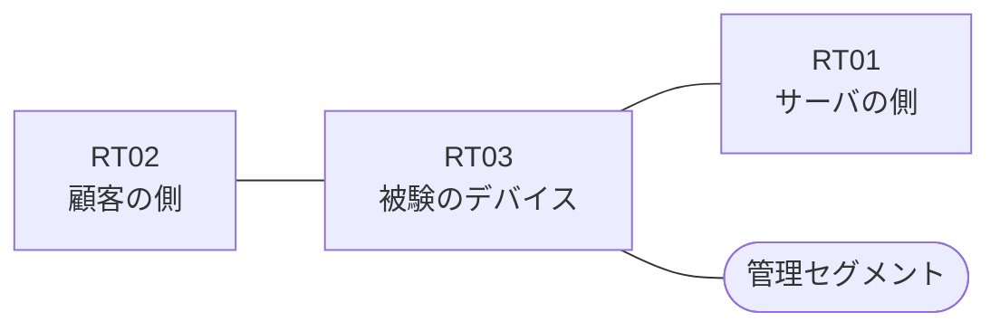

# 問題 20260906-018

> **本問は機器に接続せずに解答すること。追加の show 実行は認めない。**

## シナリオ

あなたは、下記のネットワークの保守を担当する技術者です。ある企業のネットワークにおいて、RT03 は、顧客の側のネットワークと、サーバの側のネットワークとの間に、配置されています。通信の一部において、想定されていない挙動が、観測されています。示されているところの出力および構成に基づいて、要求されているところの動作が得られていない理由が、判断されなければなりません。RT03 において、`10.73.128.0/24`、`10.73.129.0/24`、`10.73.130.0/24` のネットワークからの通信が、許可されなければなりません。拒否のエントリを使用してはなりません。アクセス・リストは、顧客の側のインターフェイスである `Ethernet0/0` において、着信の方向に適用される必要があります。`10.73.131.0/24` からの通信は、許可されてはなりません。`10.73.133.0/24` からの通信は、許可されてはなりません。本作業は、日中の時間帯において実施されるという理由により、対象外であるところのデバイスに対する構成の変更は、許可されていません。



| 区間 | 被験デバイス側のインターフェイス | ネットワーク |
|------|----------------------------------|--------------|
| RT02（顧客の側） ⇔ RT03 | `Ethernet0/0` | 10.73.253.0/24 |
| RT03 ⇔ RT01（サーバの側） | `Ethernet0/1` | 10.73.254.0/24 |
| RT03 ⇔ 管理セグメント | `Ethernet0/2` | 10.73.255.0/24 |

## 出力

観測 | サーバへの到達
--- | ---
送信元が 10.73.128.0/24 のネットワークにあるホストから、172.29.4.76 の TCP ポート 22 宛ての通信 | 到達可
送信元が 10.73.129.0/24 のネットワークにあるホストから、172.29.4.76 の TCP ポート 22 宛ての通信 | 到達可
送信元が 10.73.130.0/24 のネットワークにあるホストから、172.29.4.76 の TCP ポート 22 宛ての通信 | 到達可
送信元が 10.73.131.0/24 のネットワークにあるホストから、172.29.4.76 の TCP ポート 22 宛ての通信 | 到達可
送信元が 10.73.133.0/24 のネットワークにあるホストから、172.29.4.76 の TCP ポート 22 宛ての通信 | 到達可
送信元が 10.73.250.0/24 のネットワークにあるホストから、172.29.4.76 の TCP ポート 22 宛ての通信 | 到達可

```
RT03# show running-config | section ^interface
interface Ethernet0/0
 description === to RT02 ===
 ip address 10.73.253.1 255.255.255.0
interface Ethernet0/1
 description === to RT01 ===
 ip address 10.73.254.1 255.255.255.0
interface Ethernet0/2
 description === management ===
 ip address 10.73.255.1 255.255.255.0
 ip access-group 70 in
```
```
RT03# show ip access-lists
Standard IP access list 70
    10 permit 10.73.128.0, wildcard bits 0.0.0.255
    20 permit 10.73.129.0, wildcard bits 0.0.0.255
    30 permit 10.73.130.0, wildcard bits 0.0.0.255
```

## 設問

次のうち、正しいものは、どれですか。

## 選択肢
A. プレフィックス・リストがルート・マップから参照されていない

B. インターフェイスから参照されているアクセス・リストが、定義されていない

C. ポートの演算子が、宛先の側ではなく送信元の側に記述されている

D. ルーティング・プロトコルの隣接関係が確立されていない

E. 宛先として any が指定されているため、当該のサーバ以外への通信までが許可されている

F. アクセス・リストが、管理のためのインターフェイスに適用されている
