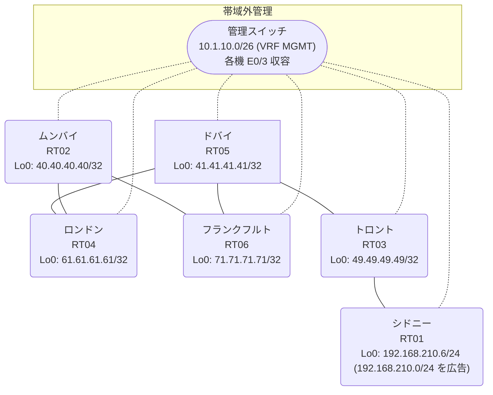

# 問題 20260907-001

> **本問は機器に接続せずに解答すること。追加の show 実行は認めない。**

## トポロジ

あなたは、ネットワークの運用を担当しています。あなたの会社のネットワークは、OSPF のドメインと EIGRP のドメインとが、2 つの境界のルータによって接続され、そして、それらは境界において接続されています。顧客のネットワーク `192.168.210.0/24` は、シドニー のサイトにおいて、別のルーティング プロトコルによって学習され、そして、再配送によって、社内へ持ち込まれています。ルーティングの設計の詳細は、示されているところのコンフィギュレーションから、読み取られることが、期待されています。



| 拠点 | ルータ | 拠点網 / 広告網 |
|------|--------|------------------|
| シドニー | RT01 | 192.168.210.6/24 (`192.168.210.0/24` を広告) |
| トロント | RT03 | 49.49.49.49/32 |
| ドバイ | RT05 | 41.41.41.41/32 |
| フランクフルト | RT06 | 71.71.71.71/32 |
| ムンバイ | RT02 | 40.40.40.40/32 |
| ロンドン | RT04 | 61.61.61.61/32 |

リンク一覧:
```
  RT02:E0/0(.1) ── RT06:E0/0(.2)   172.16.14.0/24
  RT02:E0/1(.1) ── RT04:E0/0(.3)   172.16.4.0/24
  RT06:E0/1(.2) ── RT05:E0/0(.4)   172.16.193.0/24
  RT04:E0/1(.3) ── RT05:E0/1(.4)   172.16.53.0/24
  RT05:E0/2(.4) ── RT03:E0/0(.5)   172.16.59.0/24
  RT03:E0/1(.5) ── RT01:E0/0(.6)   172.16.32.0/24
```

## 要件

1. 既存の相互再配送の設計が、削除または停止されてはなりません。
2. すべてのサイトから、`192.168.210.0/24` を含むところのすべての宛先へ、到達することができること。
3. スタティック ルートおよび既定のルートによる迂回は、実施されてはなりません。
4. 是正は、prefix-list と、再配送点における distribute-list によって、実装されなければなりません。
5. `192.168.210.0/24` 宛のパケットが、広告元である RT01 の方向へ転送され、そして、転送のループが存在していないこと。
6. スタティック・ルートおよび既定のルートによる迂回は、実施されてはなりません。

## 現在の状態

ユーザーから、通信に関する事象が、報告されています。示されているところの出力および構成に基づいて、要求されているところの動作が得られていない理由が、判断されなければなりません。

```
RT02# show ip route
Gateway of last resort is not set
      40.0.0.0/32 is subnetted, 1 subnets
C        40.40.40.40 is directly connected, Loopback0
      41.0.0.0/32 is subnetted, 1 subnets
O E2     41.41.41.41 [110/20] via 172.16.14.2, 00:04:42, Ethernet0/0
                     [110/20] via 172.16.4.3, 00:04:46, Ethernet0/1
      49.0.0.0/32 is subnetted, 1 subnets
O E2     49.49.49.49 [110/20] via 172.16.14.2, 00:04:42, Ethernet0/0
                     [110/20] via 172.16.4.3, 00:04:46, Ethernet0/1
      61.0.0.0/32 is subnetted, 1 subnets
O        61.61.61.61 [110/11] via 172.16.4.3, 00:04:46, Ethernet0/1
      71.0.0.0/32 is subnetted, 1 subnets
O        71.71.71.71 [110/11] via 172.16.14.2, 00:04:42, Ethernet0/0
      172.16.0.0/16 is variably subnetted, 8 subnets, 2 masks
C        172.16.4.0/24 is directly connected, Ethernet0/1
L        172.16.4.1/32 is directly connected, Ethernet0/1
C        172.16.14.0/24 is directly connected, Ethernet0/0
L        172.16.14.1/32 is directly connected, Ethernet0/0
O E2     172.16.32.0/24 [110/20] via 172.16.14.2, 00:04:42, Ethernet0/0
                        [110/20] via 172.16.4.3, 00:04:46, Ethernet0/1
O E2     172.16.53.0/24 [110/20] via 172.16.14.2, 00:04:42, Ethernet0/0
                        [110/20] via 172.16.4.3, 00:04:46, Ethernet0/1
O E2     172.16.59.0/24 [110/20] via 172.16.14.2, 00:04:42, Ethernet0/0
                        [110/20] via 172.16.4.3, 00:04:46, Ethernet0/1
O E2     172.16.193.0/24 [110/20] via 172.16.14.2, 00:04:42, Ethernet0/0
                         [110/20] via 172.16.4.3, 00:04:46, Ethernet0/1
O E2  192.168.210.0/24 [110/20] via 172.16.4.3, 00:04:46, Ethernet0/1
```
```
RT05# show ip eigrp topology 192.168.210.0 255.255.255.0
EIGRP-IPv4 Topology Entry for AS(48)/ID(41.41.41.41) for 192.168.210.0/24
  State is Passive, Query origin flag is 1, 1 Successor(s), FD is 281856
  Descriptor Blocks:
  172.16.193.2 (Ethernet0/0), from 172.16.193.2, Send flag is 0x0
      Composite metric is (281856/2816), route is External
      Vector metric:
        Minimum bandwidth is 10000 Kbit
        Total delay is 1010 microseconds
        Reliability is 255/255
        Load is 1/255
        Minimum MTU is 1500
        Hop count is 1
        Originating router is 71.71.71.71
      External data:
        AS number of route is 71
        External protocol is OSPF, external metric is 20
        Administrator tag is 0 (0x00000000)
  172.16.59.5 (Ethernet0/2), from 172.16.59.5, Send flag is 0x0
      Composite metric is (307456/281856), route is External
      Vector metric:
        Minimum bandwidth is 10000 Kbit
        Total delay is 2010 microseconds
        Reliability is 255/255
        Load is 1/255
        Minimum MTU is 1500
        Hop count is 2
        Originating router is 192.168.210.6
      External data:
        AS number of route is 0
        External protocol is RIP, external metric is 0
        Administrator tag is 0 (0x00000000)
```
```
RT03# show ip route
Gateway of last resort is not set
      40.0.0.0/32 is subnetted, 1 subnets
D EX     40.40.40.40 [170/307456] via 172.16.59.4, 00:04:28, Ethernet0/0
      41.0.0.0/32 is subnetted, 1 subnets
D        41.41.41.41 [90/409600] via 172.16.59.4, 00:05:14, Ethernet0/0
      49.0.0.0/32 is subnetted, 1 subnets
C        49.49.49.49 is directly connected, Loopback0
      61.0.0.0/32 is subnetted, 1 subnets
D EX     61.61.61.61 [170/307456] via 172.16.59.4, 00:05:03, Ethernet0/0
      71.0.0.0/32 is subnetted, 1 subnets
D EX     71.71.71.71 [170/307456] via 172.16.59.4, 00:04:24, Ethernet0/0
      172.16.0.0/16 is variably subnetted, 8 subnets, 2 masks
D EX     172.16.4.0/24 [170/307456] via 172.16.59.4, 00:05:03, Ethernet0/0
D EX     172.16.14.0/24 [170/307456] via 172.16.59.4, 00:04:28, Ethernet0/0
C        172.16.32.0/24 is directly connected, Ethernet0/1
L        172.16.32.5/32 is directly connected, Ethernet0/1
D        172.16.53.0/24 [90/307200] via 172.16.59.4, 00:05:14, Ethernet0/0
C        172.16.59.0/24 is directly connected, Ethernet0/0
L        172.16.59.5/32 is directly connected, Ethernet0/0
D        172.16.193.0/24 [90/307200] via 172.16.59.4, 00:05:14, Ethernet0/0
D EX  192.168.210.0/24 [170/281856] via 172.16.32.6, 00:04:25, Ethernet0/1
```
```
RT02# traceroute 192.168.210.6 probe 1 timeout 1 ttl 1 8
Type escape sequence to abort.
Tracing the route to 192.168.210.6
VRF info: (vrf in name/id, vrf out name/id)
  1 172.16.4.3 16 msec
  2 172.16.53.4 2 msec
  3 172.16.193.2 1 msec
  4 172.16.14.1 1 msec
  5 172.16.4.3 1 msec
  6 172.16.53.4 3 msec
  7 172.16.193.2 3 msec
  8 172.16.14.1 2 msec
```
```
RT05# show ip protocols | include Routing Protocol|Distance
Routing Protocol is "application"
    Gateway         Distance      Last Update
  Distance: (default is 4)
Routing Protocol is "eigrp 48"
      Distance: internal 90 external 170
    Gateway         Distance      Last Update
  Distance: internal 90 external 170
```
```
RT05# show ip route
Gateway of last resort is not set
      40.0.0.0/32 is subnetted, 1 subnets
D EX     40.40.40.40 [170/281856] via 172.16.193.2, 00:04:06, Ethernet0/0
                     [170/281856] via 172.16.53.3, 00:04:06, Ethernet0/1
      41.0.0.0/32 is subnetted, 1 subnets
C        41.41.41.41 is directly connected, Loopback0
      49.0.0.0/32 is subnetted, 1 subnets
D        49.49.49.49 [90/409600] via 172.16.59.5, 00:04:50, Ethernet0/2
      61.0.0.0/32 is subnetted, 1 subnets
D EX     61.61.61.61 [170/281856] via 172.16.193.2, 00:04:06, Ethernet0/0
                     [170/281856] via 172.16.53.3, 00:04:06, Ethernet0/1
      71.0.0.0/32 is subnetted, 1 subnets
D EX     71.71.71.71 [170/281856] via 172.16.193.2, 00:04:05, Ethernet0/0
                     [170/281856] via 172.16.53.3, 00:04:05, Ethernet0/1
      172.16.0.0/16 is variably subnetted, 9 subnets, 2 masks
D EX     172.16.4.0/24 [170/281856] via 172.16.193.2, 00:04:06, Ethernet0/0
                       [170/281856] via 172.16.53.3, 00:04:06, Ethernet0/1
D EX     172.16.14.0/24 [170/281856] via 172.16.193.2, 00:04:10, Ethernet0/0
                        [170/281856] via 172.16.53.3, 00:04:10, Ethernet0/1
D        172.16.32.0/24 [90/307200] via 172.16.59.5, 00:04:50, Ethernet0/2
C        172.16.53.0/24 is directly connected, Ethernet0/1
L        172.16.53.4/32 is directly connected, Ethernet0/1
C        172.16.59.0/24 is directly connected, Ethernet0/2
L        172.16.59.4/32 is directly connected, Ethernet0/2
C        172.16.193.0/24 is directly connected, Ethernet0/0
L        172.16.193.4/32 is directly connected, Ethernet0/0
D EX  192.168.210.0/24 [170/281856] via 172.16.193.2, 00:04:06, Ethernet0/0
```

## 設定抜粋

```
RT02# show running-config | section router
router ospf 71
 router-id 40.40.40.40
 network 40.40.40.40 0.0.0.0 area 0
 network 172.16.4.0 0.0.0.255 area 0
 network 172.16.14.0 0.0.0.255 area 0
```
```
RT06# show running-config | section router
router eigrp 48
 network 172.16.193.0 0.0.0.255
 redistribute ospf 71 metric 1000000 1 255 1 1500
router ospf 71
 router-id 71.71.71.71
 redistribute eigrp 48
 network 71.71.71.71 0.0.0.0 area 0
 network 172.16.14.0 0.0.0.255 area 0
```
```
RT04# show running-config | section router
router eigrp 48
 network 172.16.53.0 0.0.0.255
 redistribute ospf 71 metric 1000000 1 255 1 1500
router ospf 71
 router-id 61.61.61.61
 redistribute eigrp 48
 network 61.61.61.61 0.0.0.0 area 0
 network 172.16.4.0 0.0.0.255 area 0
```
```
RT05# show running-config | section router
router eigrp 48
 network 41.41.41.41 0.0.0.0
 network 172.16.53.0 0.0.0.255
 network 172.16.59.0 0.0.0.255
 network 172.16.193.0 0.0.0.255
```
```
RT03# show running-config | section router
router eigrp 48
 network 49.49.49.49 0.0.0.0
 network 172.16.32.0 0.0.0.255
 network 172.16.59.0 0.0.0.255
```
```
RT01# show running-config | section router
router eigrp 48
 network 172.16.32.0 0.0.0.255
 redistribute rip metric 1000000 1 255 1 1500
router rip
 version 2
 network 192.168.210.0
 no auto-summary
```

## 設問

次のうち、正しいものは、どれですか。

## 選択肢
A. RT05 で `clear ip route *` を実行する

B. RT06 と RT04 の両方で、router ospf 71 配下に `distance ospf external 180` を設定する

C. RT06 でのみ、`PL-NO-FEEDBACK` に `192.168.210.0/24` を deny・他を permit で作成し、router eigrp 48 配下に `distribute-list prefix PL-NO-FEEDBACK out ospf 71` を適用する

D. RT05 の router eigrp 48 配下に `distance eigrp 90 200` を設定する

E. RT06 と RT04 の両方で、`PL-NO-FEEDBACK` に `192.168.210.0/24` を deny・他を permit で作成し、router eigrp 48 配下に `distribute-list prefix PL-NO-FEEDBACK out ospf 71` を適用する

F. RT01 の router eigrp 48 配下の `redistribute rip` の seed metric をより小さい値へ変更する
