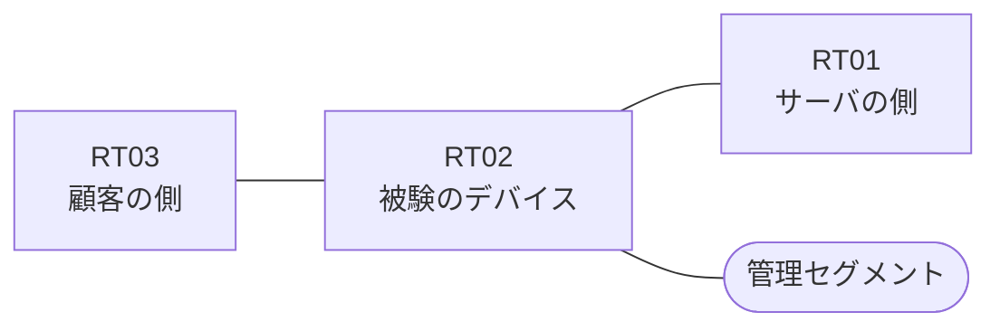

# 問題 20260907-003

> **本問は機器に接続せずに解答すること。追加の show 実行は認めない。**

## シナリオ

あなたは、下記のネットワークの保守を担当する技術者です。ある企業のネットワークにおいて、RT02 は、顧客の側のネットワークと、サーバの側のネットワークとの間に、配置されています。顧客の側のインターフェイスである `Ethernet0/0` と、サーバの側のインターフェイスである `Ethernet0/1` の双方において、着信の方向にアクセス・リストが適用されています。インタフェースの IP アドレッシングは、変更されることはできません。サーバの側のネットワークから、顧客の側のネットワークへ**新たに開始される**通信は、許可されることはできません。RT02 において、`10.28.192.0/24`、`10.28.193.0/24`、`10.28.194.0/24` のネットワークから、サーバである `172.23.31.80` の TCP ポート 22 への通信は、セッションを確立できなければなりません。示されているところのアクセス リストの適用は、変更されてはなりません。



| 区間 | 被験デバイス側のインターフェイス | ネットワーク |
|------|----------------------------------|--------------|
| RT03（顧客の側） ⇔ RT02 | `Ethernet0/0` | 10.28.253.0/24 |
| RT02 ⇔ RT01（サーバの側） | `Ethernet0/1` | 10.28.254.0/24 |
| RT02 ⇔ 管理セグメント | `Ethernet0/2` | 10.28.255.0/24 |

## 出力

```
RT02# show ip access-lists FILTER-IN
Extended IP access list FILTER-IN
    10 deny   tcp 10.28.197.0 0.0.0.255 host 172.23.31.80 eq 22 log
    20 deny   tcp 10.28.195.0 0.0.0.255 host 172.23.31.80 eq 22
    30 permit ip any any
```
```
RT02# show logging | include SEC-6
%SEC-6-IPACCESSLOGP: list FILTER-IN denied tcp 10.28.197.7(19511) -> 172.23.31.80(22), 1 packet
```

## 設問

示されているところの記録および構成から読み取ることができるものは、どれですか。(2つを選択してください)

## 選択肢
A. 記録に現れていない通信は、いずれも許可されたものである。

B. `10.28.195.7` からの通信は、許可された。

C. `10.28.197.7` からの通信は、アクセス・リストによって拒否された。

D. `10.28.192.7` からの通信は、拒否された。

E. `10.28.195.7` からの通信は、記録には現れていないが、アクセス・リストによって拒否された。
