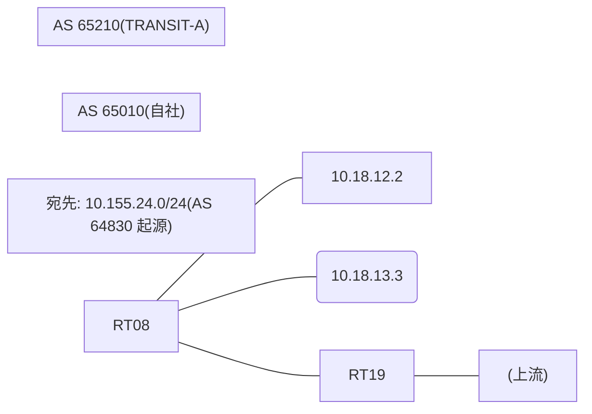

# 問題 20260907-004

> **本問は機器に接続せずに解答すること。追加の show 実行は認めない。**

## トポロジ

あなたは、ネットワークの運用を担当しています。自社のルータ RT08 は、外部のネットワーク 10.155.24.0/24 への到達性を、複数の経路を通じて、確立しています。 TRANSIT-A とは、2 本のリンクで、接続されています。 一部の経路は、自 AS 内の境界ルーターから、iBGP で、学習されています。



## 要件

1. 示されているところの出力、および、構成に基づいて、判断すること。
2. なお、機器の構成は、示されている抜粋のほかは、既定値である。

## 現在の状態

ベストパスの選出の結果について、その根拠が、確認されようとしています。

```
RT08# show ip bgp
BGP table version is 55, local router ID is 194.194.194.194
Status codes: s suppressed, d damped, h history, * valid, > best, i - internal, 
              r RIB-failure, S Stale, m multipath, b backup-path, f RT-Filter, 
              x best-external, a additional-path, c RIB-compressed, 
              t secondary path, L long-lived-stale,
Origin codes: i - IGP, e - EGP, ? - incomplete
RPKI validation codes: V valid, I invalid, N Not found

     Network          Next Hop            Metric LocPrf Weight Path
 * i  10.155.24.0/24   8.6.6.6                       100      0 65210 65210 64830 64830 i
 *>                    10.18.12.2                             0 65210 64830 i
 *                     10.18.13.3                             0 65210 64830 i
```
```
RT08# show ip bgp 10.155.24.0
BGP routing table entry for 10.155.24.0/24, version 55
BGP Bestpath: compare-routerid
Paths: (3 available, best #2, table default)
  Advertised to update-groups:
     1         
  Refresh Epoch 4
  65210 65210 64830 64830
    8.6.6.6 (metric 101) from 8.6.6.6 (8.6.6.6)
      Origin IGP, localpref 100, valid, internal
      rx pathid: 0, tx pathid: 0
      Updated on Apr 21 2026 11:34:56 UTC
  Refresh Epoch 2
  65210 64830
    10.18.12.2 from 10.18.12.2 (127.127.127.127)
      Origin IGP, localpref 100, valid, external, best
      rx pathid: 0, tx pathid: 0x0
      Updated on Apr 21 2026 11:21:14 UTC
  Refresh Epoch 1
  65210 64830
    10.18.13.3 from 10.18.13.3 (243.243.243.243)
      Origin IGP, localpref 100, valid, external
      rx pathid: 0, tx pathid: 0
      Updated on Apr 21 2026 10:43:07 UTC
```

## 設定抜粋

```
RT08# show running-config | section router bgp
router bgp 65010
 bgp router-id 194.194.194.194
 bgp log-neighbor-changes
 bgp bestpath compare-routerid
 neighbor 8.6.6.6 remote-as 65010
 neighbor 8.6.6.6 update-source Loopback0
 neighbor 10.18.12.2 remote-as 65210
 neighbor 10.18.13.3 remote-as 65210
 !
 address-family ipv4
  neighbor 8.6.6.6 activate
  neighbor 10.18.12.2 activate
  neighbor 10.18.13.3 activate
 exit-address-family
```

## 設問

示されているところの出力において、ベストパスの選出を決定づけた要素は、どれですか。(1つを選択してください)

## 選択肢
A. 送り手の BGP ルータ ID(小さいほうが優先)

B. MED(小さいほうが優先)

C. 近隣アドレス(小さいほうが優先)

D. origin コード(i < e < ?)

E. 最も古い経路(eBGP 同士のタイ)
