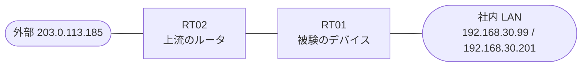

# 問題 20260907-005

> **本問は機器に接続せずに解答すること。追加の show 実行は認めない。**

## トポロジ

あなたは、ネットワークの運用を担当しています。あなたの会社の拠点のルーター RT01 は、上流のルータ RT02 を経由して、外部のネットワークへ接続されています。社内の LAN には、管理のステーション 192.168.30.99 およびサーバ 192.168.30.201 が存在し、そして、RT01 と RT02 の間では、ルーティング プロトコルの隣接関係が確立されています。RT01 には、コントロール プレーンを保護するためのサービス ポリシーが、構成されています。



| 対象 | 内容 |
|------|------|
| RT01 ⇔ RT02（外部側） | Ethernet0/0・10.92.126.0/30（RT01=10.92.126.1 / RT02=10.92.126.2） |
| RT01 ⇔ 社内 LAN | Ethernet0/1・192.168.30.0/24（RT01=192.168.30.1） |
| 管理のステーション（NMS） | 192.168.30.99（SSH / ping の発信元） |
| サーバ | 192.168.30.201 |
| 外部の発信元 | 203.0.113.185 |

## 要件

1. 管理のステーション 192.168.30.99 からの SSH によるアクセス、および、ルーティング・プロトコルの隣接関係は、影響を受けてはなりません。
2. ルーターを通過するところのトラフィックの転送に、影響が与えられてはなりません。
3. 監視のためのホスト 192.168.30.99 からの ping による死活監視は、安定して維持される必要があります。
4. ルータ自身に宛てられたトラフィックの保護は、control-plane の input のサービス・ポリシーによって、実装されなければなりません。
5. 本作業は、日中の時間帯において実施されるという理由により、対象外であるところのデバイスに対する構成の変更は、許可されていません。
6. 攻撃元 203.0.113.185 からの、ルータ自身に宛てられた ICMP は、レートに関わらず、完全に破棄されなければなりません。

## 現在の状態

いくつかの宛先への通信について、報告が上がっています。あなたは、提示されているところの情報のみを使用して、要求されている状態が満たされていない理由を、特定しなければなりません。

```
RT01# show policy-map control-plane
Control Plane 

  Service-policy input: COPP-POLICY

    Class-map: CM-PING (match-all)  
      Match: access-group 119
      police:
          cir 8000 bps, bc 1500 bytes
        conformed 0 packets, 0 bytes; actions:
          transmit 
        exceeded 0 packets, 0 bytes; actions:
          drop 
        conformed 0000 bps, exceeded 0000 bps

    Class-map: class-default (match-any)  
      Match: any
```

## 設定抜粋

```
RT01# show running-config | section control-plane
control-plane
 service-policy input COPP-POLICY
```
```
RT01# show access-lists
Extended IP access list 110
    10 permit icmp any any
```
```
RT01# show running-config | section interface
interface Ethernet0/0
 description === to RT02 ===
 ip address 10.92.126.1 255.255.255.252
interface Ethernet0/1
 ip address 192.168.30.1 255.255.255.0
```
```
RT01# show running-config | section line
line con 0
 logging synchronous
line vty 0 4
 login local
 transport input ssh
```

## 設問

次のうち、正しいものは、どれですか。

## 選択肢
A. RT01 において、ルータに宛てられた ICMP を一致させるところの class に、police を conform-action transmit および exceed-action transmit のアクションで構成する

B. RT01 において、明示の class を定義せずに、class-default に対して、帯域の制限(8000 bps)を、超過 drop のアクションで構成する

C. RT01 の外部のインターフェイスの in 方向に、`deny icmp any any` および `permit ip any any` からなるところのアクセス・グループを適用する(コントロール・プレーンのポリシーは、ICMP の帯域の制限の形を維持する)

D. RT01 において、192.168.30.99 からの SSH を一致させるところの class を、police なしで定義し、そして、ルータに宛てられた ICMP のすべてを permit によって一致させるところの専用の class において、帯域を8000 bps に制限する(超過は drop)

E. RT01 において、発信元 203.0.113.185 からの ICMP を permit によって一致させるところの class を、ポリシーの先頭に定義し、その police のアクションを、conform-action drop および exceed-action drop に構成する。続く class において、その他の ICMP の帯域を8000 bps に制限し、そして、192.168.30.99 からの SSH を一致させるclass を、police なしで定義する
