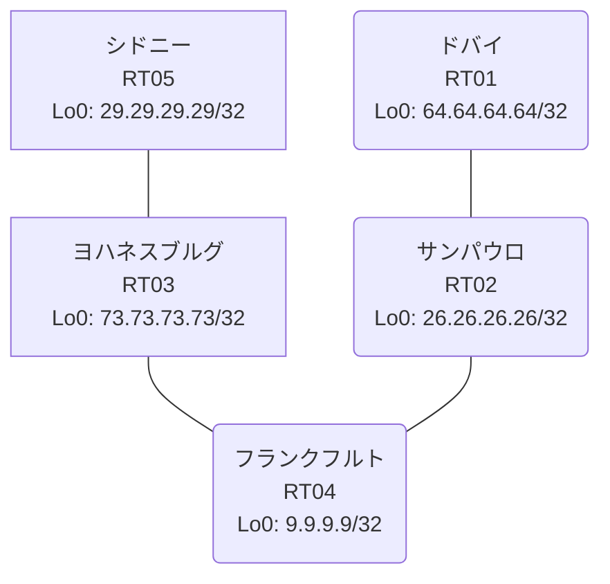

# 問題 20260908-001

> **本問は機器に接続せずに解答すること。追加の show 実行は認めない。**

## シナリオ

あなたは、ネットワークの運用を担当しています。あなたの会社のネットワークは、複数のルーティング ドメインが、境界のルーターによって接続され、そして、すべての拠点のリーチアビリティが提供されている、というものです。ルーティングの設計の詳細は、示されているところのコンフィギュレーションから、読み取られることが、期待されています。各拠点のルータと、拠点の網との対応は、下記の表に示されているとおりです。いくつかの宛先への通信について、報告が上がっています。あなたは、示されているところの出力および構成に基づいて、その構成が、下記において記述されているとおりに動作していない理由を、判断する必要があります。ルーティング プロトコルの種別およびプロセスの配置は、変更されてはなりません。シード・メトリック `100000 100 255 1 1500` は、redistribute のステートメントごとに、個別に指定されなければなりません。redistribute の参照先は、実在する隣接のプロセス/AS に限定され、無効な参照のステートメントが、コンフィギュレーションに残されることはできません。ルートの再配送に対して、フィルターが、適用されてはなりません。各サイトのネットワークは、ドメインをまたいで、すべてのサイトから、到達されることができること。本作業は、日中の時間帯において実施されるという理由により、対象外であるところのデバイスに対する構成の変更は、許可されていません。



| 拠点 | ルータ | 拠点網 |
|------|--------|----------------------|
| サンパウロ | RT02 | `26.26.26.26/32` |
| シドニー | RT05 | `29.29.29.29/32` |
| ドバイ | RT01 | `64.64.64.64/32` |
| フランクフルト | RT04 | `9.9.9.9/32` |
| ヨハネスブルグ | RT03 | `73.73.73.73/32` |

リンク一覧:
```
  RT04:E0/0(.1) ── RT02:E0/0(.2)   10.39.62.0/30
  RT02:E0/1(.1) ── RT01:E0/0(.2)   10.0.3.0/30
  RT03:E0/0(.1) ── RT05:E0/0(.2)   10.241.98.0/30
  RT03:E0/1(.1) ── RT04:E0/1(.2)   10.165.62.0/30
```

## 出力

```
RT05# show ip route
Gateway of last resort is not set
      9.0.0.0/32 is subnetted, 1 subnets
D EX     9.9.9.9 [170/307200] via 10.241.98.1, 00:04:45, Ethernet0/0
      10.0.0.0/8 is variably subnetted, 5 subnets, 2 masks
D EX     10.0.3.0/30 [170/307200] via 10.241.98.1, 00:04:11, Ethernet0/0
D EX     10.39.62.0/30 [170/307200] via 10.241.98.1, 00:04:45, Ethernet0/0
D EX     10.165.62.0/30 [170/307200] via 10.241.98.1, 00:04:45, Ethernet0/0
C        10.241.98.0/30 is directly connected, Ethernet0/0
L        10.241.98.2/32 is directly connected, Ethernet0/0
      26.0.0.0/32 is subnetted, 1 subnets
D EX     26.26.26.26 [170/307200] via 10.241.98.1, 00:04:11, Ethernet0/0
      29.0.0.0/32 is subnetted, 1 subnets
C        29.29.29.29 is directly connected, Loopback0
      64.0.0.0/32 is subnetted, 1 subnets
D EX     64.64.64.64 [170/307200] via 10.241.98.1, 00:04:05, Ethernet0/0
      73.0.0.0/32 is subnetted, 1 subnets
D        73.73.73.73 [90/409600] via 10.241.98.1, 00:04:45, Ethernet0/0
```
```
RT01# show running-config | section router
router ospf 93
 router-id 64.64.64.64
 network 10.0.3.0 0.0.0.3 area 0
 network 64.64.64.64 0.0.0.0 area 0
```
```
RT03# show access-lists
Standard IP access list 36
    10 deny   29.29.29.29
    20 permit any
```
```
RT03# show route-map
route-map RM-OLD1, deny, sequence 10
  Match clauses:
    ip address prefix-lists: PL-OLD1 
  Set clauses:
  Policy routing matches: 0 packets, 0 bytes
route-map RM-OLD1, permit, sequence 20
  Match clauses:
  Set clauses:
  Policy routing matches: 0 packets, 0 bytes
```
```
RT04# show running-config | section router
router eigrp 704
 network 9.9.9.9 0.0.0.0
 network 10.165.62.0 0.0.0.3
 redistribute ospf 93 match internal external 1 external 2 metric 100000 100 255 1 1500
router ospf 93
 router-id 9.9.9.9
 redistribute eigrp 704
 passive-interface Loopback0
 network 9.9.9.9 0.0.0.0 area 0
 network 10.39.62.0 0.0.0.3 area 0
```
```
RT03# show running-config | section router
router eigrp 246
 network 10.241.98.0 0.0.0.3
 network 73.73.73.73 0.0.0.0
 redistribute eigrp 704 metric 100000 100 255 1 1500
router eigrp 704
 timers active-time 5
 network 10.165.62.0 0.0.0.3
 network 73.73.73.73 0.0.0.0
 passive-interface Loopback0
```
```
RT02# show running-config | section router
router ospf 93
 router-id 26.26.26.26
 timers throttle spf 50 200 5000
 passive-interface Loopback0
 network 10.0.3.0 0.0.0.3 area 0
 network 10.39.62.0 0.0.0.3 area 0
 network 26.26.26.26 0.0.0.0 area 0
```
```
RT05# show running-config | section router
router eigrp 246
 network 10.241.98.0 0.0.0.3
 network 29.29.29.29 0.0.0.0
```
```
RT01# show ip route
Gateway of last resort is not set
      9.0.0.0/32 is subnetted, 1 subnets
O        9.9.9.9 [110/21] via 10.0.3.1, 00:04:27, Ethernet0/0
      10.0.0.0/8 is variably subnetted, 4 subnets, 2 masks
C        10.0.3.0/30 is directly connected, Ethernet0/0
L        10.0.3.2/32 is directly connected, Ethernet0/0
O        10.39.62.0/30 [110/20] via 10.0.3.1, 00:04:27, Ethernet0/0
O E2     10.165.62.0/30 [110/20] via 10.0.3.1, 00:04:27, Ethernet0/0
      26.0.0.0/32 is subnetted, 1 subnets
O        26.26.26.26 [110/11] via 10.0.3.1, 00:04:27, Ethernet0/0
      64.0.0.0/32 is subnetted, 1 subnets
C        64.64.64.64 is directly connected, Loopback0
      73.0.0.0/32 is subnetted, 1 subnets
O E2     73.73.73.73 [110/20] via 10.0.3.1, 00:04:27, Ethernet0/0
```
```
RT03# show ip prefix-list
ip prefix-list PL-OLD1: 2 entries
   seq 5 deny 29.29.29.29/32
   seq 10 permit 0.0.0.0/0 le 32
```
```
RT04# show ip route
Gateway of last resort is not set
      9.0.0.0/32 is subnetted, 1 subnets
C        9.9.9.9 is directly connected, Loopback0
      10.0.0.0/8 is variably subnetted, 5 subnets, 2 masks
O        10.0.3.0/30 [110/20] via 10.39.62.2, 00:03:52, Ethernet0/0
C        10.39.62.0/30 is directly connected, Ethernet0/0
L        10.39.62.1/32 is directly connected, Ethernet0/0
C        10.165.62.0/30 is directly connected, Ethernet0/1
L        10.165.62.2/32 is directly connected, Ethernet0/1
      26.0.0.0/32 is subnetted, 1 subnets
O        26.26.26.26 [110/11] via 10.39.62.2, 00:03:53, Ethernet0/0
      64.0.0.0/32 is subnetted, 1 subnets
O        64.64.64.64 [110/21] via 10.39.62.2, 00:03:47, Ethernet0/0
      73.0.0.0/32 is subnetted, 1 subnets
D        73.73.73.73 [90/409600] via 10.165.62.1, 00:04:34, Ethernet0/1
```

## 設問

次のうち、正しいものは、どれですか。

## 選択肢
**A.**
```
router eigrp 704
 no passive-interface <上流IF>
```

**B.**
```
clear ip route *
```

**C.**
```
router eigrp 704
 redistribute eigrp 253 metric 100000 100 255 1 1500
```

**D.**
```
router eigrp 246
 redistribute eigrp 704 metric 100000 100 255 1 1500
```

**E.**
```
router eigrp 704
 redistribute eigrp 246 metric 100000 100 255 1 1500
```

**F.**
```
router eigrp 704
 default-metric 100000 100 255 1 1500
```
