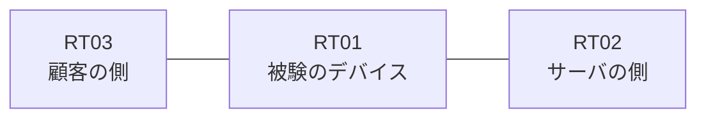

# 問題 20260908-003

> **本問は機器に接続せずに解答すること。追加の show 実行は認めない。**

## シナリオ

あなたは、ネットワークの運用を担当しています。ある企業のネットワークにおいて、RT01 は、顧客の側のネットワークと、サーバの側のネットワークとの間に配置されており、IPv6 によって運用されています。`2001:DB8:3A:C5::/64` からの通信は、許可されてはなりません。本作業は、日中の時間帯において実施されるという理由により、対象外であるところのデバイスに対する構成の変更は、許可されていません。拒否のエントリを使用してはなりません。RT01 において、`2001:DB8:3A:C0::/64`、`2001:DB8:3A:C1::/64`、`2001:DB8:3A:C2::/64` のネットワークからの通信のみが、`2001:DB8:3A:FF::10` の TCP ポート 80 に到達できなければなりません。




## 設問

次のうち、正しいものは、どれですか。

## 選択肢
**A.**
```
sequence 10 deny ipv6 2001:DB8:3A:C3::/64 any
sequence 20 permit ipv6 2001:DB8:3A:C0::/62 any
```

**B.**
```
sequence 10 permit ipv6 2001:DB8:3A:C0::/63 any
```

**C.**
```
sequence 10 permit ipv6 2001:DB8:3A:C0::/62 0.0.3.255 any
```

**D.**
```
sequence 10 permit ipv6 2001:DB8:3A:C0::/61 any
```

**E.**
```
sequence 10 permit ipv6 2001:DB8:3A:C0::/62 any
```

**F.**
```
sequence 10 permit ipv6 2001:DB8:3A:C0::/64 any
sequence 20 permit ipv6 2001:DB8:3A:C1::/64 any
sequence 30 permit ipv6 2001:DB8:3A:C2::/64 any
```
