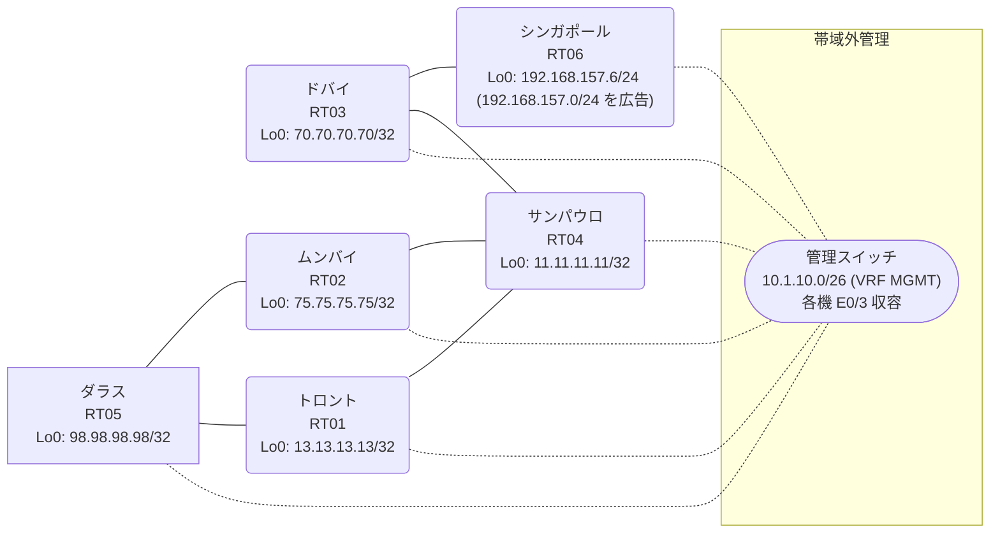

# 問題 20260908-005

> **本問は機器に接続せずに解答すること。追加の show 実行は認めない。**

## トポロジ

あなたは、下記のネットワークの保守を担当する技術者です。あなたの会社のネットワークは、OSPF のドメインと EIGRP のドメインとが、2 つの境界のルータによって接続され、そして、それらは境界において接続されています。顧客のネットワーク `192.168.157.0/24` は、シンガポール のサイトにおいて、別のルーティング プロトコルによって学習され、そして、再配送によって、社内へ持ち込まれています。ルーティングの設計の詳細は、示されているところのコンフィギュレーションから、読み取られることが、期待されています。



| 拠点 | ルータ | 拠点網 / 広告網 |
|------|--------|------------------|
| サンパウロ | RT04 | 11.11.11.11/32 |
| シンガポール | RT06 | 192.168.157.6/24 (`192.168.157.0/24` を広告) |
| ダラス | RT05 | 98.98.98.98/32 |
| トロント | RT01 | 13.13.13.13/32 |
| ドバイ | RT03 | 70.70.70.70/32 |
| ムンバイ | RT02 | 75.75.75.75/32 |

リンク一覧:
```
  RT05:E0/0(.1) ── RT02:E0/0(.2)   172.16.61.0/24
  RT05:E0/1(.1) ── RT01:E0/0(.3)   172.16.90.0/24
  RT02:E0/1(.2) ── RT04:E0/0(.4)   172.16.64.0/24
  RT01:E0/1(.3) ── RT04:E0/1(.4)   172.16.28.0/24
  RT04:E0/2(.4) ── RT03:E0/0(.5)   172.16.103.0/24
  RT03:E0/1(.5) ── RT06:E0/0(.6)   172.16.167.0/24
```

## 要件

1. 既存の相互再配送の設計が、削除または停止されてはなりません。
2. 顧客のネットワーク `192.168.157.0/24` への到達可能性が、すべてのサイトにおいて、確保されていること。
3. 是正は、番号付き標準アクセス・リストと、再配送点における distribute-list によって、実装される必要があります。
4. `192.168.157.0/24` 宛のパケットが、広告元である RT06 の方向へ転送され、そして、転送のループが存在していないこと。
5. スタティック ルートおよび既定のルートによる迂回は、実施されることはできません。
6. スタティック・ルートおよび既定のルートによる迂回は、実施されてはなりません。

## 現在の状態

いくつかの宛先への通信について、報告が上がっています。あなたは、提示されているところの情報のみを使用して、要求されている状態が満たされていない理由を、特定しなければなりません。

```
RT04# show ip route
Gateway of last resort is not set
      11.0.0.0/32 is subnetted, 1 subnets
C        11.11.11.11 is directly connected, Loopback0
      13.0.0.0/32 is subnetted, 1 subnets
D EX     13.13.13.13 [170/281856] via 172.16.64.2, 00:04:04, Ethernet0/0
                     [170/281856] via 172.16.28.3, 00:04:04, Ethernet0/1
      70.0.0.0/32 is subnetted, 1 subnets
D        70.70.70.70 [90/409600] via 172.16.103.5, 00:04:54, Ethernet0/2
      75.0.0.0/32 is subnetted, 1 subnets
D EX     75.75.75.75 [170/281856] via 172.16.64.2, 00:04:04, Ethernet0/0
                     [170/281856] via 172.16.28.3, 00:04:04, Ethernet0/1
      98.0.0.0/32 is subnetted, 1 subnets
D EX     98.98.98.98 [170/281856] via 172.16.64.2, 00:04:08, Ethernet0/0
                     [170/281856] via 172.16.28.3, 00:04:08, Ethernet0/1
      172.16.0.0/16 is variably subnetted, 9 subnets, 2 masks
C        172.16.28.0/24 is directly connected, Ethernet0/1
L        172.16.28.4/32 is directly connected, Ethernet0/1
D EX     172.16.61.0/24 [170/281856] via 172.16.64.2, 00:04:09, Ethernet0/0
                        [170/281856] via 172.16.28.3, 00:04:09, Ethernet0/1
C        172.16.64.0/24 is directly connected, Ethernet0/0
L        172.16.64.4/32 is directly connected, Ethernet0/0
D EX     172.16.90.0/24 [170/281856] via 172.16.64.2, 00:04:08, Ethernet0/0
                        [170/281856] via 172.16.28.3, 00:04:08, Ethernet0/1
C        172.16.103.0/24 is directly connected, Ethernet0/2
L        172.16.103.4/32 is directly connected, Ethernet0/2
D        172.16.167.0/24 [90/307200] via 172.16.103.5, 00:04:54, Ethernet0/2
D EX  192.168.157.0/24 [170/281856] via 172.16.64.2, 00:04:04, Ethernet0/0
```
```
RT04# show ip eigrp topology 192.168.157.0 255.255.255.0
EIGRP-IPv4 Topology Entry for AS(40)/ID(11.11.11.11) for 192.168.157.0/24
  State is Passive, Query origin flag is 1, 1 Successor(s), FD is 281856
  Descriptor Blocks:
  172.16.64.2 (Ethernet0/0), from 172.16.64.2, Send flag is 0x0
      Composite metric is (281856/2816), route is External
      Vector metric:
        Minimum bandwidth is 10000 Kbit
        Total delay is 1010 microseconds
        Reliability is 255/255
        Load is 1/255
        Minimum MTU is 1500
        Hop count is 1
        Originating router is 75.75.75.75
      External data:
        AS number of route is 38
        External protocol is OSPF, external metric is 20
        Administrator tag is 0 (0x00000000)
  172.16.103.5 (Ethernet0/2), from 172.16.103.5, Send flag is 0x0
      Composite metric is (307456/281856), route is External
      Vector metric:
        Minimum bandwidth is 10000 Kbit
        Total delay is 2010 microseconds
        Reliability is 255/255
        Load is 1/255
        Minimum MTU is 1500
        Hop count is 2
        Originating router is 192.168.157.6
      External data:
        AS number of route is 0
        External protocol is RIP, external metric is 0
        Administrator tag is 0 (0x00000000)
```
```
RT03# show ip route
Gateway of last resort is not set
      11.0.0.0/32 is subnetted, 1 subnets
D        11.11.11.11 [90/409600] via 172.16.103.4, 00:05:17, Ethernet0/0
      13.0.0.0/32 is subnetted, 1 subnets
D EX     13.13.13.13 [170/307456] via 172.16.103.4, 00:05:10, Ethernet0/0
      70.0.0.0/32 is subnetted, 1 subnets
C        70.70.70.70 is directly connected, Loopback0
      75.0.0.0/32 is subnetted, 1 subnets
D EX     75.75.75.75 [170/307456] via 172.16.103.4, 00:04:23, Ethernet0/0
      98.0.0.0/32 is subnetted, 1 subnets
D EX     98.98.98.98 [170/307456] via 172.16.103.4, 00:04:28, Ethernet0/0
      172.16.0.0/16 is variably subnetted, 8 subnets, 2 masks
D        172.16.28.0/24 [90/307200] via 172.16.103.4, 00:05:17, Ethernet0/0
D EX     172.16.61.0/24 [170/307456] via 172.16.103.4, 00:04:28, Ethernet0/0
D        172.16.64.0/24 [90/307200] via 172.16.103.4, 00:05:17, Ethernet0/0
D EX     172.16.90.0/24 [170/307456] via 172.16.103.4, 00:05:10, Ethernet0/0
C        172.16.103.0/24 is directly connected, Ethernet0/0
L        172.16.103.5/32 is directly connected, Ethernet0/0
C        172.16.167.0/24 is directly connected, Ethernet0/1
L        172.16.167.5/32 is directly connected, Ethernet0/1
D EX  192.168.157.0/24 [170/281856] via 172.16.167.6, 00:04:23, Ethernet0/1
```
```
RT05# show ip route
Gateway of last resort is not set
      11.0.0.0/32 is subnetted, 1 subnets
O E2     11.11.11.11 [110/20] via 172.16.90.3, 00:04:46, Ethernet0/1
                     [110/20] via 172.16.61.2, 00:04:46, Ethernet0/0
      13.0.0.0/32 is subnetted, 1 subnets
O        13.13.13.13 [110/11] via 172.16.90.3, 00:04:46, Ethernet0/1
      70.0.0.0/32 is subnetted, 1 subnets
O E2     70.70.70.70 [110/20] via 172.16.90.3, 00:04:46, Ethernet0/1
                     [110/20] via 172.16.61.2, 00:04:46, Ethernet0/0
      75.0.0.0/32 is subnetted, 1 subnets
O        75.75.75.75 [110/11] via 172.16.61.2, 00:04:46, Ethernet0/0
      98.0.0.0/32 is subnetted, 1 subnets
C        98.98.98.98 is directly connected, Loopback0
      172.16.0.0/16 is variably subnetted, 8 subnets, 2 masks
O E2     172.16.28.0/24 [110/20] via 172.16.90.3, 00:04:46, Ethernet0/1
                        [110/20] via 172.16.61.2, 00:04:46, Ethernet0/0
C        172.16.61.0/24 is directly connected, Ethernet0/0
L        172.16.61.1/32 is directly connected, Ethernet0/0
O E2     172.16.64.0/24 [110/20] via 172.16.90.3, 00:04:46, Ethernet0/1
                        [110/20] via 172.16.61.2, 00:04:46, Ethernet0/0
C        172.16.90.0/24 is directly connected, Ethernet0/1
L        172.16.90.1/32 is directly connected, Ethernet0/1
O E2     172.16.103.0/24 [110/20] via 172.16.90.3, 00:04:46, Ethernet0/1
                         [110/20] via 172.16.61.2, 00:04:46, Ethernet0/0
O E2     172.16.167.0/24 [110/20] via 172.16.90.3, 00:04:46, Ethernet0/1
                         [110/20] via 172.16.61.2, 00:04:46, Ethernet0/0
O E2  192.168.157.0/24 [110/20] via 172.16.90.3, 00:04:46, Ethernet0/1
```
```
RT04# show ip protocols | include Routing Protocol|Distance
Routing Protocol is "application"
    Gateway         Distance      Last Update
  Distance: (default is 4)
Routing Protocol is "eigrp 40"
      Distance: internal 90 external 170
    Gateway         Distance      Last Update
  Distance: internal 90 external 170
```
```
RT05# traceroute 192.168.157.6 probe 1 timeout 1 ttl 1 8
Type escape sequence to abort.
Tracing the route to 192.168.157.6
VRF info: (vrf in name/id, vrf out name/id)
  1 172.16.90.3 1 msec
  2 172.16.28.4 2 msec
  3 172.16.64.2 2 msec
  4 172.16.61.1 7 msec
  5 172.16.90.3 1 msec
  6 172.16.28.4 2 msec
  7 172.16.64.2 2 msec
  8 172.16.61.1 2 msec
```

## 設定抜粋

```
RT05# show running-config | section router
router ospf 38
 router-id 98.98.98.98
 network 98.98.98.98 0.0.0.0 area 0
 network 172.16.61.0 0.0.0.255 area 0
 network 172.16.90.0 0.0.0.255 area 0
```
```
RT02# show running-config | section router
router eigrp 40
 network 172.16.64.0 0.0.0.255
 redistribute ospf 38 metric 1000000 1 255 1 1500
router ospf 38
 router-id 75.75.75.75
 redistribute eigrp 40
 network 75.75.75.75 0.0.0.0 area 0
 network 172.16.61.0 0.0.0.255 area 0
```
```
RT01# show running-config | section router
router eigrp 40
 network 172.16.28.0 0.0.0.255
 redistribute ospf 38 metric 1000000 1 255 1 1500
router ospf 38
 router-id 13.13.13.13
 redistribute eigrp 40
 network 13.13.13.13 0.0.0.0 area 0
 network 172.16.90.0 0.0.0.255 area 0
```
```
RT04# show running-config | section router
router eigrp 40
 network 11.11.11.11 0.0.0.0
 network 172.16.28.0 0.0.0.255
 network 172.16.64.0 0.0.0.255
 network 172.16.103.0 0.0.0.255
```
```
RT03# show running-config | section router
router eigrp 40
 network 70.70.70.70 0.0.0.0
 network 172.16.103.0 0.0.0.255
 network 172.16.167.0 0.0.0.255
```
```
RT06# show running-config | section router
router eigrp 40
 network 172.16.167.0 0.0.0.255
 redistribute rip metric 1000000 1 255 1 1500
router rip
 version 2
 network 192.168.157.0
 no auto-summary
```

## 設問

次のうち、正しいものは、どれですか。

## 選択肢
**A.**
```
router eigrp 40
 distance eigrp 90 200
```

**B.**
```
! RT02 と RT01 の両方に投入
access-list 66 deny 192.168.157.0 0.0.0.255
access-list 66 permit any
router eigrp 40
 distribute-list 66 out ospf 38
```

**C.**
```
clear ip route *
```

**D.**
```
! RT02 と RT01 の両方に投入
route-map SET-TAG permit 10
 set tag 403
route-map DENY-TAG deny 10
 match tag 403
route-map DENY-TAG permit 20
router ospf 38
 redistribute eigrp 40 subnets route-map SET-TAG
router eigrp 40
 redistribute ospf 38 metric 1000000 1 255 1 1500 route-map DENY-TAG
```

**E.**
```
! RT02 にのみ投入
access-list 66 deny 192.168.157.0 0.0.0.255
access-list 66 permit any
router eigrp 40
 distribute-list 66 out ospf 38
```

**F.**
```
router eigrp 40
 redistribute rip metric 100 1 255 1 1500
```
