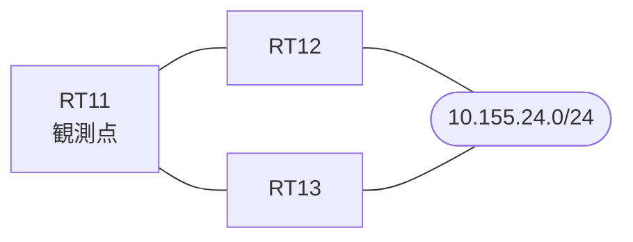

# 問題 20260908-006

> **本問は機器に接続せずに解答すること。追加の show 実行は認めない。**

## シナリオ

あなたは、ネットワークの運用を担当しています。拠点のルーター RT11 は、複数の隣接するルータを経由して、10.155.24.0/24 への経路を学習しています。ネットワークは単一の OSPF のドメインとして運用されており、そして、RT11 は当該のプレフィックスを複数の経路によって受け取っています。経路の選好に関する挙動のレビューが、実施されています。構成の変更は、1 箇所に限られなければなりません。ルーティング・プロトコルの種別およびプロセスの配置は、変更されてはなりません。RT11 における 10.155.24.0/24 への転送のパスは、運用の設計の意図と一致していなければなりません。既存の隣接関係は、維持される必要があります。現在の最良の経路のメトリックは、悪化させられてはなりません。



| 対象 | 内容 |
|------|------|
| RT11 ⇔ RT12 | Ethernet0/0・10.249.2.0/24（RT11 側の OSPF のコスト = 100） |
| RT11 ⇔ RT13 | Ethernet0/1・10.249.3.0/24（RT11 側の OSPF のコスト = 40） |
| RT12 における 10.155.24.0/24 | 当該のプレフィックスを持つインタフェースは、エリア 0 に属し、その OSPF のコストは 300 |
| RT13 | エリア 0 と エリア 10 の境界のルータ（ABR）。エリア 10 側にも、同一のプレフィックスが存在する |

## 出力

```
RT11# show running-config | section interface
interface Ethernet0/0
 description === to RT12 ===
 ip address 10.249.2.1 255.255.255.0
 ip ospf cost 100
interface Ethernet0/1
 description === to RT13 ===
 ip address 10.249.3.1 255.255.255.0
 ip ospf cost 40
```
```
RT11# show running-config | section router ospf
router ospf 1
 router-id 1.1.1.1
 network 10.249.2.0 0.0.0.255 area 0
 network 10.249.3.0 0.0.0.255 area 0
```
```
RT11# show ip ospf database summary 10.155.24.0
OSPF Router with ID (1.1.1.1) (Process ID 1)

		Summary Net Link States (Area 0)

  LS age: 519
  Options: (No TOS-capability, DC, Upward)
  LS Type: Summary Links(Network)
  Link State ID: 10.155.24.0 (summary Network Number)
  Advertising Router: 3.3.3.3
  LS Seq Number: 80000007
  Checksum: 0xE620
  Length: 28
  Network Mask: /24
	MTID: 0 	Metric: 15
```
```
RT11# show ip ospf border-routers
OSPF Router with ID (1.1.1.1) (Process ID 1)


		Base Topology (MTID 0)

Internal Router Routing Table
Codes: i - Intra-area route, I - Inter-area route

i 3.3.3.3 [40] via 10.249.3.3, Ethernet0/1, ABR, Area 0, SPF 21
```

## 設問

RT12(10.249.2.2)経由の経路が搭載されるという結果を、直接に決定づけているものは、どれですか。(1つを選択してください)

## 選択肢
A. 経路の型による選好(エリア内 > エリア間 > 外部タイプ1 > 外部タイプ2)

B. 広告元のルータ ID の比較

C. forward metric(ASBR までの内部のコスト)の比較

D. アドミニストレーティブ・ディスタンスの比較

E. メトリックの比較(小さいほうが選好される)
