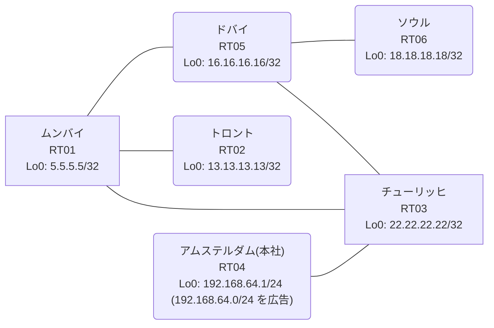

# 問題 20260909-001

> **本問は機器に接続せずに解答すること。追加の show 実行は認めない。**

## トポロジ

あなたの組織は、下記に示されているところのネットワークを運用しています。本社の顧客のネットワークは、BGP AS 64788 の RT04 によって、広告されています。あなたの会社の内部は、BGP / EIGRP / OSPF という 3 つのドメインから構成されています。サイトと、ルータおよびアドレスとの対応は、下記の表に示されているとおりです。



| 拠点 | ルータ | 拠点網 / 広告網 |
|------|--------|------------------|
| アムステルダム(本社) | RT04 | 192.168.64.1/24 (`192.168.64.0/24` を広告) |
| ソウル | RT06 | 18.18.18.18/32 |
| チューリッヒ | RT03 | 22.22.22.22/32 |
| トロント | RT02 | 13.13.13.13/32 |
| ドバイ | RT05 | 16.16.16.16/32 |
| ムンバイ | RT01 | 5.5.5.5/32 |

リンク一覧:
```
  RT04:E0/0(.1) ── RT03:E0/0(.2)   10.97.10.0/30
  RT03:E0/1(.1) ── RT01:E0/0(.2)   10.151.42.0/30
  RT03:E0/2(.1) ── RT05:E0/0(.2)   10.160.112.0/30
  RT01:E0/1(.1) ── RT05:E0/1(.2)   10.75.239.0/30
  RT05:E0/2(.1) ── RT06:E0/0(.2)   10.33.107.0/30
  RT01:E0/2(.1) ── RT02:E0/0(.2)   10.64.121.0/30
```

## 要件

1. 顧客のネットワーク `192.168.64.0/24` を含むすべての宛先への到達可能性が、すべてのサイトにおいて、確保されていること。
2. スタティック ルートおよび既定のルートによる迂回は、実施されることはできません。
3. `192.168.64.0/24` 宛のトラフィックが RT04 へ配送され、経路の周回が、発生していないこと。
4. 既存の再配送の設計が、変更または撤去されることはできません。スタティック ルートによる回避も、許可されていません。

## 現在の状態

示されているところの構成は、現在、稼働中のネットワークから、取得されたものです。到達性に関する報告は、この時点では、確認されていません。


## 設定抜粋

```
RT03# show running-config | section router
router eigrp 436
 network 10.151.42.0 0.0.0.3
 redistribute bgp 64788 metric 100000 100 255 1 1500
 redistribute ospf 48 metric 100000 100 255 1 1500
 passive-interface Loopback0
router ospf 48
 router-id 22.22.22.22
 network 10.160.112.0 0.0.0.3 area 0
 network 22.22.22.22 0.0.0.0 area 0
router bgp 64788
 bgp router-id 22.22.22.22
 bgp log-neighbor-changes
 bgp redistribute-internal
 network 22.22.22.22 mask 255.255.255.255
 redistribute ospf 48
 neighbor 10.97.10.1 remote-as 64788
```
```
RT01# show running-config | section router
router eigrp 436
 network 10.151.42.0 0.0.0.3
 redistribute ospf 48 metric 100000 100 255 1 1500
router ospf 48
 router-id 5.5.5.5
 redistribute eigrp 436
 network 5.5.5.5 0.0.0.0 area 0
 network 10.64.121.0 0.0.0.3 area 0
 network 10.75.239.0 0.0.0.3 area 0
```
```
RT05# show running-config | section router
router ospf 48
 router-id 16.16.16.16
 timers throttle spf 50 200 5000
 passive-interface Loopback0
 network 10.33.107.0 0.0.0.3 area 0
 network 10.75.239.0 0.0.0.3 area 0
 network 10.160.112.0 0.0.0.3 area 0
 network 16.16.16.16 0.0.0.0 area 0
```
```
RT04# show running-config | section router
router bgp 64788
 bgp router-id 192.168.64.1
 bgp log-neighbor-changes
 network 192.168.64.0
 neighbor 10.97.10.2 remote-as 64788
```

## 設問

RT06 から、`192.168.64.0/24` 内のホスト宛に送信されるパケットの転送について、正しい記述は、どれですか。(1つを選択してください)

## 選択肢
A. RT03 から RT04 へ転送され、宛先に到達する

B. RT03 と RT04 の間で等コストの分散が行われ、一部のパケットのみが宛先に到達する

C. RT01 が転送先を交互に切り替え、断続的に宛先に到達する

D. RT04 が当該網を広告しておらず、いずれのルータにおいても宛先が不明となる

E. RT03 が当該宛先への経路を保持せず、RT03 において破棄される

F. RT03 → RT05 → RT01 → RT03 の順の転送が繰り返され、TTL の満了によって破棄される
