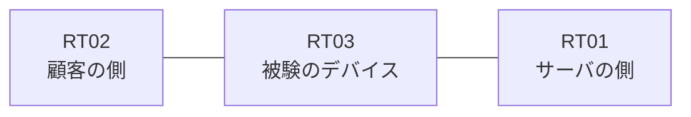

# 問題 20260909-003

> **本問は機器に接続せずに解答すること。追加の show 実行は認めない。**

## トポロジ

あなたは、下記のネットワークの保守を担当する技術者です。ある企業のネットワークにおいて、RT03 は、顧客の側のネットワークと、サーバの側のネットワークとの間に、配置されています。



| 区間 | 被験デバイス側のインターフェイス | ネットワーク |
|------|----------------------------------|--------------|
| RT02（顧客の側） ⇔ RT03 | — | 10.94.253.0/24 |
| RT03 ⇔ RT01（サーバの側） | — | 10.94.254.0/24 |

## 要件

1. 管理のための構成に対して、変更が加えられてはなりません。
2. 管理のための端末からの接続および運用に、影響を与えてはなりません。
3. RT03 において、着信インターフェイスと一致しない送信元を持つところのトラフィックが、破棄される必要があります。

## 現在の状態

通信の一部において、想定されていない挙動が、観測されています。示されているところの出力および構成に基づいて、要求されているところの動作が得られていない理由が、判断されなければなりません。

観測 | 検証の結果
--- | ---
送信元が 10.94.64.5 であるところの、Ethernet0/0 に着信するパケット | 免除される
送信元が 10.94.65.5 であるところの、Ethernet0/0 に着信するパケット | 免除される
送信元が 10.94.66.5 であるところの、Ethernet0/0 に着信するパケット | 免除される
送信元が 10.94.67.5 であるところの、Ethernet0/0 に着信するパケット | 免除される
送信元が 10.94.69.5 であるところの、Ethernet0/0 に着信するパケット | 免除される
送信元が 10.94.250.5 であるところの、Ethernet0/0 に着信するパケット | 免除される

```
RT03# show ip access-lists
```

## 設定抜粋

```
RT03# show running-config | section access-group|distribute-list|verify unicast|ip nat|access-class|class-map
 ip verify unicast source reachable-via rx 20
```

## 設問

次のうち、正しいものは、どれですか。

## 選択肢
A. インターフェイスが管理上シャットダウンされている

B. ルーティング・プロトコルの隣接関係が確立されていない

C. 検証のモードが、着信インターフェイスの一致を要求しない設定になっている

D. 検証の例外として参照されているアクセス・リストが定義されておらず、すべての送信元が検証から免除されている

E. 例外として参照されているアクセス・リストが、空である

F. プレフィックス・リストがルート・マップから参照されていない
