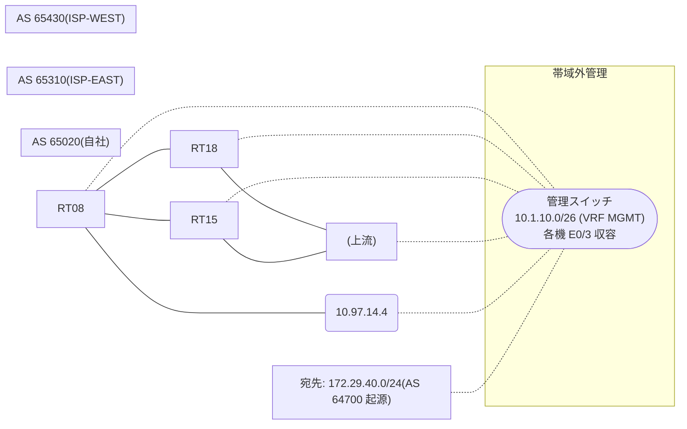

# 問題 20260909-004

> **本問は機器に接続せずに解答すること。追加の show 実行は認めない。**

## シナリオ

あなたは、下記のネットワークの保守を担当する技術者です。自社のルーター RT08 は、外部のネットワーク 172.29.40.0/24 への到達性を、複数の経路を通じて、確立しています。 ISP-WEST とも、接続されています。 一部の経路は、自 AS 内の境界ルータから、iBGP で、学習されています。運用チームは、AS 全体のトラフィックを ISP-EAST 経由とすることを意図して、境界ルーター RT18 に、示されているところの設定を、投入しました。しかしながら、RT08 のベストパスは、変更されていません。示されているところの出力、および、構成に基づいて、判断すること。なお、機器の構成は、示されている抜粋のほかは、既定値である。



## 出力

```
RT08# show ip bgp
BGP table version is 58, local router ID is 220.220.220.220
Status codes: s suppressed, d damped, h history, * valid, > best, i - internal, 
              r RIB-failure, S Stale, m multipath, b backup-path, f RT-Filter, 
              x best-external, a additional-path, c RIB-compressed, 
              t secondary path, L long-lived-stale,
Origin codes: i - IGP, e - EGP, ? - incomplete
RPKI validation codes: V valid, I invalid, N Not found

     Network          Next Hop            Metric LocPrf Weight Path
 *>   172.29.40.0/24   10.97.14.4                             0 65430 64700 i
 * i                   8.6.6.6                       100      0 65310 65310 64700 64700 i
 * i                   9.5.5.5                       100      0 65310 64700 i
```
```
RT08# show running-config | section router bgp
router bgp 65020
 bgp router-id 220.220.220.220
 bgp log-neighbor-changes
 neighbor 8.6.6.6 remote-as 65020
 neighbor 8.6.6.6 update-source Loopback0
 neighbor 9.5.5.5 remote-as 65020
 neighbor 9.5.5.5 update-source Loopback0
 neighbor 10.97.14.4 remote-as 65430
 !
 address-family ipv4
  neighbor 8.6.6.6 activate
  neighbor 9.5.5.5 activate
  neighbor 10.97.14.4 activate
 exit-address-family
```
```
RT18# show running-config | section router bgp
router bgp 65020
 bgp router-id 9.5.5.5
 neighbor 220.220.220.220 remote-as 65020
 neighbor 220.220.220.220 update-source Loopback0
 neighbor 10.97.25.2 remote-as 65310
 !
 address-family ipv4
  neighbor 220.220.220.220 activate
  neighbor 220.220.220.220 next-hop-self
  neighbor 10.97.25.2 activate
  neighbor 10.97.25.2 weight 40000
 exit-address-family
```

## 設問

この事象の原因である可能性が、最も高いものは、どれですか。(1つを選択してください)

## 選択肢
A. 設定変更後に BGP セッションの再評価(clear)が行われていない

B. MED は、異なる隣接 AS から受信した経路の間では、既定では比較されない

C. weight は、それを設定したルータのローカルでのみ有効であり、iBGP の近隣には伝播しない

D. LOCAL_PREF は iBGP でのみ交換される属性であり、eBGP の近隣には送信されない
