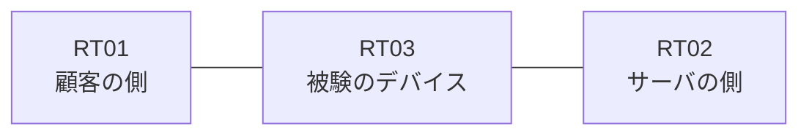

# 問題 20260909-005

> **本問は機器に接続せずに解答すること。追加の show 実行は認めない。**

## シナリオ

あなたは、下記のネットワークの保守を担当する技術者です。ある企業のネットワークにおいて、RT03 は、顧客の側のネットワークと、サーバの側のネットワークとの間に、配置されています。RT03 は、RT02 および RT01 の両方から、ルーティング プロトコルによってルートを学習しています。ユーザーから、通信に関する事象が、報告されています。あなたは、提示されているところの情報のみを使用して、要求されている状態が満たされていない理由を、特定しなければなりません。上記以外のルートの受理には、影響を与えてはなりません。RT03 は、`10.33.64.0/24`、`10.33.65.0/24`、`10.33.66.0/24` のネットワークのルートのみを、ルーティング・テーブルに保持しなければなりません。ルーティング・プロトコルの種別およびプロセスの配置は、変更されてはなりません。



| 区間 | 被験デバイス側のインターフェイス | ネットワーク |
|------|----------------------------------|--------------|
| RT01（顧客の側） ⇔ RT03 | — | 10.33.253.0/24 |
| RT03 ⇔ RT02（サーバの側） | — | 10.33.254.0/24 |

## 出力

```
RT03# show ip access-lists
```
```
RT03# show running-config | section access-group|distribute-list|verify unicast|ip nat|access-class|class-map
 distribute-list CUST-IN in
```
```
RT03# show ip route eigrp | begin Gateway
Gateway of last resort is not set

      10.33.0.0/16 is variably subnetted, 5 subnets, 2 masks
D        10.33.64.0/24 [90/409600] via 10.33.254.2, 00:04:11, Ethernet0/1
D        10.33.65.0/24 [90/409600] via 10.33.254.2, 00:04:11, Ethernet0/1
D        10.33.66.0/24 [90/409600] via 10.33.254.2, 00:04:11, Ethernet0/1
D        10.33.64.0/28 [90/409600] via 10.33.253.3, 00:04:11, Ethernet0/1
D        10.33.69.0/24 [90/409600] via 10.33.254.2, 00:04:11, Ethernet0/1
```

## 設問

次のうち、正しいものは、どれですか。

## 選択肢
A. ルーティング・プロトコルの隣接関係が確立されていない

B. 標準のアクセス・リストが用いられており、プレフィックスの長さが区別されていない

C. 拡張のアクセス・リストの送信元に、ネットワークのアドレスが記述されている

D. インターフェイスが管理上シャットダウンされている

E. 名前付きの拡張のアクセス・リストが指定されており、フィルタ自体が適用されていない

F. 参照されているアクセス・リストが定義されていない
