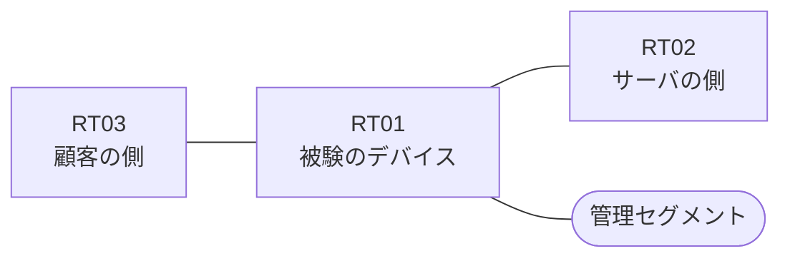

# 問題 20260909-006

> **本問は機器に接続せずに解答すること。追加の show 実行は認めない。**

## シナリオ

あなたの組織は、下記に示されているところのネットワークを運用しています。ある企業のネットワークにおいて、RT01 は、顧客の側のネットワークと、サーバの側のネットワークとの間に、配置されています。`10.128.33.0/24` からの通信は、許可されることはできません。`10.128.31.0/24` からの通信は、許可されることはできません。アクセス・リストは、顧客の側のインターフェイスである `Ethernet1/0` において、着信の方向に適用されなければなりません。当該のサーバの他のポートへの通信、および当該のサーバ以外の宛先への通信は、許可されることはできません。対象としていないネットワークが、一致の対象に含まれてはなりません。拒否のエントリを使用してはなりません。また、エントリの行数は、最小でなければなりません。RT01 において、`10.128.24.0/24` から `10.128.30.0/24` までの範囲にあるネットワークからの通信のみが、サーバである `172.21.72.36` の TCP ポート 22 に到達できなければなりません。インタフェースの IP アドレッシングは、変更されてはなりません。



| 区間 | 被験デバイス側のインターフェイス | ネットワーク |
|------|----------------------------------|--------------|
| RT03（顧客の側） ⇔ RT01 | `Ethernet1/0` | 10.128.253.0/24 |
| RT01 ⇔ RT02（サーバの側） | `Ethernet1/1` | 10.128.254.0/24 |
| RT01 ⇔ 管理セグメント | `Ethernet1/2` | 10.128.255.0/24 |

## 出力

```
RT01# show ip access-lists RT-IN
Extended IP access list RT-IN
    10 deny   tcp 10.128.33.0 0.0.0.255 host 172.21.72.36 eq 22 log
    20 deny   tcp 10.128.31.0 0.0.0.255 host 172.21.72.36 eq 22
    30 permit ip any any
```
```
RT01# show logging | include SEC-6
%SEC-6-IPACCESSLOGP: list RT-IN denied tcp 10.128.33.7(19347) -> 172.21.72.36(22), 1 packet
```

## 設問

示されているところの記録および構成から読み取ることができるものは、どれですか。(2つを選択してください)

## 選択肢
A. 記録に現れていない通信は、いずれも許可されたものである。

B. 記録されている通信の宛先ポートは 22 である。

C. `10.128.31.7` からの通信は、許可された。

D. `10.128.31.7` からの通信は、記録には現れていないが、アクセス・リストによって拒否された。

E. `10.128.24.7` からの通信は、拒否された。
