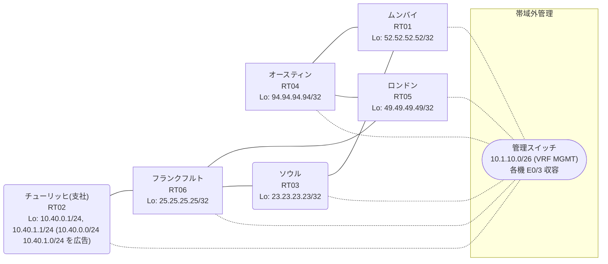

# 問題 20260910-001

> **本問は機器に接続せずに解答すること。追加の show 実行は認めない。**

## トポロジ

あなたの組織は、下記に示されているところのネットワークを運用しています。あなたの会社のネットワークは、支社のドメインと、本社のコアのドメイン(OSPF)とが、2 台の境界のルーターによって接続され、そして、それらは境界において接続されています。支社のネットワーク `10.40.0.0/24` および `10.40.1.0/24` は、RT02 によって、広告されています。どちらの境界が失われた場合においても、通信が継続されることができるように、設計されています。ルーティングの設計の詳細は、示されているところの出力から、読み取られることが、期待されています。



| 拠点 | ルータ | Loopback / 広告網 |
|------|--------|--------------------|
| オースティン | RT04 | 94.94.94.94/32 |
| ソウル | RT03 | 23.23.23.23/32 |
| チューリッヒ(支社) | RT02 | 10.40.0.1/24, 10.40.1.1/24 (`10.40.0.0/24` `10.40.1.0/24` を広告) |
| フランクフルト | RT06 | 25.25.25.25/32 |
| ムンバイ | RT01 | 52.52.52.52/32 |
| ロンドン | RT05 | 49.49.49.49/32 |

リンク一覧:
```
  RT02:E0/0(.2) ── RT06:E0/0(.1)   10.21.226.0/30
  RT06:E0/1(.1) ── RT05:E0/0(.2)   10.221.4.0/30
  RT06:E0/2(.1) ── RT03:E0/0(.2)   10.165.247.0/30
  RT05:E0/1(.1) ── RT04:E0/0(.2)   172.16.196.0/30
  RT04:E0/1(.1) ── RT01:E0/0(.2)   172.16.101.0/30
  RT03:E0/1(.1) ── RT01:E0/1(.2)   172.16.93.0/30
```

## 要件

1. 支社側のルータにおいて、本社側の経路が、両方の境界を経由する等価な経路として、保持されていること。
2. 支社のネットワーク宛のトラフィックが RT02 へ配送され、経路の周回が、発生していないこと。
3. フィルタの新設は、変更の凍結により、使用することができません。
4. 支社のネットワーク `10.40.0.0/24` / `10.40.1.0/24` への到達可能性が、すべてのサイトにおいて、確保されていること。
5. 二点相互再配送による、冗長の設計が、維持される必要があります。
6. スタティック・ルートおよび既定のルートによる迂回は、実施されることはできません。
7. 管理のための構成に対して、変更が加えられてはなりません。

## 現在の状態

一部の通信が、意図されているとおりに動作していない、という報告があります。あなたは、示されているところの出力および構成に基づいて、その構成が、下記において記述されているとおりに動作していない理由を、判断する必要があります。

```
RT06# show ip route
Gateway of last resort is not set
      10.0.0.0/8 is variably subnetted, 8 subnets, 3 masks
C        10.21.226.0/30 is directly connected, Ethernet0/0
L        10.21.226.1/32 is directly connected, Ethernet0/0
R        10.40.0.0/24 [120/1] via 10.21.226.2, 00:00:05, Ethernet0/0
R        10.40.1.0/24 [120/1] via 10.21.226.2, 00:00:05, Ethernet0/0
C        10.165.247.0/30 is directly connected, Ethernet0/2
L        10.165.247.1/32 is directly connected, Ethernet0/2
C        10.221.4.0/30 is directly connected, Ethernet0/1
L        10.221.4.1/32 is directly connected, Ethernet0/1
      23.0.0.0/32 is subnetted, 1 subnets
R        23.23.23.23 [120/1] via 10.165.247.2, 00:00:07, Ethernet0/2
      25.0.0.0/32 is subnetted, 1 subnets
C        25.25.25.25 is directly connected, Loopback0
      49.0.0.0/32 is subnetted, 1 subnets
R        49.49.49.49 [120/5] via 10.165.247.2, 00:00:07, Ethernet0/2
      52.0.0.0/32 is subnetted, 1 subnets
R        52.52.52.52 [120/5] via 10.165.247.2, 00:00:07, Ethernet0/2
      94.0.0.0/32 is subnetted, 1 subnets
R        94.94.94.94 [120/5] via 10.165.247.2, 00:00:07, Ethernet0/2
      172.16.0.0/30 is subnetted, 3 subnets
R        172.16.93.0 [120/5] via 10.165.247.2, 00:00:07, Ethernet0/2
R        172.16.101.0 [120/5] via 10.165.247.2, 00:00:07, Ethernet0/2
R        172.16.196.0 [120/5] via 10.165.247.2, 00:00:07, Ethernet0/2
```
```
RT06# show ip route 49.49.49.49
Routing entry for 49.49.49.49/32
  Known via "rip", distance 120, metric 5
  Tag 100
  Redistributing via rip
  Last update from 10.165.247.2 on Ethernet0/2, 00:00:07 ago
  Routing Descriptor Blocks:
  * 10.165.247.2, from 10.165.247.2, 00:00:07 ago, via Ethernet0/2
      Route metric is 5, traffic share count is 1
      Route tag 100
```
```
RT05# show ip protocols
*** IP Routing is NSF aware ***

Routing Protocol is "application"
  Sending updates every 0 seconds
  Invalid after 0 seconds, hold down 0, flushed after 0
  Outgoing update filter list for all interfaces is not set
  Incoming update filter list for all interfaces is not set
  Maximum path: 32
  Routing for Networks:
  Routing Information Sources:
    Gateway         Distance      Last Update
  Distance: (default is 4)

Routing Protocol is "ospf 1"
  Outgoing update filter list for all interfaces is not set
  Incoming update filter list for all interfaces is not set
  Router ID 49.49.49.49
  It is an autonomous system boundary router
 Redistributing External Routes from,
    rip, includes subnets in redistribution
  Number of areas in this router is 1. 1 normal 0 stub 0 nssa
  Maximum path: 4
  Routing for Networks:
    49.49.49.49 0.0.0.0 area 0
    172.16.196.0 0.0.0.3 area 0
  Routing Information Sources:
    Gateway         Distance      Last Update
    23.23.23.23          110      00:04:17
    52.52.52.52          110      00:04:19
    94.94.94.94          110      00:04:19
  Distance: intra-area 110 inter-area 110 external 180

Routing Protocol is "rip"
  Outgoing update filter list for all interfaces is 10
  Incoming update filter list for all interfaces is not set
  Sending updates every 30 seconds, next due in 12 seconds
  Invalid after 180 seconds, hold down 180, flushed after 240
  Redistributing: ospf 1 (internal, external 1 & 2, nssa-external 1 & 2)
                  rip
  Default version control: send version 2, receive version 2
    Interface                           Send  Recv  Triggered RIP  Key-chain
    Ethernet0/0                         2     2          No        none            
    Loopback0                           2     2          No        none            
  Automatic network summarization is not in effect
  Maximum path: 4
  Routing for Networks:
    10.0.0.0
    49.0.0.0
  Routing Information Sources:
    Gateway         Distance      Last Update
    10.221.4.1           120      00:00:26
  Distance: (default is 120)
```
```
RT05# show access-lists
Standard IP access list 10
    10 deny   any (205 matches)
```

## 設定抜粋

```
RT05# show running-config | section router
router ospf 1
 router-id 49.49.49.49
 redistribute rip route-map RIP2OSPF
 network 49.49.49.49 0.0.0.0 area 0
 network 172.16.196.0 0.0.0.3 area 0
 distance ospf external 180
router rip
 version 2
 redistribute ospf 1 metric 5 route-map OSPF2RIP
 network 10.0.0.0
 network 49.0.0.0
 distribute-list 10 out
 no auto-summary
```

## 設問

次のうち、正しいものは、どれですか。

## 選択肢
**A.**
```
! RT05 に投入
access-list 10 permit any
```

**B.**
```
! RT03 に投入
access-list 10 deny any
router rip
 distribute-list 10 out
```

**C.**
```
! RT06 に投入
router rip
 maximum-paths 2
```

**D.**
```
! RT05 に投入
router rip
 no distribute-list 10 out
!
no access-list 10
```

**E.**
```
! RT05 に投入
router rip
 redistribute ospf 1 metric 10 route-map OSPF2RIP
```

**F.**
```
clear ip route *
```
