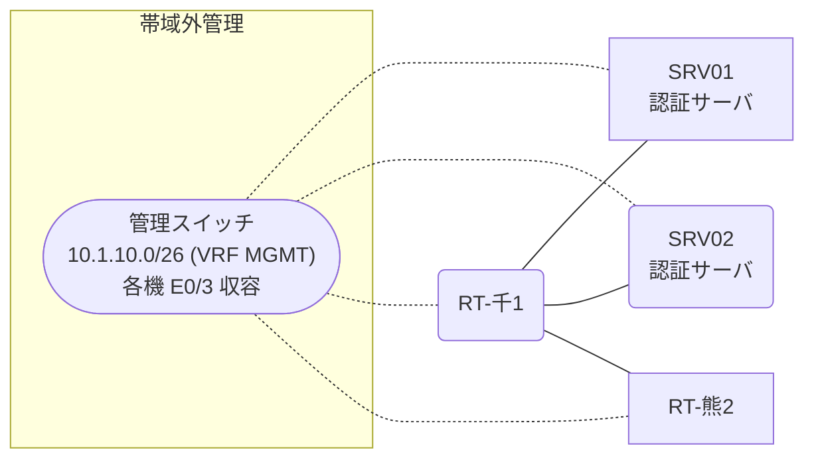

# 問題 20260910-002

> **本問は機器に接続せずに解答すること。追加の show 実行は認めない。**

## トポロジ

あなたは、ネットワークの運用を担当しています。2 つの拠点のルータが、共通の認証サーバ群を用いて、管理者の認証を行うように構成されています。一方のルータはサーバと直結しており、他方はそのルーターを経由してサーバに到達します。



### 認証サーバの仕様

| 項目 | SRV01 | SRV02 |
|---|---|---|
| アドレス | 10.99.220.2 | 10.99.221.2 |
| 待受ポート | 1812 / 1813 | 11812 / 11813 |
| 共有鍵 | K-9931 | K-9931 |
| 受理する送信元 | 10.7.0.1 ・ 10.9.0.2 | 同左 |
| 台帳 | ope-suzuki(15) ・ helpdesk(1) ・ SUZUKI(15) | 同左 |
| 現在の稼働状態 | 保守作業のため停止中 | 稼働中 |

### ルータのアドレス

| ルータ | Loopback0 | 認証サーバ方向のインタフェース |
|---|---|---|
| RT-千1(千葉) | 10.7.0.1 | Ethernet0/0 = 10.99.220.1 |
| RT-熊2(熊本) | 10.9.0.2 | Ethernet0/0 = 10.91.12.2 |

## 要件

1. 千葉・熊本 の両拠点で、利用者 ope-suzuki が権限レベル 15 で機器を操作できること。
2. 認証は認証サーバ群 NOC-RADIUS を用いること。
3. 認証サーバが全て停止した場合でも、コンソールからは操作できること。

## 現在の状態

いくつかの宛先への通信について、報告が上がっています。あなたは、提示されているところの情報のみを使用して、要求されている状態が満たされていない理由を、特定しなければなりません。

| 拠点 | ユーザ | 結果 |
|---|---|---|
| 千葉 | ope-suzuki | ログイン不可 |
| 千葉 | helpdesk | ログイン不可 |
| 千葉 | backup-adm | ログイン可(権限レベル 15) |
| 千葉 | ope-suzuki(6 セッション目以降) | ログイン不可 |
| 千葉 | backup-adm(コンソールから) | ログイン可(権限レベル 15) |
| 千葉 | ope-suzuki(ログインに要する時間) | 1 回目 約 30 秒 / 2 回目以降 即時 |
| 熊本 | ope-suzuki | ログイン可(権限レベル 15) |
| 熊本 | helpdesk | ログイン可(権限レベル 1) |
| 熊本 | backup-adm | ログイン不可 |
| 熊本 | helpdesk からの特権昇格 | 昇格可(15) |
| 熊本 | ope-suzuki(6 セッション目以降) | ログイン可(権限レベル 15) |
| 熊本 | backup-adm(コンソールから) | ログイン可(権限レベル 15) |
| 熊本 | ope-suzuki(ログインに要する時間) | 1 回目 約 15 秒 / 2 回目以降 即時 |

認証サーバがすべて停止した場合:

| 拠点 | ユーザ | 結果 |
|---|---|---|
| 千葉 | backup-adm | ログイン可(権限レベル 15) |
| 千葉 | SUZUKI | ログイン可(権限レベル 15) |
| 千葉 | backup-adm(コンソールから) | ログイン可(権限レベル 15) |
| 熊本 | backup-adm | ログイン可(権限レベル 15) |
| 熊本 | SUZUKI | ログイン可(権限レベル 15) |
| 熊本 | backup-adm(コンソールから) | ログイン可(権限レベル 15) |

```
千葉: No authoritative response from any server. (1 回目 約 30 秒 / 2 回目以降 即時)
熊本: User was successfully authenticated. (1 回目 約 15 秒 / 2 回目以降 即時)
```

## 設定抜粋

```
RT-千1# show running-config | section aaa
aaa new-model
!
radius server RAD1
 address ipv4 10.99.220.2 auth-port 1812 acct-port 1813
 key OLD-KEY
!
radius server RAD2
 address ipv4 10.99.221.2 auth-port 11812 acct-port 11813
 key OLD-KEY
!
aaa group server radius NOC-RADIUS
 server name RAD1
 server name RAD2
 deadtime 5
!
aaa authentication login default group NOC-RADIUS local
aaa authentication login CONSOLE local
aaa authorization exec default group NOC-RADIUS local
aaa authorization exec CONSOLE local
aaa authorization console
!
ip radius source-interface Loopback0
radius-server timeout 5
radius-server retransmit 2
radius-server dead-criteria time 5 tries 1
!
username backup-adm privilege 15 secret 5 $1$xxxx
username SUZUKI privilege 15 secret 5 $1$yyyy
!
line con 0
 exec-timeout 0 0
 logging synchronous
 login authentication CONSOLE
 authorization exec CONSOLE
line vty 0 4
 exec-timeout 0 0
 transport input ssh
line vty 5 15
 exec-timeout 0 0
 transport input ssh
```
```
RT-熊2# show running-config | section aaa
aaa new-model
!
radius server RAD1
 address ipv4 10.99.220.2 auth-port 1812 acct-port 1813
 key K-9931
!
radius server RAD2
 address ipv4 10.99.221.2 auth-port 11812 acct-port 11813
 key K-9931
!
aaa group server radius NOC-RADIUS
 server name RAD1
 server name RAD2
 deadtime 5
!
aaa authentication login default group NOC-RADIUS local
aaa authentication login CONSOLE local
aaa authorization exec default group NOC-RADIUS local
aaa authorization exec CONSOLE local
aaa authorization console
!
ip radius source-interface Loopback0
radius-server timeout 5
radius-server retransmit 2
radius-server dead-criteria time 5 tries 1
!
username backup-adm privilege 15 secret 5 $1$xxxx
username SUZUKI privilege 15 secret 5 $1$yyyy
!
line con 0
 exec-timeout 0 0
 logging synchronous
 login authentication CONSOLE
 authorization exec CONSOLE
line vty 0 4
 exec-timeout 0 0
 transport input ssh
line vty 5 15
 exec-timeout 0 0
 transport input ssh
```

## 設問

次のうち、正しいものは、どれですか。

## 選択肢
A. ルータと認証サーバの共有鍵が一致していない。

B. コンソール回線に対する認可が有効化されていない。

C. exec の認可に代替手段が構成されていない。

D. ルータが指定している待受ポートがサーバの実際の値と異なる。
