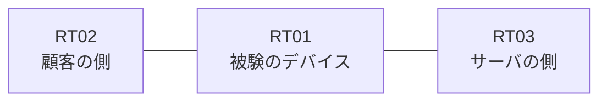

# 問題 20260910-003

> **本問は機器に接続せずに解答すること。追加の show 実行は認めない。**

## シナリオ

あなたは、下記のネットワークの保守を担当する技術者です。ある企業のネットワークにおいて、RT01 は、顧客の側のネットワークと、サーバの側のネットワークとの間に配置されており、IPv6 によって運用されています。一部の通信が、意図されているとおりに動作していない、という報告があります。あなたは、提示されているところの情報のみを使用して、要求されている状態が満たされていない理由を、特定しなければなりません。インタフェースの IP アドレッシングは、変更されてはなりません。RT01 において、`2001:DB8:AF:18::/64`、`2001:DB8:AF:19::/64`、`2001:DB8:AF:1A::/64` のネットワークからの通信のみが、`2001:DB8:AF:FF::10` の TCP ポート 22 に到達できなければなりません。対象としていないネットワークが、一致の対象に含まれてはなりません。また、拒否のエントリを使用してはなりません。`2001:DB8:AF:1B::/64` からの通信は、許可されてはなりません。`2001:DB8:AF:1D::/64` からの通信は、許可されることはできません。



## 出力

観測 | サーバへの到達
--- | ---
送信元が 2001:DB8:AF:18::/64 のネットワークにあるホストから、2001:DB8:AF:FF::10 の TCP ポート 22 宛ての通信 | 到達可
送信元が 2001:DB8:AF:19::/64 のネットワークにあるホストから、2001:DB8:AF:FF::10 の TCP ポート 22 宛ての通信 | 到達可
送信元が 2001:DB8:AF:1A::/64 のネットワークにあるホストから、2001:DB8:AF:FF::10 の TCP ポート 22 宛ての通信 | 到達可
送信元が 2001:DB8:AF:1B::/64 のネットワークにあるホストから、2001:DB8:AF:FF::10 の TCP ポート 22 宛ての通信 | 到達可
送信元が 2001:DB8:AF:1D::/64 のネットワークにあるホストから、2001:DB8:AF:FF::10 の TCP ポート 22 宛ての通信 | 到達可
送信元が 2001:DB8:AF:FA::/64 のネットワークにあるホストから、2001:DB8:AF:FF::10 の TCP ポート 22 宛ての通信 | 到達不可

```
RT01# show ipv6 access-list
IPv6 access list V6-FILTER-IN
    permit ipv6 2001:DB8:AF:18::/61 any sequence 10
    deny ipv6 2001:DB8:AF:1D::/64 any sequence 20
```
```
RT01# show running-config | section ipv6 access-list|traffic-filter
ipv6 access-list V6-FILTER-IN
 sequence 10 permit ipv6 2001:DB8:AF:18::/61 any
 sequence 20 deny ipv6 2001:DB8:AF:1D::/64 any
interface Ethernet0/0
 ipv6 traffic-filter V6-FILTER-IN in
```
```
RT01# show ipv6 neighbors
IPv6 Address                              Age Link-layer Addr State Interface
2001:DB8:AF:18::3                           0 aabb.cc02.4f00  REACH Et0/0
```

## 設問

次のうち、正しいものは、どれですか。

## 選択肢
A. シーケンス番号が連続していないため、エントリが評価されていない

B. 先行するエントリが広い範囲を許可しており、後続のエントリが評価されない

C. 参照されているアクセス・リストが定義されていない

D. ワイルドカードによる指定が受理されず、意図されたエントリが存在していない

E. プレフィックスの長さが長く、対象としているネットワークの一部が一致の対象から外れている

F. 空のアクセス・リストが参照されているため、暗黙の拒否によってすべてが破棄されている
